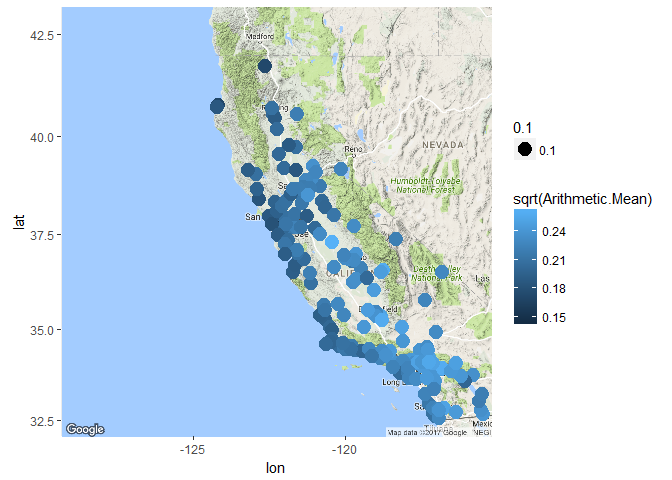

Maps
================

GitHub Documents
----------------

This is an R Markdown format used for publishing markdown documents to GitHub. When you click the **Knit** button all R code chunks are run and a markdown file (.md) suitable for publishing to GitHub is generated.

``` r
s133df <- read.csv('C:/Users/Shiva/Downloads/annual_all_2016/annual_all_2016.csv')
head(s133df,200)
```

    ##     State.Code County.Code Site.Num Parameter.Code POC Latitude Longitude
    ## 1            1           3       10          44201   1 30.49748 -87.88026
    ## 2            1           3       10          44201   1 30.49748 -87.88026
    ## 3            1           3       10          44201   1 30.49748 -87.88026
    ## 4            1           3       10          44201   1 30.49748 -87.88026
    ## 5            1           3       10          68101   1 30.49748 -87.88026
    ## 6            1           3       10          68102   1 30.49748 -87.88026
    ## 7            1           3       10          68105   1 30.49748 -87.88026
    ## 8            1           3       10          68108   1 30.49748 -87.88026
    ## 9            1           3       10          68109   1 30.49748 -87.88026
    ## 10           1           3       10          88101   1 30.49748 -87.88026
    ## 11           1           3       10          88101   1 30.49748 -87.88026
    ## 12           1           3       10          88101   1 30.49748 -87.88026
    ## 13           1           3       10          88101   1 30.49748 -87.88026
    ## 14           1          27        1          68101   1 33.28493 -85.80361
    ## 15           1          27        1          68102   1 33.28493 -85.80361
    ## 16           1          27        1          68105   1 33.28493 -85.80361
    ## 17           1          27        1          68108   1 33.28493 -85.80361
    ## 18           1          27        1          68109   1 33.28493 -85.80361
    ## 19           1          27        1          88101   1 33.28493 -85.80361
    ## 20           1          27        1          88101   1 33.28493 -85.80361
    ## 21           1          27        1          88101   1 33.28493 -85.80361
    ## 22           1          27        1          88101   1 33.28493 -85.80361
    ## 23           1          33     1002          44201   1 34.76262 -87.63810
    ## 24           1          33     1002          44201   1 34.76262 -87.63810
    ## 25           1          33     1002          44201   1 34.76262 -87.63810
    ## 26           1          33     1002          44201   1 34.76262 -87.63810
    ## 27           1          33     1002          68101   1 34.76262 -87.63810
    ## 28           1          33     1002          68102   1 34.76262 -87.63810
    ## 29           1          33     1002          68105   1 34.76262 -87.63810
    ## 30           1          33     1002          68108   1 34.76262 -87.63810
    ## 31           1          33     1002          68109   1 34.76262 -87.63810
    ## 32           1          33     1002          88101   1 34.76262 -87.63810
    ## 33           1          33     1002          88101   1 34.76262 -87.63810
    ## 34           1          33     1002          88101   1 34.76262 -87.63810
    ## 35           1          33     1002          88101   1 34.76262 -87.63810
    ## 36           1          49     1003          68101   1 34.28857 -85.96986
    ## 37           1          49     1003          68102   1 34.28857 -85.96986
    ## 38           1          49     1003          68105   1 34.28857 -85.96986
    ## 39           1          49     1003          68108   1 34.28857 -85.96986
    ## 40           1          49     1003          68109   1 34.28857 -85.96986
    ## 41           1          49     1003          88101   1 34.28857 -85.96986
    ## 42           1          49     1003          88101   1 34.28857 -85.96986
    ## 43           1          49     1003          88101   1 34.28857 -85.96986
    ## 44           1          49     1003          88101   1 34.28857 -85.96986
    ## 45           1          49     9991          44201   1 34.28900 -85.97007
    ## 46           1          49     9991          44201   1 34.28900 -85.97007
    ## 47           1          49     9991          44201   1 34.28900 -85.97007
    ## 48           1          49     9991          44201   1 34.28900 -85.97007
    ## 49           1          51        1          44201   1 32.49857 -86.13659
    ## 50           1          51        1          44201   1 32.49857 -86.13659
    ## 51           1          51        1          44201   1 32.49857 -86.13659
    ## 52           1          51        1          44201   1 32.49857 -86.13659
    ## 53           1          55       10          68101   1 33.99149 -85.99265
    ## 54           1          55       10          68102   1 33.99149 -85.99265
    ## 55           1          55       10          68105   1 33.99149 -85.99265
    ## 56           1          55       10          68108   1 33.99149 -85.99265
    ## 57           1          55       10          68109   1 33.99149 -85.99265
    ## 58           1          55       10          88101   1 33.99149 -85.99265
    ## 59           1          55       10          88101   1 33.99149 -85.99265
    ## 60           1          55       10          88101   1 33.99149 -85.99265
    ## 61           1          55       10          88101   1 33.99149 -85.99265
    ## 62           1          55       10          88502   3 33.99149 -85.99265
    ## 63           1          55       10          88502   3 33.99149 -85.99265
    ## 64           1          55       11          44201   1 33.90390 -86.05390
    ## 65           1          55       11          44201   1 33.90390 -86.05390
    ## 66           1          55       11          44201   1 33.90390 -86.05390
    ## 67           1          55       11          44201   1 33.90390 -86.05390
    ## 68           1          69        3          68101   1 31.22478 -85.39079
    ## 69           1          69        3          68102   1 31.22478 -85.39079
    ## 70           1          69        3          68105   1 31.22478 -85.39079
    ## 71           1          69        3          68108   1 31.22478 -85.39079
    ## 72           1          69        3          68109   1 31.22478 -85.39079
    ## 73           1          69        3          88101   1 31.22478 -85.39079
    ## 74           1          69        3          88101   1 31.22478 -85.39079
    ## 75           1          69        3          88101   1 31.22478 -85.39079
    ## 76           1          69        3          88101   1 31.22478 -85.39079
    ## 77           1          69        4          44201   1 31.18893 -85.42309
    ## 78           1          69        4          44201   1 31.18893 -85.42309
    ## 79           1          69        4          44201   1 31.18893 -85.42309
    ## 80           1          69        4          44201   1 31.18893 -85.42309
    ## 81           1          73       23          42101   2 33.55306 -86.81500
    ## 82           1          73       23          42101   2 33.55306 -86.81500
    ## 83           1          73       23          42401   2 33.55306 -86.81500
    ## 84           1          73       23          42401   2 33.55306 -86.81500
    ## 85           1          73       23          42401   2 33.55306 -86.81500
    ## 86           1          73       23          42401   2 33.55306 -86.81500
    ## 87           1          73       23          42406   1 33.55306 -86.81500
    ## 88           1          73       23          42600   1 33.55306 -86.81500
    ## 89           1          73       23          42601   1 33.55306 -86.81500
    ## 90           1          73       23          42601   2 33.55306 -86.81500
    ## 91           1          73       23          42602   1 33.55306 -86.81500
    ## 92           1          73       23          42602   1 33.55306 -86.81500
    ## 93           1          73       23          42603   1 33.55306 -86.81500
    ## 94           1          73       23          44201   1 33.55306 -86.81500
    ## 95           1          73       23          44201   1 33.55306 -86.81500
    ## 96           1          73       23          44201   1 33.55306 -86.81500
    ## 97           1          73       23          44201   1 33.55306 -86.81500
    ## 98           1          73       23          61103   1 33.55306 -86.81500
    ## 99           1          73       23          61104   1 33.55306 -86.81500
    ## 100          1          73       23          62101   1 33.55306 -86.81500
    ## 101          1          73       23          62201   2 33.55306 -86.81500
    ## 102          1          73       23          63301   1 33.55306 -86.81500
    ## 103          1          73       23          64101   1 33.55306 -86.81500
    ## 104          1          73       23          65102   1 33.55306 -86.81500
    ## 105          1          73       23          68102   1 33.55306 -86.81500
    ## 106          1          73       23          68102   2 33.55306 -86.81500
    ## 107          1          73       23          68105   1 33.55306 -86.81500
    ## 108          1          73       23          68105   2 33.55306 -86.81500
    ## 109          1          73       23          68108   1 33.55306 -86.81500
    ## 110          1          73       23          68108   2 33.55306 -86.81500
    ## 111          1          73       23          81102   4 33.55306 -86.81500
    ## 112          1          73       23          81102   4 33.55306 -86.81500
    ## 113          1          73       23          81102   4 33.55306 -86.81500
    ## 114          1          73       23          81102   4 33.55306 -86.81500
    ## 115          1          73       23          81102   6 33.55306 -86.81500
    ## 116          1          73       23          81102   7 33.55306 -86.81500
    ## 117          1          73       23          85101   6 33.55306 -86.81500
    ## 118          1          73       23          85101   7 33.55306 -86.81500
    ## 119          1          73       23          85129   1 33.55306 -86.81500
    ## 120          1          73       23          85129   2 33.55306 -86.81500
    ## 121          1          73       23          86101   1 33.55306 -86.81500
    ## 122          1          73       23          86101   2 33.55306 -86.81500
    ## 123          1          73       23          88101   1 33.55306 -86.81500
    ## 124          1          73       23          88101   1 33.55306 -86.81500
    ## 125          1          73       23          88101   1 33.55306 -86.81500
    ## 126          1          73       23          88101   1 33.55306 -86.81500
    ## 127          1          73       23          88101   2 33.55306 -86.81500
    ## 128          1          73       23          88101   2 33.55306 -86.81500
    ## 129          1          73       23          88101   2 33.55306 -86.81500
    ## 130          1          73       23          88101   2 33.55306 -86.81500
    ## 131          1          73       23          88101   3 33.55306 -86.81500
    ## 132          1          73       23          88101   3 33.55306 -86.81500
    ## 133          1          73       23          88101   3 33.55306 -86.81500
    ## 134          1          73       23          88101   3 33.55306 -86.81500
    ## 135          1          73       23          88101   3 33.55306 -86.81500
    ## 136          1          73       23          88101   3 33.55306 -86.81500
    ## 137          1          73       23          88102   5 33.55306 -86.81500
    ## 138          1          73       23          88103   5 33.55306 -86.81500
    ## 139          1          73       23          88104   5 33.55306 -86.81500
    ## 140          1          73       23          88107   5 33.55306 -86.81500
    ## 141          1          73       23          88109   5 33.55306 -86.81500
    ## 142          1          73       23          88110   5 33.55306 -86.81500
    ## 143          1          73       23          88111   5 33.55306 -86.81500
    ## 144          1          73       23          88112   5 33.55306 -86.81500
    ## 145          1          73       23          88113   5 33.55306 -86.81500
    ## 146          1          73       23          88114   5 33.55306 -86.81500
    ## 147          1          73       23          88115   5 33.55306 -86.81500
    ## 148          1          73       23          88117   5 33.55306 -86.81500
    ## 149          1          73       23          88118   5 33.55306 -86.81500
    ## 150          1          73       23          88126   5 33.55306 -86.81500
    ## 151          1          73       23          88128   5 33.55306 -86.81500
    ## 152          1          73       23          88131   5 33.55306 -86.81500
    ## 153          1          73       23          88132   5 33.55306 -86.81500
    ## 154          1          73       23          88136   5 33.55306 -86.81500
    ## 155          1          73       23          88140   5 33.55306 -86.81500
    ## 156          1          73       23          88152   5 33.55306 -86.81500
    ## 157          1          73       23          88154   5 33.55306 -86.81500
    ## 158          1          73       23          88160   5 33.55306 -86.81500
    ## 159          1          73       23          88161   5 33.55306 -86.81500
    ## 160          1          73       23          88164   5 33.55306 -86.81500
    ## 161          1          73       23          88165   5 33.55306 -86.81500
    ## 162          1          73       23          88166   5 33.55306 -86.81500
    ## 163          1          73       23          88167   5 33.55306 -86.81500
    ## 164          1          73       23          88168   5 33.55306 -86.81500
    ## 165          1          73       23          88169   5 33.55306 -86.81500
    ## 166          1          73       23          88176   5 33.55306 -86.81500
    ## 167          1          73       23          88180   5 33.55306 -86.81500
    ## 168          1          73       23          88184   5 33.55306 -86.81500
    ## 169          1          73       23          88185   5 33.55306 -86.81500
    ## 170          1          73       23          88301   5 33.55306 -86.81500
    ## 171          1          73       23          88302   5 33.55306 -86.81500
    ## 172          1          73       23          88303   5 33.55306 -86.81500
    ## 173          1          73       23          88306   5 33.55306 -86.81500
    ## 174          1          73       23          88355   5 33.55306 -86.81500
    ## 175          1          73       23          88357   5 33.55306 -86.81500
    ## 176          1          73       23          88370   5 33.55306 -86.81500
    ## 177          1          73       23          88374   5 33.55306 -86.81500
    ## 178          1          73       23          88375   5 33.55306 -86.81500
    ## 179          1          73       23          88376   5 33.55306 -86.81500
    ## 180          1          73       23          88377   5 33.55306 -86.81500
    ## 181          1          73       23          88378   5 33.55306 -86.81500
    ## 182          1          73       23          88379   5 33.55306 -86.81500
    ## 183          1          73       23          88380   5 33.55306 -86.81500
    ## 184          1          73       23          88381   5 33.55306 -86.81500
    ## 185          1          73       23          88382   5 33.55306 -86.81500
    ## 186          1          73       23          88383   5 33.55306 -86.81500
    ## 187          1          73       23          88384   5 33.55306 -86.81500
    ## 188          1          73       23          88385   5 33.55306 -86.81500
    ## 189          1          73       23          88388   5 33.55306 -86.81500
    ## 190          1          73       23          88403   5 33.55306 -86.81500
    ## 191          1          73     1003          42101   1 33.48556 -86.91500
    ## 192          1          73     1003          42101   1 33.48556 -86.91500
    ## 193          1          73     1003          42401   1 33.48556 -86.91500
    ## 194          1          73     1003          42401   1 33.48556 -86.91500
    ## 195          1          73     1003          42401   1 33.48556 -86.91500
    ## 196          1          73     1003          42401   1 33.48556 -86.91500
    ## 197          1          73     1003          42406   1 33.48556 -86.91500
    ## 198          1          73     1003          44201   1 33.48556 -86.91500
    ## 199          1          73     1003          44201   1 33.48556 -86.91500
    ## 200          1          73     1003          44201   1 33.48556 -86.91500
    ##     Datum                                        Parameter.Name
    ## 1   NAD83                                                 Ozone
    ## 2   NAD83                                                 Ozone
    ## 3   NAD83                                                 Ozone
    ## 4   NAD83                                                 Ozone
    ## 5   NAD83                                  Sample Flow Rate- CV
    ## 6   NAD83                                         Sample Volume
    ## 7   NAD83 Average Ambient Temperature for MetOne SASS/SuperSASS
    ## 8   NAD83    Average Ambient Pressure for MetOne SASS/SuperSASS
    ## 9   NAD83                                   Elapsed Sample Time
    ## 10  NAD83                              PM2.5 - Local Conditions
    ## 11  NAD83                              PM2.5 - Local Conditions
    ## 12  NAD83                              PM2.5 - Local Conditions
    ## 13  NAD83                              PM2.5 - Local Conditions
    ## 14  NAD83                                  Sample Flow Rate- CV
    ## 15  NAD83                                         Sample Volume
    ## 16  NAD83 Average Ambient Temperature for MetOne SASS/SuperSASS
    ## 17  NAD83    Average Ambient Pressure for MetOne SASS/SuperSASS
    ## 18  NAD83                                   Elapsed Sample Time
    ## 19  NAD83                              PM2.5 - Local Conditions
    ## 20  NAD83                              PM2.5 - Local Conditions
    ## 21  NAD83                              PM2.5 - Local Conditions
    ## 22  NAD83                              PM2.5 - Local Conditions
    ## 23  NAD83                                                 Ozone
    ## 24  NAD83                                                 Ozone
    ## 25  NAD83                                                 Ozone
    ## 26  NAD83                                                 Ozone
    ## 27  NAD83                                  Sample Flow Rate- CV
    ## 28  NAD83                                         Sample Volume
    ## 29  NAD83 Average Ambient Temperature for MetOne SASS/SuperSASS
    ## 30  NAD83    Average Ambient Pressure for MetOne SASS/SuperSASS
    ## 31  NAD83                                   Elapsed Sample Time
    ## 32  NAD83                              PM2.5 - Local Conditions
    ## 33  NAD83                              PM2.5 - Local Conditions
    ## 34  NAD83                              PM2.5 - Local Conditions
    ## 35  NAD83                              PM2.5 - Local Conditions
    ## 36  NAD83                                  Sample Flow Rate- CV
    ## 37  NAD83                                         Sample Volume
    ## 38  NAD83 Average Ambient Temperature for MetOne SASS/SuperSASS
    ## 39  NAD83    Average Ambient Pressure for MetOne SASS/SuperSASS
    ## 40  NAD83                                   Elapsed Sample Time
    ## 41  NAD83                              PM2.5 - Local Conditions
    ## 42  NAD83                              PM2.5 - Local Conditions
    ## 43  NAD83                              PM2.5 - Local Conditions
    ## 44  NAD83                              PM2.5 - Local Conditions
    ## 45  NAD83                                                 Ozone
    ## 46  NAD83                                                 Ozone
    ## 47  NAD83                                                 Ozone
    ## 48  NAD83                                                 Ozone
    ## 49  WGS84                                                 Ozone
    ## 50  WGS84                                                 Ozone
    ## 51  WGS84                                                 Ozone
    ## 52  WGS84                                                 Ozone
    ## 53  NAD83                                  Sample Flow Rate- CV
    ## 54  NAD83                                         Sample Volume
    ## 55  NAD83 Average Ambient Temperature for MetOne SASS/SuperSASS
    ## 56  NAD83    Average Ambient Pressure for MetOne SASS/SuperSASS
    ## 57  NAD83                                   Elapsed Sample Time
    ## 58  NAD83                              PM2.5 - Local Conditions
    ## 59  NAD83                              PM2.5 - Local Conditions
    ## 60  NAD83                              PM2.5 - Local Conditions
    ## 61  NAD83                              PM2.5 - Local Conditions
    ## 62  NAD83                Acceptable PM2.5 AQI & Speciation Mass
    ## 63  NAD83                Acceptable PM2.5 AQI & Speciation Mass
    ## 64  NAD83                                                 Ozone
    ## 65  NAD83                                                 Ozone
    ## 66  NAD83                                                 Ozone
    ## 67  NAD83                                                 Ozone
    ## 68  NAD83                                  Sample Flow Rate- CV
    ## 69  NAD83                                         Sample Volume
    ## 70  NAD83 Average Ambient Temperature for MetOne SASS/SuperSASS
    ## 71  NAD83    Average Ambient Pressure for MetOne SASS/SuperSASS
    ## 72  NAD83                                   Elapsed Sample Time
    ## 73  NAD83                              PM2.5 - Local Conditions
    ## 74  NAD83                              PM2.5 - Local Conditions
    ## 75  NAD83                              PM2.5 - Local Conditions
    ## 76  NAD83                              PM2.5 - Local Conditions
    ## 77  NAD83                                                 Ozone
    ## 78  NAD83                                                 Ozone
    ## 79  NAD83                                                 Ozone
    ## 80  NAD83                                                 Ozone
    ## 81  WGS84                                       Carbon monoxide
    ## 82  WGS84                                       Carbon monoxide
    ## 83  WGS84                                        Sulfur dioxide
    ## 84  WGS84                                        Sulfur dioxide
    ## 85  WGS84                                        Sulfur dioxide
    ## 86  WGS84                                        Sulfur dioxide
    ## 87  WGS84                                     SO2 max 5-min avg
    ## 88  WGS84                     Reactive oxides of nitrogen (NOy)
    ## 89  WGS84                                     Nitric oxide (NO)
    ## 90  WGS84                                     Nitric oxide (NO)
    ## 91  WGS84                                Nitrogen dioxide (NO2)
    ## 92  WGS84                                Nitrogen dioxide (NO2)
    ## 93  WGS84                              Oxides of nitrogen (NOx)
    ## 94  WGS84                                                 Ozone
    ## 95  WGS84                                                 Ozone
    ## 96  WGS84                                                 Ozone
    ## 97  WGS84                                                 Ozone
    ## 98  WGS84                                Wind Speed - Resultant
    ## 99  WGS84                            Wind Direction - Resultant
    ## 100 WGS84                                   Outdoor Temperature
    ## 101 WGS84                                    Relative Humidity 
    ## 102 WGS84                                       Solar radiation
    ## 103 WGS84                                   Barometric pressure
    ## 104 WGS84                               Rain/melt precipitation
    ## 105 WGS84                                         Sample Volume
    ## 106 WGS84                                         Sample Volume
    ## 107 WGS84 Average Ambient Temperature for MetOne SASS/SuperSASS
    ## 108 WGS84 Average Ambient Temperature for MetOne SASS/SuperSASS
    ## 109 WGS84    Average Ambient Pressure for MetOne SASS/SuperSASS
    ## 110 WGS84    Average Ambient Pressure for MetOne SASS/SuperSASS
    ## 111 WGS84                                 PM10 Total 0-10um STP
    ## 112 WGS84                                 PM10 Total 0-10um STP
    ## 113 WGS84                                 PM10 Total 0-10um STP
    ## 114 WGS84                                 PM10 Total 0-10um STP
    ## 115 WGS84                                 PM10 Total 0-10um STP
    ## 116 WGS84                                 PM10 Total 0-10um STP
    ## 117 WGS84                                             PM10 - LC
    ## 118 WGS84                                             PM10 - LC
    ## 119 WGS84                                  Lead PM10 LC FRM/FEM
    ## 120 WGS84                                  Lead PM10 LC FRM/FEM
    ## 121 WGS84                           PM10-2.5 - Local Conditions
    ## 122 WGS84                           PM10-2.5 - Local Conditions
    ## 123 WGS84                              PM2.5 - Local Conditions
    ## 124 WGS84                              PM2.5 - Local Conditions
    ## 125 WGS84                              PM2.5 - Local Conditions
    ## 126 WGS84                              PM2.5 - Local Conditions
    ## 127 WGS84                              PM2.5 - Local Conditions
    ## 128 WGS84                              PM2.5 - Local Conditions
    ## 129 WGS84                              PM2.5 - Local Conditions
    ## 130 WGS84                              PM2.5 - Local Conditions
    ## 131 WGS84                              PM2.5 - Local Conditions
    ## 132 WGS84                              PM2.5 - Local Conditions
    ## 133 WGS84                              PM2.5 - Local Conditions
    ## 134 WGS84                              PM2.5 - Local Conditions
    ## 135 WGS84                              PM2.5 - Local Conditions
    ## 136 WGS84                              PM2.5 - Local Conditions
    ## 137 WGS84                                     Antimony PM2.5 LC
    ## 138 WGS84                                      Arsenic PM2.5 LC
    ## 139 WGS84                                     Aluminum PM2.5 LC
    ## 140 WGS84                                       Barium PM2.5 LC
    ## 141 WGS84                                      Bromine PM2.5 LC
    ## 142 WGS84                                      Cadmium PM2.5 LC
    ## 143 WGS84                                      Calcium PM2.5 LC
    ## 144 WGS84                                     Chromium PM2.5 LC
    ## 145 WGS84                                       Cobalt PM2.5 LC
    ## 146 WGS84                                       Copper PM2.5 LC
    ## 147 WGS84                                     Chlorine PM2.5 LC
    ## 148 WGS84                                       Cerium PM2.5 LC
    ## 149 WGS84                                       Cesium PM2.5 LC
    ## 150 WGS84                                         Iron PM2.5 LC
    ## 151 WGS84                                         Lead PM2.5 LC
    ## 152 WGS84                                       Indium PM2.5 LC
    ## 153 WGS84                                    Manganese PM2.5 LC
    ## 154 WGS84                                       Nickel PM2.5 LC
    ## 155 WGS84                                    Magnesium PM2.5 LC
    ## 156 WGS84                                   Phosphorus PM2.5 LC
    ## 157 WGS84                                     Selenium PM2.5 LC
    ## 158 WGS84                                          Tin PM2.5 LC
    ## 159 WGS84                                     Titanium PM2.5 LC
    ## 160 WGS84                                     Vanadium PM2.5 LC
    ## 161 WGS84                                      Silicon PM2.5 LC
    ## 162 WGS84                                       Silver PM2.5 LC
    ## 163 WGS84                                         Zinc PM2.5 LC
    ## 164 WGS84                                    Strontium PM2.5 LC
    ## 165 WGS84                                       Sulfur PM2.5 LC
    ## 166 WGS84                                     Rubidium PM2.5 LC
    ## 167 WGS84                                    Potassium PM2.5 LC
    ## 168 WGS84                                       Sodium PM2.5 LC
    ## 169 WGS84                                    Zirconium PM2.5 LC
    ## 170 WGS84                                 Ammonium Ion PM2.5 LC
    ## 171 WGS84                                   Sodium Ion Pm2.5 LC
    ## 172 WGS84                                Potassium Ion PM2.5 LC
    ## 173 WGS84                                Total Nitrate PM2.5 LC
    ## 174 WGS84                    OC CSN_Rev Unadjusted PM2.5 LC TOT
    ## 175 WGS84                    EC CSN_Rev Unadjusted PM2.5 LC TOT
    ## 176 WGS84                    OC CSN_Rev Unadjusted PM2.5 LC TOR
    ## 177 WGS84                       OC1 CSN_Rev Unadjusted PM2.5 LC
    ## 178 WGS84                       OC2 CSN_Rev Unadjusted PM2.5 LC
    ## 179 WGS84                       OC3 CSN_Rev Unadjusted PM2.5 LC
    ## 180 WGS84                       OC4 CSN_Rev Unadjusted PM2.5 LC
    ## 181 WGS84                    OP CSN_Rev Unadjusted PM2.5 LC TOR
    ## 182 WGS84                                       OP PM2.5 LC TOT
    ## 183 WGS84                    EC CSN_Rev Unadjusted PM2.5 LC TOR
    ## 184 WGS84                                       EC PM2.5 LC TOT
    ## 185 WGS84                                       OC PM2.5 LC TOT
    ## 186 WGS84                       EC1 CSN_Rev Unadjusted PM2.5 LC
    ## 187 WGS84                       EC2 CSN_Rev Unadjusted PM2.5 LC
    ## 188 WGS84                       EC3 CSN_Rev Unadjusted PM2.5 LC
    ## 189 WGS84                    OP CSN_Rev Unadjusted PM2.5 LC TOT
    ## 190 WGS84                                      Sulfate PM2.5 LC
    ## 191 WGS84                                       Carbon monoxide
    ## 192 WGS84                                       Carbon monoxide
    ## 193 WGS84                                        Sulfur dioxide
    ## 194 WGS84                                        Sulfur dioxide
    ## 195 WGS84                                        Sulfur dioxide
    ## 196 WGS84                                        Sulfur dioxide
    ## 197 WGS84                                     SO2 max 5-min avg
    ## 198 WGS84                                                 Ozone
    ## 199 WGS84                                                 Ozone
    ## 200 WGS84                                                 Ozone
    ##             Sample.Duration               Pollutant.Standard
    ## 1                    1 HOUR          Ozone 1-hour Daily 2005
    ## 2   8-HR RUN AVG BEGIN HOUR                Ozone 8-Hour 1997
    ## 3   8-HR RUN AVG BEGIN HOUR                Ozone 8-Hour 2008
    ## 4   8-HR RUN AVG BEGIN HOUR                Ozone 8-hour 2015
    ## 5                   24 HOUR                                 
    ## 6                   24 HOUR                                 
    ## 7                   24 HOUR                                 
    ## 8                   24 HOUR                                 
    ## 9                   24 HOUR                                 
    ## 10                  24 HOUR                PM25 24-hour 2006
    ## 11                  24 HOUR                PM25 24-hour 2012
    ## 12                  24 HOUR                 PM25 Annual 2006
    ## 13                  24 HOUR                 PM25 Annual 2012
    ## 14                  24 HOUR                                 
    ## 15                  24 HOUR                                 
    ## 16                  24 HOUR                                 
    ## 17                  24 HOUR                                 
    ## 18                  24 HOUR                                 
    ## 19                  24 HOUR                PM25 24-hour 2006
    ## 20                  24 HOUR                PM25 24-hour 2012
    ## 21                  24 HOUR                 PM25 Annual 2006
    ## 22                  24 HOUR                 PM25 Annual 2012
    ## 23                   1 HOUR          Ozone 1-hour Daily 2005
    ## 24  8-HR RUN AVG BEGIN HOUR                Ozone 8-Hour 1997
    ## 25  8-HR RUN AVG BEGIN HOUR                Ozone 8-Hour 2008
    ## 26  8-HR RUN AVG BEGIN HOUR                Ozone 8-hour 2015
    ## 27                  24 HOUR                                 
    ## 28                  24 HOUR                                 
    ## 29                  24 HOUR                                 
    ## 30                  24 HOUR                                 
    ## 31                  24 HOUR                                 
    ## 32                  24 HOUR                PM25 24-hour 2006
    ## 33                  24 HOUR                PM25 24-hour 2012
    ## 34                  24 HOUR                 PM25 Annual 2006
    ## 35                  24 HOUR                 PM25 Annual 2012
    ## 36                  24 HOUR                                 
    ## 37                  24 HOUR                                 
    ## 38                  24 HOUR                                 
    ## 39                  24 HOUR                                 
    ## 40                  24 HOUR                                 
    ## 41                  24 HOUR                PM25 24-hour 2006
    ## 42                  24 HOUR                PM25 24-hour 2012
    ## 43                  24 HOUR                 PM25 Annual 2006
    ## 44                  24 HOUR                 PM25 Annual 2012
    ## 45                   1 HOUR          Ozone 1-hour Daily 2005
    ## 46  8-HR RUN AVG BEGIN HOUR                Ozone 8-Hour 1997
    ## 47  8-HR RUN AVG BEGIN HOUR                Ozone 8-Hour 2008
    ## 48  8-HR RUN AVG BEGIN HOUR                Ozone 8-hour 2015
    ## 49                   1 HOUR          Ozone 1-hour Daily 2005
    ## 50  8-HR RUN AVG BEGIN HOUR                Ozone 8-Hour 1997
    ## 51  8-HR RUN AVG BEGIN HOUR                Ozone 8-Hour 2008
    ## 52  8-HR RUN AVG BEGIN HOUR                Ozone 8-hour 2015
    ## 53                  24 HOUR                                 
    ## 54                  24 HOUR                                 
    ## 55                  24 HOUR                                 
    ## 56                  24 HOUR                                 
    ## 57                  24 HOUR                                 
    ## 58                  24 HOUR                PM25 24-hour 2006
    ## 59                  24 HOUR                PM25 24-hour 2012
    ## 60                  24 HOUR                 PM25 Annual 2006
    ## 61                  24 HOUR                 PM25 Annual 2012
    ## 62                   1 HOUR                                 
    ## 63            24-HR BLK AVG                                 
    ## 64                   1 HOUR          Ozone 1-hour Daily 2005
    ## 65  8-HR RUN AVG BEGIN HOUR                Ozone 8-Hour 1997
    ## 66  8-HR RUN AVG BEGIN HOUR                Ozone 8-Hour 2008
    ## 67  8-HR RUN AVG BEGIN HOUR                Ozone 8-hour 2015
    ## 68                  24 HOUR                                 
    ## 69                  24 HOUR                                 
    ## 70                  24 HOUR                                 
    ## 71                  24 HOUR                                 
    ## 72                  24 HOUR                                 
    ## 73                  24 HOUR                PM25 24-hour 2006
    ## 74                  24 HOUR                PM25 24-hour 2012
    ## 75                  24 HOUR                 PM25 Annual 2006
    ## 76                  24 HOUR                 PM25 Annual 2012
    ## 77                   1 HOUR          Ozone 1-hour Daily 2005
    ## 78  8-HR RUN AVG BEGIN HOUR                Ozone 8-Hour 1997
    ## 79  8-HR RUN AVG BEGIN HOUR                Ozone 8-Hour 2008
    ## 80  8-HR RUN AVG BEGIN HOUR                Ozone 8-hour 2015
    ## 81                   1 HOUR                   CO 1-hour 1971
    ## 82    8-HR RUN AVG END HOUR                   CO 8-hour 1971
    ## 83                   1 HOUR                  SO2 1-hour 2010
    ## 84                   1 HOUR                  SO2 Annual 1971
    ## 85            24-HR BLK AVG                 SO2 24-hour 1971
    ## 86             3-HR BLK AVG                  SO2 3-hour 1971
    ## 87                   1 HOUR                                 
    ## 88                   1 HOUR                                 
    ## 89                   1 HOUR                                 
    ## 90                   1 HOUR                                 
    ## 91                   1 HOUR                       NO2 1-hour
    ## 92                   1 HOUR                  NO2 Annual 1971
    ## 93                   1 HOUR                                 
    ## 94                   1 HOUR          Ozone 1-hour Daily 2005
    ## 95  8-HR RUN AVG BEGIN HOUR                Ozone 8-Hour 1997
    ## 96  8-HR RUN AVG BEGIN HOUR                Ozone 8-Hour 2008
    ## 97  8-HR RUN AVG BEGIN HOUR                Ozone 8-hour 2015
    ## 98                   1 HOUR                                 
    ## 99                   1 HOUR                                 
    ## 100                  1 HOUR                                 
    ## 101                  1 HOUR                                 
    ## 102                  1 HOUR                                 
    ## 103                  1 HOUR                                 
    ## 104                  1 HOUR                                 
    ## 105                 24 HOUR                                 
    ## 106                 24 HOUR                                 
    ## 107                 24 HOUR                                 
    ## 108                 24 HOUR                                 
    ## 109                 24 HOUR                                 
    ## 110                 24 HOUR                                 
    ## 111                  1 HOUR                                 
    ## 112                  1 HOUR                                 
    ## 113           24-HR BLK AVG                PM10 24-hour 2006
    ## 114           24-HR BLK AVG                PM10 24-hour 2006
    ## 115                 24 HOUR                PM10 24-hour 2006
    ## 116                 24 HOUR                PM10 24-hour 2006
    ## 117                 24 HOUR                                 
    ## 118                 24 HOUR                                 
    ## 119                 24 HOUR Lead 3-Month PM10 Surrogate 2009
    ## 120                 24 HOUR Lead 3-Month PM10 Surrogate 2009
    ## 121                 24 HOUR                                 
    ## 122                 24 HOUR                                 
    ## 123                 24 HOUR                PM25 24-hour 2006
    ## 124                 24 HOUR                PM25 24-hour 2012
    ## 125                 24 HOUR                 PM25 Annual 2006
    ## 126                 24 HOUR                 PM25 Annual 2012
    ## 127                 24 HOUR                PM25 24-hour 2006
    ## 128                 24 HOUR                PM25 24-hour 2012
    ## 129                 24 HOUR                 PM25 Annual 2006
    ## 130                 24 HOUR                 PM25 Annual 2012
    ## 131                  1 HOUR                                 
    ## 132                  1 HOUR                                 
    ## 133           24-HR BLK AVG                PM25 24-hour 2006
    ## 134           24-HR BLK AVG                PM25 24-hour 2012
    ## 135           24-HR BLK AVG                 PM25 Annual 2006
    ## 136           24-HR BLK AVG                 PM25 Annual 2012
    ## 137                 24 HOUR                                 
    ## 138                 24 HOUR                                 
    ## 139                 24 HOUR                                 
    ## 140                 24 HOUR                                 
    ## 141                 24 HOUR                                 
    ## 142                 24 HOUR                                 
    ## 143                 24 HOUR                                 
    ## 144                 24 HOUR                                 
    ## 145                 24 HOUR                                 
    ## 146                 24 HOUR                                 
    ## 147                 24 HOUR                                 
    ## 148                 24 HOUR                                 
    ## 149                 24 HOUR                                 
    ## 150                 24 HOUR                                 
    ## 151                 24 HOUR                                 
    ## 152                 24 HOUR                                 
    ## 153                 24 HOUR                                 
    ## 154                 24 HOUR                                 
    ## 155                 24 HOUR                                 
    ## 156                 24 HOUR                                 
    ## 157                 24 HOUR                                 
    ## 158                 24 HOUR                                 
    ## 159                 24 HOUR                                 
    ## 160                 24 HOUR                                 
    ## 161                 24 HOUR                                 
    ## 162                 24 HOUR                                 
    ## 163                 24 HOUR                                 
    ## 164                 24 HOUR                                 
    ## 165                 24 HOUR                                 
    ## 166                 24 HOUR                                 
    ## 167                 24 HOUR                                 
    ## 168                 24 HOUR                                 
    ## 169                 24 HOUR                                 
    ## 170                 24 HOUR                                 
    ## 171                 24 HOUR                                 
    ## 172                 24 HOUR                                 
    ## 173                 24 HOUR                                 
    ## 174                 24 HOUR                                 
    ## 175                 24 HOUR                                 
    ## 176                 24 HOUR                                 
    ## 177                 24 HOUR                                 
    ## 178                 24 HOUR                                 
    ## 179                 24 HOUR                                 
    ## 180                 24 HOUR                                 
    ## 181                 24 HOUR                                 
    ## 182                 24 HOUR                                 
    ## 183                 24 HOUR                                 
    ## 184                 24 HOUR                                 
    ## 185                 24 HOUR                                 
    ## 186                 24 HOUR                                 
    ## 187                 24 HOUR                                 
    ## 188                 24 HOUR                                 
    ## 189                 24 HOUR                                 
    ## 190                 24 HOUR                                 
    ## 191                  1 HOUR                   CO 1-hour 1971
    ## 192   8-HR RUN AVG END HOUR                   CO 8-hour 1971
    ## 193                  1 HOUR                  SO2 1-hour 2010
    ## 194                  1 HOUR                  SO2 Annual 1971
    ## 195           24-HR BLK AVG                 SO2 24-hour 1971
    ## 196            3-HR BLK AVG                  SO2 3-hour 1971
    ## 197                  1 HOUR                                 
    ## 198                  1 HOUR          Ozone 1-hour Daily 2005
    ## 199 8-HR RUN AVG BEGIN HOUR                Ozone 8-Hour 1997
    ## 200 8-HR RUN AVG BEGIN HOUR                Ozone 8-Hour 2008
    ##                                                              Metric.Used
    ## 1   Daily maxima of observed hourly values (between 9:00 AM and 8:00 PM)
    ## 2      Daily maximum of 8 hour running average of observed hourly values
    ## 3      Daily maximum of 8 hour running average of observed hourly values
    ## 4                                Daily maximum of 8-hour running average
    ## 5                                                        Observed Values
    ## 6                                                        Observed Values
    ## 7                                                        Observed Values
    ## 8                                                        Observed Values
    ## 9                                                        Observed Values
    ## 10                                                            Daily Mean
    ## 11                                                            Daily Mean
    ## 12                                        Quarterly Means of Daily Means
    ## 13                                        Quarterly Means of Daily Means
    ## 14                                                       Observed Values
    ## 15                                                       Observed Values
    ## 16                                                       Observed Values
    ## 17                                                       Observed Values
    ## 18                                                       Observed Values
    ## 19                                                            Daily Mean
    ## 20                                                            Daily Mean
    ## 21                                        Quarterly Means of Daily Means
    ## 22                                        Quarterly Means of Daily Means
    ## 23  Daily maxima of observed hourly values (between 9:00 AM and 8:00 PM)
    ## 24     Daily maximum of 8 hour running average of observed hourly values
    ## 25     Daily maximum of 8 hour running average of observed hourly values
    ## 26                               Daily maximum of 8-hour running average
    ## 27                                                       Observed Values
    ## 28                                                       Observed Values
    ## 29                                                       Observed Values
    ## 30                                                       Observed Values
    ## 31                                                       Observed Values
    ## 32                                                            Daily Mean
    ## 33                                                            Daily Mean
    ## 34                                        Quarterly Means of Daily Means
    ## 35                                        Quarterly Means of Daily Means
    ## 36                                                       Observed Values
    ## 37                                                       Observed Values
    ## 38                                                       Observed Values
    ## 39                                                       Observed Values
    ## 40                                                       Observed Values
    ## 41                                                            Daily Mean
    ## 42                                                            Daily Mean
    ## 43                                        Quarterly Means of Daily Means
    ## 44                                        Quarterly Means of Daily Means
    ## 45  Daily maxima of observed hourly values (between 9:00 AM and 8:00 PM)
    ## 46     Daily maximum of 8 hour running average of observed hourly values
    ## 47     Daily maximum of 8 hour running average of observed hourly values
    ## 48                               Daily maximum of 8-hour running average
    ## 49  Daily maxima of observed hourly values (between 9:00 AM and 8:00 PM)
    ## 50     Daily maximum of 8 hour running average of observed hourly values
    ## 51     Daily maximum of 8 hour running average of observed hourly values
    ## 52                               Daily maximum of 8-hour running average
    ## 53                                                       Observed Values
    ## 54                                                       Observed Values
    ## 55                                                       Observed Values
    ## 56                                                       Observed Values
    ## 57                                                       Observed Values
    ## 58                                                            Daily Mean
    ## 59                                                            Daily Mean
    ## 60                                        Quarterly Means of Daily Means
    ## 61                                        Quarterly Means of Daily Means
    ## 62                                                       Observed Values
    ## 63                                                       Observed Values
    ## 64  Daily maxima of observed hourly values (between 9:00 AM and 8:00 PM)
    ## 65     Daily maximum of 8 hour running average of observed hourly values
    ## 66     Daily maximum of 8 hour running average of observed hourly values
    ## 67                               Daily maximum of 8-hour running average
    ## 68                                                       Observed Values
    ## 69                                                       Observed Values
    ## 70                                                       Observed Values
    ## 71                                                       Observed Values
    ## 72                                                       Observed Values
    ## 73                                                            Daily Mean
    ## 74                                                            Daily Mean
    ## 75                                        Quarterly Means of Daily Means
    ## 76                                        Quarterly Means of Daily Means
    ## 77  Daily maxima of observed hourly values (between 9:00 AM and 8:00 PM)
    ## 78     Daily maximum of 8 hour running average of observed hourly values
    ## 79     Daily maximum of 8 hour running average of observed hourly values
    ## 80                               Daily maximum of 8-hour running average
    ## 81                                                 Obseved hourly values
    ## 82           8-Hour running average (end hour) of observed hourly values
    ## 83                                          Daily maximum 1-hour average
    ## 84                                                       Observed Values
    ## 85                                      Daily Average of observed values
    ## 86                        3-Hour block average of observed hourly values
    ## 87                                                       Observed Values
    ## 88                                                       Observed Values
    ## 89                                                       Observed Values
    ## 90                                                       Observed Values
    ## 91                                          Daily Maximum 1-hour average
    ## 92                                                       Observed values
    ## 93                                                       Observed Values
    ## 94  Daily maxima of observed hourly values (between 9:00 AM and 8:00 PM)
    ## 95     Daily maximum of 8 hour running average of observed hourly values
    ## 96     Daily maximum of 8 hour running average of observed hourly values
    ## 97                               Daily maximum of 8-hour running average
    ## 98                                                       Observed Values
    ## 99                                                       Observed Values
    ## 100                                                      Observed Values
    ## 101                                                      Observed Values
    ## 102                                                      Observed Values
    ## 103                                                      Observed Values
    ## 104                                                      Observed Values
    ## 105                                                      Observed Values
    ## 106                                                      Observed Values
    ## 107                                                      Observed Values
    ## 108                                                      Observed Values
    ## 109                                                      Observed Values
    ## 110                                                      Observed Values
    ## 111                                                      Observed Values
    ## 112                                                      Observed Values
    ## 113                                                           Daily Mean
    ## 114                                                           Daily Mean
    ## 115                                                           Daily Mean
    ## 116                                                           Daily Mean
    ## 117                                                      Observed Values
    ## 118                                                      Observed Values
    ## 119                                                      Observed Values
    ## 120                                                      Observed Values
    ## 121                                                      Observed Values
    ## 122                                                      Observed Values
    ## 123                                                           Daily Mean
    ## 124                                                           Daily Mean
    ## 125                                       Quarterly Means of Daily Means
    ## 126                                       Quarterly Means of Daily Means
    ## 127                                                           Daily Mean
    ## 128                                                           Daily Mean
    ## 129                                       Quarterly Means of Daily Means
    ## 130                                       Quarterly Means of Daily Means
    ## 131                                                      Observed Values
    ## 132                                                      Observed Values
    ## 133                                                           Daily Mean
    ## 134                                                           Daily Mean
    ## 135                                       Quarterly Means of Daily Means
    ## 136                                       Quarterly Means of Daily Means
    ## 137                                                      Observed Values
    ## 138                                                      Observed Values
    ## 139                                                      Observed Values
    ## 140                                                      Observed Values
    ## 141                                                      Observed Values
    ## 142                                                      Observed Values
    ## 143                                                      Observed Values
    ## 144                                                      Observed Values
    ## 145                                                      Observed Values
    ## 146                                                      Observed Values
    ## 147                                                      Observed Values
    ## 148                                                      Observed Values
    ## 149                                                      Observed Values
    ## 150                                                      Observed Values
    ## 151                                                      Observed Values
    ## 152                                                      Observed Values
    ## 153                                                      Observed Values
    ## 154                                                      Observed Values
    ## 155                                                      Observed Values
    ## 156                                                      Observed Values
    ## 157                                                      Observed Values
    ## 158                                                      Observed Values
    ## 159                                                      Observed Values
    ## 160                                                      Observed Values
    ## 161                                                      Observed Values
    ## 162                                                      Observed Values
    ## 163                                                      Observed Values
    ## 164                                                      Observed Values
    ## 165                                                      Observed Values
    ## 166                                                      Observed Values
    ## 167                                                      Observed Values
    ## 168                                                      Observed Values
    ## 169                                                      Observed Values
    ## 170                                                      Observed Values
    ## 171                                                      Observed Values
    ## 172                                                      Observed Values
    ## 173                                                      Observed Values
    ## 174                                                      Observed Values
    ## 175                                                      Observed Values
    ## 176                                                      Observed Values
    ## 177                                                      Observed Values
    ## 178                                                      Observed Values
    ## 179                                                      Observed Values
    ## 180                                                      Observed Values
    ## 181                                                      Observed Values
    ## 182                                                      Observed Values
    ## 183                                                      Observed Values
    ## 184                                                      Observed Values
    ## 185                                                      Observed Values
    ## 186                                                      Observed Values
    ## 187                                                      Observed Values
    ## 188                                                      Observed Values
    ## 189                                                      Observed Values
    ## 190                                                      Observed Values
    ## 191                                                Obseved hourly values
    ## 192          8-Hour running average (end hour) of observed hourly values
    ## 193                                         Daily maximum 1-hour average
    ## 194                                                      Observed Values
    ## 195                                     Daily Average of observed values
    ## 196                       3-Hour block average of observed hourly values
    ## 197                                                      Observed Values
    ## 198 Daily maxima of observed hourly values (between 9:00 AM and 8:00 PM)
    ## 199    Daily maximum of 8 hour running average of observed hourly values
    ## 200    Daily maximum of 8 hour running average of observed hourly values
    ##                                                                                                      Method.Name
    ## 1                                                                                    INSTRUMENTAL - ULTRA VIOLET
    ## 2                                                                                                               
    ## 3                                                                                                               
    ## 4                                                                                                               
    ## 5                                                                   R & P Model 2025 PM2.5 Sequent - Calculation
    ## 6                                                                   R & P Model 2025 PM2.5 Sequent - Calculation
    ## 7                                                                    R & P Model 2025 PM2.5 Sequent - Electronic
    ## 8                                                             R & P Model 2025 PM2.5 Sequent - Barometric Sensor
    ## 9                                                                   R & P Model 2025 PM2.5 Sequent - Calculation
    ## 10                                                                                         Multiple Methods Used
    ## 11                                                                                         Multiple Methods Used
    ## 12                                                                                         Multiple Methods Used
    ## 13                                                                                         Multiple Methods Used
    ## 14                                                                  R & P Model 2025 PM2.5 Sequent - Calculation
    ## 15                                                                  R & P Model 2025 PM2.5 Sequent - Calculation
    ## 16                                                                   R & P Model 2025 PM2.5 Sequent - Electronic
    ## 17                                                            R & P Model 2025 PM2.5 Sequent - Barometric Sensor
    ## 18                                                                  R & P Model 2025 PM2.5 Sequent - Calculation
    ## 19                                                                                         Multiple Methods Used
    ## 20                                                                                         Multiple Methods Used
    ## 21                                                                                         Multiple Methods Used
    ## 22                                                                                         Multiple Methods Used
    ## 23                                                                                   INSTRUMENTAL - ULTRA VIOLET
    ## 24                                                                                                              
    ## 25                                                                                                              
    ## 26                                                                                                              
    ## 27                                                                  R & P Model 2025 PM2.5 Sequent - Calculation
    ## 28                                                                  R & P Model 2025 PM2.5 Sequent - Calculation
    ## 29                                                                   R & P Model 2025 PM2.5 Sequent - Electronic
    ## 30                                                            R & P Model 2025 PM2.5 Sequent - Barometric Sensor
    ## 31                                                                  R & P Model 2025 PM2.5 Sequent - Calculation
    ## 32                                                                                         Multiple Methods Used
    ## 33                                                                                         Multiple Methods Used
    ## 34                                                                                         Multiple Methods Used
    ## 35                                                                                         Multiple Methods Used
    ## 36                                                                  R & P Model 2025 PM2.5 Sequent - Calculation
    ## 37                                                                  R & P Model 2025 PM2.5 Sequent - Calculation
    ## 38                                                                   R & P Model 2025 PM2.5 Sequent - Electronic
    ## 39                                                            R & P Model 2025 PM2.5 Sequent - Barometric Sensor
    ## 40                                                                  R & P Model 2025 PM2.5 Sequent - Calculation
    ## 41                                                                                         Multiple Methods Used
    ## 42                                                                                         Multiple Methods Used
    ## 43                                                                                         Multiple Methods Used
    ## 44                                                                                         Multiple Methods Used
    ## 45                                                                                   INSTRUMENTAL - ULTRA VIOLET
    ## 46                                                                                                              
    ## 47                                                                                                              
    ## 48                                                                                                              
    ## 49                                                                                   INSTRUMENTAL - ULTRA VIOLET
    ## 50                                                                                                              
    ## 51                                                                                                              
    ## 52                                                                                                              
    ## 53                                                                  R & P Model 2025 PM2.5 Sequent - Calculation
    ## 54                                                                  R & P Model 2025 PM2.5 Sequent - Calculation
    ## 55                                                                   R & P Model 2025 PM2.5 Sequent - Electronic
    ## 56                                                            R & P Model 2025 PM2.5 Sequent - Barometric Sensor
    ## 57                                                                  R & P Model 2025 PM2.5 Sequent - Calculation
    ## 58                                                                                         Multiple Methods Used
    ## 59                                                                                         Multiple Methods Used
    ## 60                                                                                         Multiple Methods Used
    ## 61                                                                                         Multiple Methods Used
    ## 62                                                               Met-One BAM-1020 W/PM2.5 SCC - Beta Attenuation
    ## 63                                                                                                              
    ## 64                                                                                   INSTRUMENTAL - ULTRA VIOLET
    ## 65                                                                                                              
    ## 66                                                                                                              
    ## 67                                                                                                              
    ## 68                                                                  R & P Model 2025 PM2.5 Sequent - Calculation
    ## 69                                                                  R & P Model 2025 PM2.5 Sequent - Calculation
    ## 70                                                                   R & P Model 2025 PM2.5 Sequent - Electronic
    ## 71                                                            R & P Model 2025 PM2.5 Sequent - Barometric Sensor
    ## 72                                                                  R & P Model 2025 PM2.5 Sequent - Calculation
    ## 73                                                                                         Multiple Methods Used
    ## 74                                                                                         Multiple Methods Used
    ## 75                                                                                         Multiple Methods Used
    ## 76                                                                                         Multiple Methods Used
    ## 77                                                                                   INSTRUMENTAL - ULTRA VIOLET
    ## 78                                                                                                              
    ## 79                                                                                                              
    ## 80                                                                                                              
    ## 81                                                 INSTRUMENTAL - Gas Filter Correlation Thermo Electron 48i-TLE
    ## 82                                                                                                              
    ## 83                                                             INSTRUMENTAL - Pulsed Fluorescent 43C-TLE/43i-TLE
    ## 84                                                             INSTRUMENTAL - Pulsed Fluorescent 43C-TLE/43i-TLE
    ## 85                                                                                                              
    ## 86                                                                                                              
    ## 87                                                                             INSTRUMENTAL - PULSED FLUORESCENT
    ## 88                                                 Instrumental - Chemiluminescence Thermo Electron 42C-Y, 42i-Y
    ## 89                                                 Instrumental - Chemiluminescence Thermo Electron 42C-Y, 42i-Y
    ## 90                                            Teledyne-API Model 200EUP or T200UP - Photolytic-Chemiluminescence
    ## 91                                            Teledyne-API Model 200EUP or T200UP - Photolytic-Chemiluminescence
    ## 92                                            Teledyne-API Model 200EUP or T200UP - Photolytic-Chemiluminescence
    ## 93                                            Teledyne-API Model 200EUP or T200UP - Photolytic-Chemiluminescence
    ## 94                                                                        INSTRUMENTAL - ULTRA VIOLET ABSORPTION
    ## 95                                                                                                              
    ## 96                                                                                                              
    ## 97                                                                                                              
    ## 98                                                            Instrumental - Met One Sonic Anemometer Model 50.5
    ## 99                                                            Instrumental - Met One Sonic Anemometer Model 50.5
    ## 100                                                                                  Instrumental - Met One 083D
    ## 101                                                                                  Instrumental - Met One 083D
    ## 102                                                                                   INSTRUMENTAL - PYRANOMETER
    ## 103                                                                             INSTRUMENTAL - BAROMETRIC SENSOR
    ## 104                                                               TIPPING BUCKET - METONE 8 HEATD RAIN GAUGE 375
    ## 105                                                           BGI Models PQ200-VSCC or PQ200A-VSCC - Calculation
    ## 106                                                           BGI Models PQ200-VSCC or PQ200A-VSCC - Calculation
    ## 107                                                            BGI Models PQ200-VSCC or PQ200A-VSCC - Electronic
    ## 108                                                            BGI Models PQ200-VSCC or PQ200A-VSCC - Electronic
    ## 109                                                     BGI Models PQ200-VSCC or PQ200A-VSCC - Barometric Sensor
    ## 110                                                     BGI Models PQ200-VSCC or PQ200A-VSCC - Barometric Sensor
    ## 111                                                           T A Series FH 62 C14 Continuous - Beta Attenuation
    ## 112                                                           T A Series FH 62 C14 Continuous - Beta Attenuation
    ## 113                                                                                                             
    ## 114                                                                                                             
    ## 115                                                                      BGI Inc. Model PQ200 PM10 - Gravimetric
    ## 116                                                                      BGI Inc. Model PQ200 PM10 - Gravimetric
    ## 117                                                                      BGI Inc. Model PQ200 PM10 - Gravimetric
    ## 118                                                                      BGI Inc. Model PQ200 PM10 - Gravimetric
    ## 119                                                              BGI PQ200 PM10 - X-ray Fluorescence (EDXRF) FRM
    ## 120                                                              BGI PQ200 PM10 - X-ray Fluorescence (EDXRF) FRM
    ## 121                                    BGI Inc Model PQ200 PM10-2.5 Sampler Pair - Paired Gravimetric Difference
    ## 122                                    BGI Inc Model PQ200 PM10-2.5 Sampler Pair - Paired Gravimetric Difference
    ## 123                                                           BGI Models PQ200-VSCC or PQ200A-VSCC - Gravimetric
    ## 124                                                           BGI Models PQ200-VSCC or PQ200A-VSCC - Gravimetric
    ## 125                                                           BGI Models PQ200-VSCC or PQ200A-VSCC - Gravimetric
    ## 126                                                           BGI Models PQ200-VSCC or PQ200A-VSCC - Gravimetric
    ## 127                                                           BGI Models PQ200-VSCC or PQ200A-VSCC - Gravimetric
    ## 128                                                           BGI Models PQ200-VSCC or PQ200A-VSCC - Gravimetric
    ## 129                                                           BGI Models PQ200-VSCC or PQ200A-VSCC - Gravimetric
    ## 130                                                           BGI Models PQ200-VSCC or PQ200A-VSCC - Gravimetric
    ## 131                                             Thermo Scientific 5014i or FH62C14-DHS w/VSCC - Beta Attenuation
    ## 132                                             Thermo Scientific 5014i or FH62C14-DHS w/VSCC - Beta Attenuation
    ## 133                                                                                                             
    ## 134                                                                                                             
    ## 135                                                                                                             
    ## 136                                                                                                             
    ## 137                                                                  Met One SASS Teflon - Energy dispersive XRF
    ## 138                                                                   Met OneSASS Teflon - Energy dispersive XRF
    ## 139                                                                  Met One SASS Teflon - Energy dispersive XRF
    ## 140                                                                  Met One SASS Teflon - Energy dispersive XRF
    ## 141                                                                  Met One SASS Teflon - Energy dispersive XRF
    ## 142                                                                  Met One SASS Teflon - Energy dispersive XRF
    ## 143                                                                  Met One SASS Teflon - Energy dispersive XRF
    ## 144                                                                  Met One SASS Teflon - Energy dispersive XRF
    ## 145                                                                  Met One SASS Teflon - Energy Dispersive XRF
    ## 146                                                                  Met One SASS Teflon - Energy dispersive XRF
    ## 147                                                                  Met One SASS Teflon - Energy Dispersive XRF
    ## 148                                                                  Met One SASS Teflon - Energy Dispersive XRF
    ## 149                                                                  Met One SASS Teflon - Energy Dispersive XRF
    ## 150                                                                  Met One SASS Teflon - Energy Dispersive XRF
    ## 151                                                                  Met One SASS Teflon - Energy Dispersive XRF
    ## 152                                                                  Met One SASS Teflon - Energy Dispersive XRF
    ## 153                                                                  Met One SASS Teflon - Energy Dispersive XRF
    ## 154                                                                  Met One SASS Teflon - Energy Dispersive XRF
    ## 155                                                                  Met One SASS Teflon - Energy Dispersive XRF
    ## 156                                                                  Met One SASS Teflon - Energy Dispersive XRF
    ## 157                                                                  Met One SASS Teflon - Energy Dispersive XRF
    ## 158                                                                  Met One SASS Teflon - Energy Dispersive XRF
    ## 159                                                                  Met One SASS Teflon - Energy Dispersive XRF
    ## 160                                                                  Met One SASS Teflon - Energy Dispersive XRF
    ## 161                                                                  Met One SASS Teflon - Energy Dispersive XRF
    ## 162                                                                  Met One SASS Teflon - Energy Dispersive XRF
    ## 163                                                                  Met One SASS Teflon - Energy Dispersive XRF
    ## 164                                                                  Met One SASS Teflon - Energy Dispersive XRF
    ## 165                                                                  Met One SASS Teflon - Energy Dispersive XRF
    ## 166                                                                  Met One SASS Teflon - Energy Dispersive XRF
    ## 167                                                                  Met One SASS Teflon - Energy Dispersive XRF
    ## 168                                                                  Met One SASS Teflon - Energy Dispersive XRF
    ## 169                                                                  Met One SASS Teflon - Energy Dispersive XRF
    ## 170                                                                      Met One SASS Nylon - Ion Chromatography
    ## 171                                                                      Met One SASS Nylon - Ion Chromatography
    ## 172                                                                      Met One SASS Nylon - Ion Chromatography
    ## 173                                                                      Met One SASS Nylon - Ion Chromatography
    ## 174        URG 3000N w/Pall Quartz filter and Cyclone Inlet - OC1+OC2+OC3+OC4+OP (88374+88375+88376+88377+88388)
    ## 175                  URG 3000N w/Pall Quartz filter and Cyclone Inlet - EC1+EC2+EC3-OP (88329+88330+88331-88388)
    ## 176 URG 3000N w/Pall Quartz filter and Cyclone Inlet - OC1+OC2+OC3+OC4+(OP(TOR))=(88374+88375+88376+88377+88378)
    ## 177                                               URG 3000N w/Pall Quartz filter and Cyclone Inlet - IMPROVE TOR
    ## 178                                               URG 3000N w/Pall Quartz filter and Cyclone Inlet - IMPROVE TOR
    ## 179                                               URG 3000N w/Pall Quartz filter and Cyclone Inlet - IMPROVE TOR
    ## 180                                               URG 3000N w/Pall Quartz filter and Cyclone Inlet - IMPROVE TOR
    ## 181                                               URG 3000N w/Pall Quartz filter and Cyclone Inlet - IMPROVE TOR
    ## 182                      URG 3000N w/Pall Quartz filter and Cyclone Inlet - IMPROVE_A TOT w/CSN urban adjustment
    ## 183          URG 3000N w/Pall Quartz filter and Cyclone Inlet - EC1+EC2+EC3-(OP(TOR))=(88383+88384+88385-88378))
    ## 184           URG 3000N w/Pall Quartz filter and Cyclone Inlet - EC1+EC2+EC3-(OP(TOT))=(88329+88330+88331-88379)
    ## 185 URG 3000N w/Pall Quartz filter and Cyclone Inlet - OC1+OC2+OC3+OC4+(OP(TOT))=(88324+88325+88326+88327+88379)
    ## 186                                                 URG 3000N w/Pall Quartz filter and Cyclone Inlet - IMPROVE_A
    ## 187                                                 URG 3000N w/Pall Quartz filter and Cyclone Inlet - IMPROVE_A
    ## 188                                                 URG 3000N w/Pall Quartz filter and Cyclone Inlet - IMPROVE_A
    ## 189                                               URG 3000N w/Pall Quartz filter and Cyclone Inlet - IMPROVE TOT
    ## 190                                                                      Met One SASS Nylon - Ion Chromatography
    ## 191                                                                        INSTRUMENTAL - NONDISPERSIVE INFRARED
    ## 192                                                                                                             
    ## 193                                                                            INSTRUMENTAL - PULSED FLUORESCENT
    ## 194                                                                            INSTRUMENTAL - PULSED FLUORESCENT
    ## 195                                                                                                             
    ## 196                                                                                                             
    ## 197                                                                            INSTRUMENTAL - PULSED FLUORESCENT
    ## 198                                                                                  INSTRUMENTAL - ULTRA VIOLET
    ## 199                                                                                                             
    ## 200                                                                                                             
    ##     Year              Units.of.Measure                Event.Type
    ## 1   2016             Parts per million                 No Events
    ## 2   2016             Parts per million                 No Events
    ## 3   2016             Parts per million                 No Events
    ## 4   2016             Parts per million                 No Events
    ## 5   2016                       Percent                 No Events
    ## 6   2016                   Cubic meter                 No Events
    ## 7   2016            Degrees Centigrade                 No Events
    ## 8   2016         Millimeters (mercury)                 No Events
    ## 9   2016                       Minutes                 No Events
    ## 10  2016   Micrograms/cubic meter (LC)                 No Events
    ## 11  2016   Micrograms/cubic meter (LC)                 No Events
    ## 12  2016   Micrograms/cubic meter (LC)                 No Events
    ## 13  2016   Micrograms/cubic meter (LC)                 No Events
    ## 14  2016                       Percent                 No Events
    ## 15  2016                   Cubic meter                 No Events
    ## 16  2016            Degrees Centigrade                 No Events
    ## 17  2016         Millimeters (mercury)                 No Events
    ## 18  2016                       Minutes                 No Events
    ## 19  2016   Micrograms/cubic meter (LC)                 No Events
    ## 20  2016   Micrograms/cubic meter (LC)                 No Events
    ## 21  2016   Micrograms/cubic meter (LC)                 No Events
    ## 22  2016   Micrograms/cubic meter (LC)                 No Events
    ## 23  2016             Parts per million                 No Events
    ## 24  2016             Parts per million                 No Events
    ## 25  2016             Parts per million                 No Events
    ## 26  2016             Parts per million                 No Events
    ## 27  2016                       Percent                 No Events
    ## 28  2016                   Cubic meter                 No Events
    ## 29  2016            Degrees Centigrade                 No Events
    ## 30  2016         Millimeters (mercury)                 No Events
    ## 31  2016                       Minutes                 No Events
    ## 32  2016   Micrograms/cubic meter (LC)                 No Events
    ## 33  2016   Micrograms/cubic meter (LC)                 No Events
    ## 34  2016   Micrograms/cubic meter (LC)                 No Events
    ## 35  2016   Micrograms/cubic meter (LC)                 No Events
    ## 36  2016                       Percent                 No Events
    ## 37  2016                   Cubic meter                 No Events
    ## 38  2016            Degrees Centigrade                 No Events
    ## 39  2016         Millimeters (mercury)                 No Events
    ## 40  2016                       Minutes                 No Events
    ## 41  2016   Micrograms/cubic meter (LC)                 No Events
    ## 42  2016   Micrograms/cubic meter (LC)                 No Events
    ## 43  2016   Micrograms/cubic meter (LC)                 No Events
    ## 44  2016   Micrograms/cubic meter (LC)                 No Events
    ## 45  2016             Parts per million                 No Events
    ## 46  2016             Parts per million                 No Events
    ## 47  2016             Parts per million                 No Events
    ## 48  2016             Parts per million                 No Events
    ## 49  2016             Parts per million                 No Events
    ## 50  2016             Parts per million                 No Events
    ## 51  2016             Parts per million                 No Events
    ## 52  2016             Parts per million                 No Events
    ## 53  2016                       Percent                 No Events
    ## 54  2016                   Cubic meter                 No Events
    ## 55  2016            Degrees Centigrade                 No Events
    ## 56  2016         Millimeters (mercury)                 No Events
    ## 57  2016                       Minutes                 No Events
    ## 58  2016   Micrograms/cubic meter (LC)                 No Events
    ## 59  2016   Micrograms/cubic meter (LC)                 No Events
    ## 60  2016   Micrograms/cubic meter (LC)                 No Events
    ## 61  2016   Micrograms/cubic meter (LC)                 No Events
    ## 62  2016   Micrograms/cubic meter (LC)                 No Events
    ## 63  2016   Micrograms/cubic meter (LC)                 No Events
    ## 64  2016             Parts per million                 No Events
    ## 65  2016             Parts per million                 No Events
    ## 66  2016             Parts per million                 No Events
    ## 67  2016             Parts per million                 No Events
    ## 68  2016                       Percent                 No Events
    ## 69  2016                   Cubic meter                 No Events
    ## 70  2016            Degrees Centigrade                 No Events
    ## 71  2016         Millimeters (mercury)                 No Events
    ## 72  2016                       Minutes                 No Events
    ## 73  2016   Micrograms/cubic meter (LC)                 No Events
    ## 74  2016   Micrograms/cubic meter (LC)                 No Events
    ## 75  2016   Micrograms/cubic meter (LC)                 No Events
    ## 76  2016   Micrograms/cubic meter (LC)                 No Events
    ## 77  2016             Parts per million                 No Events
    ## 78  2016             Parts per million                 No Events
    ## 79  2016             Parts per million                 No Events
    ## 80  2016             Parts per million                 No Events
    ## 81  2016             Parts per million                 No Events
    ## 82  2016             Parts per million                 No Events
    ## 83  2016             Parts per billion                 No Events
    ## 84  2016             Parts per billion                 No Events
    ## 85  2016             Parts per billion                 No Events
    ## 86  2016             Parts per billion                 No Events
    ## 87  2016             Parts per billion                 No Events
    ## 88  2016             Parts per billion                 No Events
    ## 89  2016             Parts per billion                 No Events
    ## 90  2016             Parts per billion                 No Events
    ## 91  2016             Parts per billion                 No Events
    ## 92  2016             Parts per billion                 No Events
    ## 93  2016             Parts per billion                 No Events
    ## 94  2016             Parts per million                 No Events
    ## 95  2016             Parts per million                 No Events
    ## 96  2016             Parts per million                 No Events
    ## 97  2016             Parts per million                 No Events
    ## 98  2016                         Knots                 No Events
    ## 99  2016               Degrees Compass                 No Events
    ## 100 2016            Degrees Fahrenheit                 No Events
    ## 101 2016     Percent relative humidity                 No Events
    ## 102 2016               Langleys/minute                 No Events
    ## 103 2016                     Millibars                 No Events
    ## 104 2016             Inches (rainfall)                 No Events
    ## 105 2016                   Cubic meter                 No Events
    ## 106 2016                   Cubic meter                 No Events
    ## 107 2016            Degrees Centigrade                 No Events
    ## 108 2016            Degrees Centigrade                 No Events
    ## 109 2016         Millimeters (mercury)                 No Events
    ## 110 2016         Millimeters (mercury)                 No Events
    ## 111 2016 Micrograms/cubic meter (25 C) Concurred Events Excluded
    ## 112 2016 Micrograms/cubic meter (25 C)          Events Inclucded
    ## 113 2016 Micrograms/cubic meter (25 C)          Events Inclucded
    ## 114 2016 Micrograms/cubic meter (25 C) Concurred Events Excluded
    ## 115 2016 Micrograms/cubic meter (25 C)                 No Events
    ## 116 2016 Micrograms/cubic meter (25 C)                 No Events
    ## 117 2016   Micrograms/cubic meter (LC)                 No Events
    ## 118 2016   Micrograms/cubic meter (LC)                 No Events
    ## 119 2016   Micrograms/cubic meter (LC)                 No Events
    ## 120 2016   Micrograms/cubic meter (LC)                 No Events
    ## 121 2016   Micrograms/cubic meter (LC)                 No Events
    ## 122 2016   Micrograms/cubic meter (LC)                 No Events
    ## 123 2016   Micrograms/cubic meter (LC)                 No Events
    ## 124 2016   Micrograms/cubic meter (LC)                 No Events
    ## 125 2016   Micrograms/cubic meter (LC)                 No Events
    ## 126 2016   Micrograms/cubic meter (LC)                 No Events
    ## 127 2016   Micrograms/cubic meter (LC)                 No Events
    ## 128 2016   Micrograms/cubic meter (LC)                 No Events
    ## 129 2016   Micrograms/cubic meter (LC)                 No Events
    ## 130 2016   Micrograms/cubic meter (LC)                 No Events
    ## 131 2016   Micrograms/cubic meter (LC)          Events Inclucded
    ## 132 2016   Micrograms/cubic meter (LC) Concurred Events Excluded
    ## 133 2016   Micrograms/cubic meter (LC)          Events Inclucded
    ## 134 2016   Micrograms/cubic meter (LC)          Events Inclucded
    ## 135 2016   Micrograms/cubic meter (LC)          Events Inclucded
    ## 136 2016   Micrograms/cubic meter (LC)          Events Inclucded
    ## 137 2016   Micrograms/cubic meter (LC)                 No Events
    ## 138 2016   Micrograms/cubic meter (LC)                 No Events
    ## 139 2016   Micrograms/cubic meter (LC)                 No Events
    ## 140 2016   Micrograms/cubic meter (LC)                 No Events
    ## 141 2016   Micrograms/cubic meter (LC)                 No Events
    ## 142 2016   Micrograms/cubic meter (LC)                 No Events
    ## 143 2016   Micrograms/cubic meter (LC)                 No Events
    ## 144 2016   Micrograms/cubic meter (LC)                 No Events
    ## 145 2016   Micrograms/cubic meter (LC)                 No Events
    ## 146 2016   Micrograms/cubic meter (LC)                 No Events
    ## 147 2016   Micrograms/cubic meter (LC)                 No Events
    ## 148 2016   Micrograms/cubic meter (LC)                 No Events
    ## 149 2016   Micrograms/cubic meter (LC)                 No Events
    ## 150 2016   Micrograms/cubic meter (LC)                 No Events
    ## 151 2016   Micrograms/cubic meter (LC)                 No Events
    ## 152 2016   Micrograms/cubic meter (LC)                 No Events
    ## 153 2016   Micrograms/cubic meter (LC)                 No Events
    ## 154 2016   Micrograms/cubic meter (LC)                 No Events
    ## 155 2016   Micrograms/cubic meter (LC)                 No Events
    ## 156 2016   Micrograms/cubic meter (LC)                 No Events
    ## 157 2016   Micrograms/cubic meter (LC)                 No Events
    ## 158 2016   Micrograms/cubic meter (LC)                 No Events
    ## 159 2016   Micrograms/cubic meter (LC)                 No Events
    ## 160 2016   Micrograms/cubic meter (LC)                 No Events
    ## 161 2016   Micrograms/cubic meter (LC)                 No Events
    ## 162 2016   Micrograms/cubic meter (LC)                 No Events
    ## 163 2016   Micrograms/cubic meter (LC)                 No Events
    ## 164 2016   Micrograms/cubic meter (LC)                 No Events
    ## 165 2016   Micrograms/cubic meter (LC)                 No Events
    ## 166 2016   Micrograms/cubic meter (LC)                 No Events
    ## 167 2016   Micrograms/cubic meter (LC)                 No Events
    ## 168 2016   Micrograms/cubic meter (LC)                 No Events
    ## 169 2016   Micrograms/cubic meter (LC)                 No Events
    ## 170 2016   Micrograms/cubic meter (LC)                 No Events
    ## 171 2016   Micrograms/cubic meter (LC)                 No Events
    ## 172 2016   Micrograms/cubic meter (LC)                 No Events
    ## 173 2016   Micrograms/cubic meter (LC)                 No Events
    ## 174 2016   Micrograms/cubic meter (LC)                 No Events
    ## 175 2016   Micrograms/cubic meter (LC)                 No Events
    ## 176 2016   Micrograms/cubic meter (LC)                 No Events
    ## 177 2016   Micrograms/cubic meter (LC)                 No Events
    ## 178 2016   Micrograms/cubic meter (LC)                 No Events
    ## 179 2016   Micrograms/cubic meter (LC)                 No Events
    ## 180 2016   Micrograms/cubic meter (LC)                 No Events
    ## 181 2016   Micrograms/cubic meter (LC)                 No Events
    ## 182 2016   Micrograms/cubic meter (LC)                 No Events
    ## 183 2016   Micrograms/cubic meter (LC)                 No Events
    ## 184 2016   Micrograms/cubic meter (LC)                 No Events
    ## 185 2016   Micrograms/cubic meter (LC)                 No Events
    ## 186 2016   Micrograms/cubic meter (LC)                 No Events
    ## 187 2016   Micrograms/cubic meter (LC)                 No Events
    ## 188 2016   Micrograms/cubic meter (LC)                 No Events
    ## 189 2016   Micrograms/cubic meter (LC)                 No Events
    ## 190 2016   Micrograms/cubic meter (LC)                 No Events
    ## 191 2016             Parts per million                 No Events
    ## 192 2016             Parts per million                 No Events
    ## 193 2016             Parts per billion                 No Events
    ## 194 2016             Parts per billion                 No Events
    ## 195 2016             Parts per billion                 No Events
    ## 196 2016             Parts per billion                 No Events
    ## 197 2016             Parts per billion                 No Events
    ## 198 2016             Parts per million                 No Events
    ## 199 2016             Parts per million                 No Events
    ## 200 2016             Parts per million                 No Events
    ##     Observation.Count Observation.Percent Completeness.Indicator
    ## 1                4817                  86                      Y
    ## 2                5046                  85                      Y
    ## 3                5046                  85                      Y
    ## 4                3577                  84                      Y
    ## 5                  60                  98                      N
    ## 6                  60                  98                      N
    ## 7                  60                  98                      N
    ## 8                  60                  98                      N
    ## 9                  60                  98                      N
    ## 10                 91                  75                      N
    ## 11                 91                  75                      N
    ## 12                 91                  75                      N
    ## 13                 91                  75                      N
    ## 14                 58                  95                      N
    ## 15                 58                  95                      N
    ## 16                 58                  95                      N
    ## 17                 58                  95                      N
    ## 18                 58                  95                      N
    ## 19                 87                  71                      N
    ## 20                 87                  71                      N
    ## 21                 87                  71                      N
    ## 22                 87                  71                      N
    ## 23               4824                  85                      Y
    ## 24               5029                  85                      Y
    ## 25               5029                  85                      Y
    ## 26               3564                  84                      Y
    ## 27                 59                  97                      N
    ## 28                 59                  97                      N
    ## 29                 59                  97                      N
    ## 30                 59                  97                      N
    ## 31                 59                  97                      N
    ## 32                 89                  73                      N
    ## 33                 89                  73                      N
    ## 34                 89                  73                      N
    ## 35                 89                  73                      N
    ## 36                 60                  98                      N
    ## 37                 60                  98                      N
    ## 38                 60                  98                      N
    ## 39                 60                  98                      N
    ## 40                 60                  98                      N
    ## 41                 89                  73                      N
    ## 42                 89                  73                      N
    ## 43                 89                  73                      N
    ## 44                 89                  73                      N
    ## 45               6018                  82                      Y
    ## 46               6217                  80                      Y
    ## 47               6217                  80                      Y
    ## 48               4382                  80                      Y
    ## 49               2683                  48                      N
    ## 50               2814                  48                      N
    ## 51               2814                  48                      N
    ## 52               1995                  47                      N
    ## 53                 60                  98                      N
    ## 54                 60                  98                      N
    ## 55                 60                  98                      N
    ## 56                 60                  98                      N
    ## 57                 60                  98                      N
    ## 58                 90                  74                      N
    ## 59                 90                  74                      N
    ## 60                 90                  74                      N
    ## 61                 90                  74                      N
    ## 62               5838                  66                      N
    ## 63                237                  65                      N
    ## 64               4833                  87                      Y
    ## 65               5061                  86                      Y
    ## 66               5061                  86                      Y
    ## 67               3587                  86                      Y
    ## 68                 60                  49                      N
    ## 69                 60                  49                      N
    ## 70                 60                  49                      N
    ## 71                 60                  49                      N
    ## 72                 60                  49                      N
    ## 73                 88                  72                      N
    ## 74                 88                  72                      N
    ## 75                 88                  72                      N
    ## 76                 88                  72                      N
    ## 77               4771                  86                      Y
    ## 78               4995                  84                      Y
    ## 79               4995                  84                      Y
    ## 80               3548                  84                      Y
    ## 81               6160                  70                      N
    ## 82               6465                  74                      Y
    ## 83               6121                  70                      N
    ## 84               6121                  70                      N
    ## 85                282                  77                      N
    ## 86               1908                  65                      N
    ## 87               6095                  69                      N
    ## 88               4360                  50                      N
    ## 89               4361                  50                      N
    ## 90               6529                  74                      N
    ## 91               6530                  74                      N
    ## 92               6530                  74                      N
    ## 93               6527                  74                      N
    ## 94               6888                  93                      Y
    ## 95               6882                  91                      Y
    ## 96               6882                  91                      Y
    ## 97               4898                  93                      Y
    ## 98               6832                  78                      Y
    ## 99               6832                  78                      Y
    ## 100              6786                  77                      Y
    ## 101              6787                  77                      Y
    ## 102              5324                  61                      N
    ## 103              6786                  77                      Y
    ## 104              6833                  78                      Y
    ## 105               100                 100                      N
    ## 106                52                  14                      N
    ## 107               100                 100                      N
    ## 108                52                  14                      N
    ## 109               100                 100                      N
    ## 110                52                  14                      N
    ## 111              6899                  79                      Y
    ## 112              6899                  79                      Y
    ## 113               287                  78                      N
    ## 114               287                  78                      N
    ## 115               100                  82                      N
    ## 116                51                  84                      N
    ## 117               100                  82                      N
    ## 118                51                  42                      N
    ## 119                31                  51                      N
    ## 120                31                  51                      N
    ## 121                86                 100                      N
    ## 122                46                  75                      N
    ## 123               100                  81                      N
    ## 124               100                  81                      N
    ## 125               100                  81                      N
    ## 126               100                  81                      N
    ## 127                52                  84                      N
    ## 128                52                  84                      N
    ## 129                52                  84                      N
    ## 130                52                  84                      N
    ## 131              5678                  65                      N
    ## 132              5678                  65                      N
    ## 133               234                  64                      N
    ## 134               234                  64                      N
    ## 135               234                  64                      N
    ## 136               234                  64                      N
    ## 137                15                  12                      N
    ## 138                20                  16                      N
    ## 139                11                   9                      N
    ## 140                18                  15                      N
    ## 141                20                  16                      N
    ## 142                15                  12                      N
    ## 143                20                  16                      N
    ## 144                17                  14                      N
    ## 145                14                  11                      N
    ## 146                14                  11                      N
    ## 147                16                  13                      N
    ## 148                13                  11                      N
    ## 149                14                  11                      N
    ## 150                20                  16                      N
    ## 151                17                  14                      N
    ## 152                16                  13                      N
    ## 153                18                  15                      N
    ## 154                17                  14                      N
    ## 155                16                  13                      N
    ## 156                20                  16                      N
    ## 157                18                  15                      N
    ## 158                14                  11                      N
    ## 159                18                  15                      N
    ## 160                20                  16                      N
    ## 161                20                  16                      N
    ## 162                15                  12                      N
    ## 163                20                  16                      N
    ## 164                17                  14                      N
    ## 165                20                  16                      N
    ## 166                15                  12                      N
    ## 167                20                  16                      N
    ## 168                19                  16                      N
    ## 169                16                  13                      N
    ## 170                20                  16                      N
    ## 171                20                  16                      N
    ## 172                20                  16                      N
    ## 173                20                  16                      N
    ## 174                20                  16                      N
    ## 175                20                  16                      N
    ## 176                20                  16                      N
    ## 177                20                  16                      N
    ## 178                20                  16                      N
    ## 179                20                  16                      N
    ## 180                20                  16                      N
    ## 181                20                  16                      N
    ## 182                20                  16                      N
    ## 183                20                  16                      N
    ## 184                20                  16                      N
    ## 185                20                  16                      N
    ## 186                20                  16                      N
    ## 187                20                  16                      N
    ## 188                20                  16                      N
    ## 189                20                  16                      N
    ## 190                20                  16                      N
    ## 191              7238                  82                      Y
    ## 192              7242                  82                      Y
    ## 193              7117                  81                      N
    ## 194              7117                  81                      N
    ## 195               297                  81                      N
    ## 196              2349                  80                      N
    ## 197              7098                  81                      Y
    ## 198              6155                 100                      Y
    ## 199              6169                 100                      Y
    ## 200              6169                 100                      Y
    ##     Valid.Day.Count Required.Day.Count Exceptional.Data.Count
    ## 1               210                245                      0
    ## 2               208                245                      0
    ## 3               208                245                      0
    ## 4               207                245                      0
    ## 5                31                 61                      0
    ## 6                31                 61                      0
    ## 7                31                 61                      0
    ## 8                31                 61                      0
    ## 9                31                 61                      0
    ## 10               91                122                      0
    ## 11               91                122                      0
    ## 12               91                122                      0
    ## 13               91                122                      0
    ## 14               31                 61                      0
    ## 15               31                 61                      0
    ## 16               31                 61                      0
    ## 17               31                 61                      0
    ## 18               31                 61                      0
    ## 19               87                122                      0
    ## 20               87                122                      0
    ## 21               87                122                      0
    ## 22               87                122                      0
    ## 23              209                245                      0
    ## 24              208                245                      0
    ## 25              208                245                      0
    ## 26              207                245                      0
    ## 27               31                 61                      0
    ## 28               31                 61                      0
    ## 29               31                 61                      0
    ## 30               31                 61                      0
    ## 31               31                 61                      0
    ## 32               89                122                      0
    ## 33               89                122                      0
    ## 34               89                122                      0
    ## 35               89                122                      0
    ## 36               31                 61                      0
    ## 37               31                 61                      0
    ## 38               31                 61                      0
    ## 39               31                 61                      0
    ## 40               31                 61                      0
    ## 41               89                122                      0
    ## 42               89                122                      0
    ## 43               89                122                      0
    ## 44               89                122                      0
    ## 45              202                245                      0
    ## 46              195                245                      0
    ## 47              195                245                      0
    ## 48              195                245                      0
    ## 49              117                245                      0
    ## 50              117                245                      0
    ## 51              117                245                      0
    ## 52              116                245                      0
    ## 53               31                 61                      0
    ## 54               31                 61                      0
    ## 55               31                 61                      0
    ## 56               31                 61                      0
    ## 57               31                 61                      0
    ## 58               90                122                      0
    ## 59               90                122                      0
    ## 60               90                122                      0
    ## 61               90                122                      0
    ## 62              237                366                      0
    ## 63              237                366                      0
    ## 64              212                245                      0
    ## 65              210                245                      0
    ## 66              210                245                      0
    ## 67              210                245                      0
    ## 68               60                122                      0
    ## 69               60                122                      0
    ## 70               60                122                      0
    ## 71               60                122                      0
    ## 72               60                122                      0
    ## 73               88                122                      0
    ## 74               88                122                      0
    ## 75               88                122                      0
    ## 76               88                122                      0
    ## 77              211                245                      0
    ## 78              207                245                      0
    ## 79              207                245                      0
    ## 80              206                245                      0
    ## 81              284                366                      0
    ## 82              265                366                      0
    ## 83              282                366                      0
    ## 84              282                366                      0
    ## 85              282                366                      0
    ## 86              272                366                      0
    ## 87              280                366                      0
    ## 88              196                366                      0
    ## 89              196                366                      0
    ## 90              278                366                      0
    ## 91              278                366                      0
    ## 92              278                366                      0
    ## 93              278                366                      0
    ## 94              229                245                      0
    ## 95              224                245                      0
    ## 96              224                245                      0
    ## 97              229                245                      0
    ## 98              284                366                      0
    ## 99              284                366                      0
    ## 100             281                366                      0
    ## 101             281                366                      0
    ## 102             220                366                      0
    ## 103             281                366                      0
    ## 104             284                366                      0
    ## 105              51                 61                      0
    ## 106              52                366                      0
    ## 107              51                 61                      0
    ## 108              52                366                      0
    ## 109              51                 61                      0
    ## 110              52                366                      0
    ## 111             287                366                   6899
    ## 112             287                366                   6899
    ## 113             287                366                      0
    ## 114             287                366                      0
    ## 115             100                122                      0
    ## 116              51                 61                      0
    ## 117             100                122                      0
    ## 118              51                122                      0
    ## 119              31                 61                      0
    ## 120              31                 61                      0
    ## 121              46                 61                      0
    ## 122              46                 61                      0
    ## 123              99                122                      0
    ## 124              99                122                      0
    ## 125              99                122                      0
    ## 126              99                122                      0
    ## 127              51                 61                      0
    ## 128              51                 61                      0
    ## 129              51                 61                      0
    ## 130              51                 61                      0
    ## 131             241                366                   5678
    ## 132             241                366                   5678
    ## 133             234                366                      0
    ## 134             234                366                      0
    ## 135             234                366                      0
    ## 136             234                366                      0
    ## 137              15                122                      0
    ## 138              20                122                      0
    ## 139              11                122                      0
    ## 140              18                122                      0
    ## 141              20                122                      0
    ## 142              15                122                      0
    ## 143              20                122                      0
    ## 144              17                122                      0
    ## 145              14                122                      0
    ## 146              14                122                      0
    ## 147              16                122                      0
    ## 148              13                122                      0
    ## 149              14                122                      0
    ## 150              20                122                      0
    ## 151              17                122                      0
    ## 152              16                122                      0
    ## 153              18                122                      0
    ## 154              17                122                      0
    ## 155              16                122                      0
    ## 156              20                122                      0
    ## 157              18                122                      0
    ## 158              14                122                      0
    ## 159              18                122                      0
    ## 160              20                122                      0
    ## 161              20                122                      0
    ## 162              15                122                      0
    ## 163              20                122                      0
    ## 164              17                122                      0
    ## 165              20                122                      0
    ## 166              15                122                      0
    ## 167              20                122                      0
    ## 168              19                122                      0
    ## 169              16                122                      0
    ## 170              20                122                      0
    ## 171              20                122                      0
    ## 172              20                122                      0
    ## 173              20                122                      0
    ## 174              20                122                      0
    ## 175              20                122                      0
    ## 176              20                122                      0
    ## 177              20                122                      0
    ## 178              20                122                      0
    ## 179              20                122                      0
    ## 180              20                122                      0
    ## 181              20                122                      0
    ## 182              20                122                      0
    ## 183              20                122                      0
    ## 184              20                122                      0
    ## 185              20                122                      0
    ## 186              20                122                      0
    ## 187              20                122                      0
    ## 188              20                122                      0
    ## 189              20                122                      0
    ## 190              20                122                      0
    ## 191             302                366                      0
    ## 192             301                366                      0
    ## 193             297                366                      0
    ## 194             297                366                      0
    ## 195             297                366                      0
    ## 196             296                366                      0
    ## 197             297                366                      0
    ## 198             245                245                      0
    ## 199             245                245                      0
    ## 200             245                245                      0
    ##     Null.Data.Count Primary.Exceedance.Count Secondary.Exceedance.Count
    ## 1               319                        0                          0
    ## 2                 0                        0                          0
    ## 3                 0                        0                          0
    ## 4                 0                        0                          0
    ## 5                 0                       NA                         NA
    ## 6                 0                       NA                         NA
    ## 7                 0                       NA                         NA
    ## 8                 0                       NA                         NA
    ## 9                 0                       NA                         NA
    ## 10                1                        0                          0
    ## 11                1                        0                          0
    ## 12                1                       NA                         NA
    ## 13                1                       NA                         NA
    ## 14                0                       NA                         NA
    ## 15                0                       NA                         NA
    ## 16                0                       NA                         NA
    ## 17                0                       NA                         NA
    ## 18                0                       NA                         NA
    ## 19                7                        0                          0
    ## 20                7                        0                          0
    ## 21                7                       NA                         NA
    ## 22                7                       NA                         NA
    ## 23              312                        0                          0
    ## 24                0                        0                          0
    ## 25                0                        0                          0
    ## 26                0                        1                          1
    ## 27                0                       NA                         NA
    ## 28                0                       NA                         NA
    ## 29                0                       NA                         NA
    ## 30                0                       NA                         NA
    ## 31                0                       NA                         NA
    ## 32                3                        0                          0
    ## 33                3                        0                          0
    ## 34                3                       NA                         NA
    ## 35                3                       NA                         NA
    ## 36                0                       NA                         NA
    ## 37                0                       NA                         NA
    ## 38                0                       NA                         NA
    ## 39                0                       NA                         NA
    ## 40                0                       NA                         NA
    ## 41                3                        0                          0
    ## 42                3                        0                          0
    ## 43                3                       NA                         NA
    ## 44                3                       NA                         NA
    ## 45              558                        0                          0
    ## 46                0                        0                          0
    ## 47                0                        0                          0
    ## 48                0                        0                          0
    ## 49              159                        0                          0
    ## 50                0                        0                          0
    ## 51                0                        0                          0
    ## 52                0                        0                          0
    ## 53                0                       NA                         NA
    ## 54                0                       NA                         NA
    ## 55                0                       NA                         NA
    ## 56                0                       NA                         NA
    ## 57                0                       NA                         NA
    ## 58                2                        0                          0
    ## 59                2                        0                          0
    ## 60                2                       NA                         NA
    ## 61                2                       NA                         NA
    ## 62              728                       NA                         NA
    ## 63                0                       NA                         NA
    ## 64              303                        0                          0
    ## 65                0                        0                          0
    ## 66                0                        0                          0
    ## 67                0                        0                          0
    ## 68                0                       NA                         NA
    ## 69                0                       NA                         NA
    ## 70                0                       NA                         NA
    ## 71                0                       NA                         NA
    ## 72                0                       NA                         NA
    ## 73                4                        0                          0
    ## 74                4                        0                          0
    ## 75                4                       NA                         NA
    ## 76                4                       NA                         NA
    ## 77              365                        0                          0
    ## 78                0                        0                          0
    ## 79                0                        0                          0
    ## 80                0                        0                          0
    ## 81             1160                        0                          0
    ## 82                0                        0                          0
    ## 83             1199                        0                         NA
    ## 84             1199                       NA                         NA
    ## 85                0                        0                         NA
    ## 86                0                       NA                          0
    ## 87             1225                       NA                         NA
    ## 88             2960                       NA                         NA
    ## 89             2959                       NA                         NA
    ## 90              791                       NA                         NA
    ## 91              790                        0                         NA
    ## 92              790                       NA                         NA
    ## 93              793                       NA                         NA
    ## 94              432                        0                          0
    ## 95                0                        1                          1
    ## 96                0                        1                          1
    ## 97                0                        3                          3
    ## 98              488                       NA                         NA
    ## 99              488                       NA                         NA
    ## 100             534                       NA                         NA
    ## 101             533                       NA                         NA
    ## 102             532                       NA                         NA
    ## 103             534                       NA                         NA
    ## 104             487                       NA                         NA
    ## 105               0                       NA                         NA
    ## 106               0                       NA                         NA
    ## 107               0                       NA                         NA
    ## 108               0                       NA                         NA
    ## 109               0                       NA                         NA
    ## 110               0                       NA                         NA
    ## 111             421                       NA                         NA
    ## 112             421                       NA                         NA
    ## 113               0                        0                          0
    ## 114               0                        0                          0
    ## 115               3                        0                          0
    ## 116               0                        0                          0
    ## 117               3                       NA                         NA
    ## 118               0                       NA                         NA
    ## 119               0                        0                          0
    ## 120               0                        0                          0
    ## 121               7                       NA                         NA
    ## 122               0                       NA                         NA
    ## 123               4                        0                          0
    ## 124               4                        0                          0
    ## 125               4                       NA                         NA
    ## 126               4                       NA                         NA
    ## 127               0                        0                          0
    ## 128               0                        0                          0
    ## 129               0                       NA                         NA
    ## 130               0                       NA                         NA
    ## 131            1642                       NA                         NA
    ## 132            1642                       NA                         NA
    ## 133               0                        0                          0
    ## 134               0                        0                          0
    ## 135               0                       NA                         NA
    ## 136               0                       NA                         NA
    ## 137               0                       NA                         NA
    ## 138               0                       NA                         NA
    ## 139               0                       NA                         NA
    ## 140               0                       NA                         NA
    ## 141               0                       NA                         NA
    ## 142               0                       NA                         NA
    ## 143               0                       NA                         NA
    ## 144               0                       NA                         NA
    ## 145               0                       NA                         NA
    ## 146               0                       NA                         NA
    ## 147               0                       NA                         NA
    ## 148               0                       NA                         NA
    ## 149               0                       NA                         NA
    ## 150               0                       NA                         NA
    ## 151               0                       NA                         NA
    ## 152               0                       NA                         NA
    ## 153               0                       NA                         NA
    ## 154               0                       NA                         NA
    ## 155               0                       NA                         NA
    ## 156               0                       NA                         NA
    ## 157               0                       NA                         NA
    ## 158               0                       NA                         NA
    ## 159               0                       NA                         NA
    ## 160               0                       NA                         NA
    ## 161               0                       NA                         NA
    ## 162               0                       NA                         NA
    ## 163               0                       NA                         NA
    ## 164               0                       NA                         NA
    ## 165               0                       NA                         NA
    ## 166               0                       NA                         NA
    ## 167               0                       NA                         NA
    ## 168               0                       NA                         NA
    ## 169               0                       NA                         NA
    ## 170               0                       NA                         NA
    ## 171               0                       NA                         NA
    ## 172               0                       NA                         NA
    ## 173               0                       NA                         NA
    ## 174               0                       NA                         NA
    ## 175               0                       NA                         NA
    ## 176               0                       NA                         NA
    ## 177               0                       NA                         NA
    ## 178               0                       NA                         NA
    ## 179               0                       NA                         NA
    ## 180               0                       NA                         NA
    ## 181               0                       NA                         NA
    ## 182               0                       NA                         NA
    ## 183               0                       NA                         NA
    ## 184               0                       NA                         NA
    ## 185               0                       NA                         NA
    ## 186               0                       NA                         NA
    ## 187               0                       NA                         NA
    ## 188               0                       NA                         NA
    ## 189               0                       NA                         NA
    ## 190               0                       NA                         NA
    ## 191              82                        0                          0
    ## 192               0                        0                          0
    ## 193             203                        0                         NA
    ## 194             203                       NA                         NA
    ## 195               0                        0                         NA
    ## 196               0                       NA                          0
    ## 197             222                       NA                         NA
    ## 198             421                        0                          0
    ## 199               0                        1                          1
    ## 200               0                        1                          1
    ##        Certification.Indicator Num.Obs.Below.MDL Arithmetic.Mean
    ## 1   Certification not required                 0        0.044948
    ## 2   Certification not required                 0        0.040409
    ## 3   Certification not required                 0        0.040409
    ## 4   Certification not required                 0        0.040309
    ## 5   Certification not required                 0        0.080000
    ## 6   Certification not required                 0       24.011667
    ## 7   Certification not required                 0       19.008333
    ## 8   Certification not required                 0      759.433333
    ## 9   Certification not required                 0     1439.183333
    ## 10  Certification not required                 0        7.076923
    ## 11  Certification not required                 0        7.076923
    ## 12  Certification not required                 0        7.076923
    ## 13  Certification not required                 0        7.076923
    ## 14  Certification not required                 0        0.106897
    ## 15  Certification not required                 0       24.100000
    ## 16  Certification not required                 0       14.670690
    ## 17  Certification not required                 0      734.379310
    ## 18  Certification not required                 0     1439.862069
    ## 19  Certification not required                 0        7.391954
    ## 20  Certification not required                 0        7.391954
    ## 21  Certification not required                 0        7.391954
    ## 22  Certification not required                 0        7.391954
    ## 23  Certification not required                 0        0.045249
    ## 24  Certification not required                 0        0.040495
    ## 25  Certification not required                 0        0.040495
    ## 26  Certification not required                 0        0.040469
    ## 27  Certification not required                 0        0.000000
    ## 28  Certification not required                 0       24.096610
    ## 29  Certification not required                 0       13.998305
    ## 30  Certification not required                 0      748.745763
    ## 31  Certification not required                 0     1439.949153
    ## 32  Certification not required                 0        7.380899
    ## 33  Certification not required                 0        7.380899
    ## 34  Certification not required                 0        7.380899
    ## 35  Certification not required                 0        7.380899
    ## 36  Certification not required                 0        0.370000
    ## 37  Certification not required                 0       24.011667
    ## 38  Certification not required                 0       14.381667
    ## 39  Certification not required                 0      731.666667
    ## 40  Certification not required                 0     1439.950000
    ## 41  Certification not required                 0        7.297753
    ## 42  Certification not required                 0        7.297753
    ## 43  Certification not required                 0        7.297753
    ## 44  Certification not required                 0        7.297753
    ## 45  Certification not required                 0        0.048851
    ## 46  Certification not required                 0        0.045277
    ## 47  Certification not required                 0        0.045277
    ## 48  Certification not required                 0        0.045174
    ## 49  Certification not required                 0        0.047350
    ## 50  Certification not required                 0        0.042684
    ## 51  Certification not required                 0        0.042684
    ## 52  Certification not required                 0        0.042784
    ## 53  Certification not required                 0        0.020000
    ## 54  Certification not required                 0       23.973333
    ## 55  Certification not required                 0       16.308333
    ## 56  Certification not required                 0      746.650000
    ## 57  Certification not required                 0     1438.250000
    ## 58  Certification not required                 0        8.018889
    ## 59  Certification not required                 0        8.018889
    ## 60  Certification not required                 0        8.018889
    ## 61  Certification not required                 0        8.018889
    ## 62  Certification not required                 0       12.919236
    ## 63  Certification not required                 0       12.815190
    ## 64  Certification not required                 0        0.049722
    ## 65  Certification not required                 0        0.045248
    ## 66  Certification not required                 0        0.045248
    ## 67  Certification not required                 0        0.045148
    ## 68  Certification not required                 0        0.100000
    ## 69  Certification not required                 0       24.000000
    ## 70  Certification not required                 0       19.183333
    ## 71  Certification not required                 0      753.116667
    ## 72  Certification not required                 0     1439.883333
    ## 73  Certification not required                 0        6.859091
    ## 74  Certification not required                 0        6.859091
    ## 75  Certification not required                 0        6.859091
    ## 76  Certification not required                 0        6.859091
    ## 77  Certification not required                 0        0.041886
    ## 78  Certification not required                 0        0.037203
    ## 79  Certification not required                 0        0.037203
    ## 80  Certification not required                 0        0.037039
    ## 81  Certification not required                 0        0.215352
    ## 82  Certification not required                 0        0.217370
    ## 83  Certification not required                 0        5.833688
    ## 84  Certification not required                 0        1.096177
    ## 85  Certification not required                 0        1.100709
    ## 86  Certification not required                 0        1.033648
    ## 87  Certification not required                 0        2.026202
    ## 88  Certification not required                 0       12.530161
    ## 89  Certification not required                 0        4.604586
    ## 90  Certification not required                 0        3.518257
    ## 91  Certification not required                 0       24.205755
    ## 92  Certification not required                 0        9.550475
    ## 93  Certification not required                 0       13.107890
    ## 94  Certification not required                 0        0.050821
    ## 95  Certification not required                 0        0.045125
    ## 96  Certification not required                 0        0.045125
    ## 97  Certification not required                 0        0.044865
    ## 98  Certification not required                 0        2.352605
    ## 99  Certification not required                 0      172.876610
    ## 100 Certification not required                 0       68.488108
    ## 101 Certification not required                 0       64.182850
    ## 102 Certification not required                 0        0.244985
    ## 103 Certification not required                 0      996.020218
    ## 104 Certification not required                 0        0.005286
    ## 105 Certification not required                 0       24.000000
    ## 106 Certification not required                 0       24.000000
    ## 107 Certification not required                 0       19.907000
    ## 108 Certification not required                 0       20.330769
    ## 109 Certification not required                 0      746.260000
    ## 110 Certification not required                 0      746.673077
    ## 111 Certification not required                 0       19.912306
    ## 112 Certification not required                 0       19.912306
    ## 113 Certification not required                 0       19.463415
    ## 114 Certification not required                 0       19.463415
    ## 115 Certification not required                 0       21.450000
    ## 116 Certification not required                 0       22.490196
    ## 117 Certification not required                 0       21.310000
    ## 118 Certification not required                 0       22.352941
    ## 119 Certification not required                 0        0.013129
    ## 120 Certification not required                 0        0.013484
    ## 121 Certification not required                 0       11.410465
    ## 122 Certification not required                 0       12.400000
    ## 123 Certification not required                 0        9.763000
    ## 124 Certification not required                 0        9.763000
    ## 125 Certification not required                 0        9.763000
    ## 126 Certification not required                 0        9.763000
    ## 127 Certification not required                 0       10.284615
    ## 128 Certification not required                 0       10.284615
    ## 129 Certification not required                 0       10.284615
    ## 130 Certification not required                 0       10.284615
    ## 131 Certification not required                 0       10.665428
    ## 132 Certification not required                 0       10.665428
    ## 133 Certification not required                 0       10.658547
    ## 134 Certification not required                 0       10.658547
    ## 135 Certification not required                 0       10.658547
    ## 136 Certification not required                 0       10.658547
    ## 137 Certification not required                 0        0.006733
    ## 138 Certification not required                 0        0.000350
    ## 139 Certification not required                 0        0.017545
    ## 140 Certification not required                 0        0.024333
    ## 141 Certification not required                 0        0.003200
    ## 142 Certification not required                 0        0.005667
    ## 143 Certification not required                 0        0.047700
    ## 144 Certification not required                 0        0.000353
    ## 145 Certification not required                 0       -0.000571
    ## 146 Certification not required                 0        0.004643
    ## 147 Certification not required                 0        0.021563
    ## 148 Certification not required                 0        0.032385
    ## 149 Certification not required                 0       -0.002000
    ## 150 Certification not required                 0        0.069050
    ## 151 Certification not required                 0        0.007647
    ## 152 Certification not required                 0        0.000875
    ## 153 Certification not required                 0        0.007556
    ## 154 Certification not required                 0        0.000588
    ## 155 Certification not required                 0        0.020313
    ## 156 Certification not required                 0        0.000450
    ## 157 Certification not required                 0        0.001389
    ## 158 Certification not required                 0        0.007643
    ## 159 Certification not required                 0        0.001778
    ## 160 Certification not required                 0        0.000500
    ## 161 Certification not required                 0        0.045600
    ## 162 Certification not required                 0        0.001333
    ## 163 Certification not required                 0        0.040050
    ## 164 Certification not required                 0        0.000765
    ## 165 Certification not required                 0        0.464600
    ## 166 Certification not required                 0        0.001333
    ## 167 Certification not required                 0        0.049700
    ## 168 Certification not required                 0        0.067211
    ## 169 Certification not required                 0        0.007313
    ## 170 Certification not required                 0        0.308500
    ## 171 Certification not required                 0        0.056500
    ## 172 Certification not required                 0        0.030500
    ## 173 Certification not required                 0        0.717000
    ## 174 Certification not required                 0        2.043100
    ## 175 Certification not required                 0        0.334750
    ## 176 Certification not required                 0        1.790650
    ## 177 Certification not required                 0        0.089900
    ## 178 Certification not required                 0        0.446700
    ## 179 Certification not required                 0        0.648900
    ## 180 Certification not required                 0        0.414800
    ## 181 Certification not required                 0        0.190300
    ## 182 Certification not required                 0        0.442800
    ## 183 Certification not required                 0        0.587300
    ## 184 Certification not required                 0        0.334750
    ## 185 Certification not required                 0        1.987440
    ## 186 Certification not required                 0        0.700825
    ## 187 Certification not required                 0        0.076617
    ## 188 Certification not required                 0        0.000000
    ## 189 Certification not required                 0        0.442800
    ## 190 Certification not required                 0        1.233500
    ## 191 Certification not required                 0        0.337566
    ## 192 Certification not required                 0        0.339906
    ## 193 Certification not required                 0        2.950505
    ## 194 Certification not required                 0        1.459224
    ## 195 Certification not required                 0        1.461953
    ## 196 Certification not required                 0        1.423457
    ## 197 Certification not required                 0        1.811059
    ## 198 Certification not required                 0        0.049694
    ## 199 Certification not required                 0        0.043947
    ## 200 Certification not required                 0        0.043947
    ##     Arithmetic.Standard.Dev X1st.Max.Value X1st.Max.DateTime
    ## 1                  0.012181        0.07400  2016-04-05 13:00
    ## 2                  0.011501        0.06600  2016-05-14 11:00
    ## 3                  0.011501        0.06600  2016-05-14 11:00
    ## 4                  0.011415        0.06600  2016-05-14 11:00
    ## 5                  0.120451        0.40000  2016-03-01 00:00
    ## 6                  0.080447       24.10000  2016-01-04 00:00
    ## 7                  6.909347       29.60000  2016-06-26 00:00
    ## 8                  3.436428      767.00000  2016-02-27 00:00
    ## 9                  4.343285     1440.00000  2016-01-01 00:00
    ## 10                 2.378472       13.80000  2016-06-17 00:00
    ## 11                 2.378472       13.80000  2016-06-17 00:00
    ## 12                 2.378472       13.80000  2016-06-17 00:00
    ## 13                 2.378472       13.80000  2016-06-17 00:00
    ## 14                 0.052523        0.50000  2016-06-23 00:00
    ## 15                 0.000000       24.10000  2016-01-01 00:00
    ## 16                 7.611165       26.40000  2016-06-29 00:00
    ## 17                 3.422462      742.00000  2016-01-19 00:00
    ## 18                 0.347839     1440.00000  2016-01-01 00:00
    ## 19                 2.714527       14.30000  2016-09-09 00:00
    ## 20                 2.714527       14.30000  2016-09-09 00:00
    ## 21                 2.714527       14.30000  2016-09-09 00:00
    ## 22                 2.714527       14.30000  2016-09-09 00:00
    ## 23                 0.010556        0.08300  2016-06-10 16:00
    ## 24                 0.010368        0.07500  2016-06-10 10:00
    ## 25                 0.010368        0.07500  2016-06-10 10:00
    ## 26                 0.010407        0.07500  2016-06-10 10:00
    ## 27                 0.000000        0.00000  2016-01-01 00:00
    ## 28                 0.018252       24.10000  2016-01-01 00:00
    ## 29                 8.295086       27.80000  2016-06-26 00:00
    ## 30                 4.146429      759.00000  2016-01-19 00:00
    ## 31                 0.221572     1440.00000  2016-01-01 00:00
    ## 32                 2.813437       16.00000  2016-03-22 00:00
    ## 33                 2.813437       16.00000  2016-03-22 00:00
    ## 34                 2.813437       16.00000  2016-03-22 00:00
    ## 35                 2.813437       16.00000  2016-03-22 00:00
    ## 36                 0.133150        0.50000  2016-03-01 00:00
    ## 37                 0.032373       24.10000  2016-02-18 00:00
    ## 38                 7.946719       27.30000  2016-06-23 00:00
    ## 39                 3.938797      740.00000  2016-01-19 00:00
    ## 40                 0.219784     1440.00000  2016-01-01 00:00
    ## 41                 2.690597       13.50000  2016-06-11 00:00
    ## 42                 2.690597       13.50000  2016-06-11 00:00
    ## 43                 2.690597       13.50000  2016-06-11 00:00
    ## 44                 2.690597       13.50000  2016-06-11 00:00
    ## 45                 0.009426        0.07100  2016-05-24 16:00
    ## 46                 0.009307        0.06700  2016-06-10 10:00
    ## 47                 0.009307        0.06700  2016-06-10 10:00
    ## 48                 0.009284        0.06700  2016-06-10 10:00
    ## 49                 0.008728        0.06900  2016-06-21 16:00
    ## 50                 0.008587        0.06300  2016-05-24 10:00
    ## 51                 0.008587        0.06300  2016-05-24 10:00
    ## 52                 0.008544        0.06300  2016-05-24 10:00
    ## 53                 0.073184        0.40000  2016-06-26 00:00
    ## 54                 0.130015       24.00000  2016-01-01 00:00
    ## 55                 8.332076       29.40000  2016-06-26 00:00
    ## 56                 3.999258      756.00000  2016-01-19 00:00
    ## 57                 8.191821     1440.00000  2016-01-04 00:00
    ## 58                 2.852789       14.70000  2016-06-11 00:00
    ## 59                 2.852789       14.70000  2016-06-11 00:00
    ## 60                 2.852789       14.70000  2016-06-11 00:00
    ## 61                 2.852789       14.70000  2016-06-11 00:00
    ## 62                22.350395      985.20000  2016-06-08 13:00
    ## 63                 7.157551       55.10000  2016-06-15 00:00
    ## 64                 0.010181        0.07400  2016-06-10 14:00
    ## 65                 0.009693        0.06900  2016-06-10 09:00
    ## 66                 0.009693        0.06900  2016-06-10 09:00
    ## 67                 0.009775        0.06900  2016-06-10 09:00
    ## 68                 0.000000        0.10000  2016-01-01 00:00
    ## 69                 0.000000       24.00000  2016-01-01 00:00
    ## 70                 6.599927       29.10000  2016-06-08 00:00
    ## 71                 3.508303      761.00000  2016-01-19 00:00
    ## 72                 0.323732     1440.00000  2016-01-01 00:00
    ## 73                 2.452380       13.00000  2016-03-16 00:00
    ## 74                 2.452380       13.00000  2016-03-16 00:00
    ## 75                 2.452380       13.00000  2016-03-16 00:00
    ## 76                 2.452380       13.00000  2016-03-16 00:00
    ## 77                 0.010779        0.07400  2016-05-24 14:00
    ## 78                 0.010845        0.06900  2016-05-24 10:00
    ## 79                 0.010845        0.06900  2016-05-24 10:00
    ## 80                 0.010799        0.06900  2016-05-24 10:00
    ## 81                 0.158571        4.88000  2016-01-05 04:00
    ## 82                 0.133984        1.80000  2016-01-05 06:00
    ## 83                 8.155423       59.80000  2016-10-02 08:00
    ## 84                 2.877011       59.80000  2016-10-02 08:00
    ## 85                 1.343152        9.20000  2016-06-10 00:00
    ## 86                 2.360648       32.30000  2016-06-10 05:00
    ## 87                 5.456344      103.10000  2016-10-02 08:00
    ## 88                15.864155      171.90000  2016-01-13 07:00
    ## 89                10.493770      143.00000  2016-01-13 07:00
    ## 90                 9.733439      104.90000  2016-01-12 00:00
    ## 91                 9.449713       51.70000  2016-04-18 20:00
    ## 92                 8.739553       51.70000  2016-04-18 20:00
    ## 93                16.152712      133.30000  2016-03-22 07:00
    ## 94                 0.012431        0.09500  2016-06-10 12:00
    ## 95                 0.011105        0.08500  2016-06-10 09:00
    ## 96                 0.011105        0.08500  2016-06-10 09:00
    ## 97                 0.011261        0.08500  2016-06-10 09:00
    ## 98                 5.535724       43.90000  2016-05-31 04:00
    ## 99               110.086504      360.00000  2016-01-16 19:00
    ## 100               16.385423       99.70000  2016-06-26 14:00
    ## 101               19.495607       97.00000  2016-01-16 00:00
    ## 102                0.339378        1.28000  2016-06-09 11:00
    ## 103                4.227015     1007.50000  2016-01-05 10:00
    ## 104                0.041106        1.05000  2016-07-09 15:00
    ## 105                0.000000       24.00000  2016-01-01 00:00
    ## 106                0.000000       24.00000  2016-01-01 00:00
    ## 107                8.294774       31.20000  2016-07-08 00:00
    ## 108                7.911509       30.50000  2016-08-04 00:00
    ## 109                3.365361      756.00000  2016-01-19 00:00
    ## 110                3.501939      755.00000  2016-01-19 00:00
    ## 111               18.551004      266.00000  2016-04-18 22:00
    ## 112               18.551004      266.00000  2016-04-18 22:00
    ## 113               10.284989       71.00000  2016-04-18 00:00
    ## 114               10.284989       71.00000  2016-04-18 00:00
    ## 115               12.207280       82.00000  2016-04-18 00:00
    ## 116               13.859831       85.00000  2016-04-18 00:00
    ## 117               12.158627       83.00000  2016-04-18 00:00
    ## 118               13.793946       86.00000  2016-04-18 00:00
    ## 119                0.033458        0.18300  2016-05-12 00:00
    ## 120                0.032723        0.17500  2016-05-12 00:00
    ## 121                8.637211       63.60000  2016-04-18 00:00
    ## 122               10.952240       66.70000  2016-04-18 00:00
    ## 123                4.182422       21.60000  2016-05-24 00:00
    ## 124                4.182422       21.60000  2016-05-24 00:00
    ## 125                4.182422       21.60000  2016-05-24 00:00
    ## 126                4.182422       21.60000  2016-05-24 00:00
    ## 127                3.984351       20.80000  2016-05-24 00:00
    ## 128                3.984351       20.80000  2016-05-24 00:00
    ## 129                3.984351       20.80000  2016-05-24 00:00
    ## 130                3.984351       20.80000  2016-05-24 00:00
    ## 131                7.389629       47.30000  2016-09-28 09:00
    ## 132                7.389629       47.30000  2016-09-28 09:00
    ## 133                4.445091       24.70000  2016-10-13 00:00
    ## 134                4.445091       24.70000  2016-10-13 00:00
    ## 135                4.445091       24.70000  2016-10-13 00:00
    ## 136                4.445091       24.70000  2016-10-13 00:00
    ## 137                0.016930        0.04000  2016-02-15 00:00
    ## 138                0.001089        0.00400  2016-01-31 00:00
    ## 139                0.029436        0.07100  2016-01-13 00:00
    ## 140                0.032349        0.09200  2016-02-12 00:00
    ## 141                0.003622        0.01200  2016-02-18 00:00
    ## 142                0.008261        0.02400  2016-02-24 00:00
    ## 143                0.034121        0.14600  2016-01-13 00:00
    ## 144                0.002290        0.00700  2016-02-12 00:00
    ## 145                0.001016        0.00100  2016-01-04 00:00
    ## 146                0.004845        0.01900  2016-01-13 00:00
    ## 147                0.026845        0.09900  2016-02-21 00:00
    ## 148                0.052831        0.12300  2016-01-07 00:00
    ## 149                0.030235        0.04300  2016-02-12 00:00
    ## 150                0.056267        0.21900  2016-01-13 00:00
    ## 151                0.012678        0.04200  2016-01-13 00:00
    ## 152                0.010032        0.01800  2016-02-18 00:00
    ## 153                0.014317        0.05800  2016-02-24 00:00
    ## 154                0.000870        0.00200  2016-01-07 00:00
    ## 155                0.022884        0.06200  2016-01-22 00:00
    ## 156                0.001468        0.00600  2016-02-06 00:00
    ## 157                0.001754        0.00500  2016-02-18 00:00
    ## 158                0.016805        0.03800  2016-01-04 00:00
    ## 159                0.002074        0.00700  2016-02-15 00:00
    ## 160                0.000688        0.00200  2016-01-01 00:00
    ## 161                0.030828        0.12100  2016-02-03 00:00
    ## 162                0.004655        0.01200  2016-02-06 00:00
    ## 163                0.039848        0.16300  2016-01-13 00:00
    ## 164                0.001480        0.00500  2016-01-10 00:00
    ## 165                0.298546        1.48700  2016-01-01 00:00
    ## 166                0.002769        0.00800  2016-02-12 00:00
    ## 167                0.020586        0.09900  2016-01-01 00:00
    ## 168                0.086274        0.35300  2016-02-21 00:00
    ## 169                0.016796        0.03100  2016-01-04 00:00
    ## 170                0.349410        1.57000  2016-01-01 00:00
    ## 171                0.098102        0.37000  2016-01-31 00:00
    ## 172                0.020384        0.08000  2016-01-01 00:00
    ## 173                0.456498        1.97000  2016-01-04 00:00
    ## 174                1.197144        4.72500  2016-02-06 00:00
    ## 175                0.284794        1.01800  2016-01-13 00:00
    ## 176                1.038204        4.01500  2016-02-06 00:00
    ## 177                0.127965        0.43400  2016-02-06 00:00
    ## 178                0.278447        1.17600  2016-02-06 00:00
    ## 179                0.451241        1.48400  2016-02-15 00:00
    ## 180                0.261058        0.90900  2016-02-15 00:00
    ## 181                0.125774        0.48800  2016-02-06 00:00
    ## 182                0.245019        1.19800  2016-02-06 00:00
    ## 183                0.434731        1.60300  2016-02-06 00:00
    ## 184                0.284794        1.01800  2016-01-13 00:00
    ## 185                1.194438        4.66043  2016-02-06 00:00
    ## 186                0.414527        1.86625  2016-02-06 00:00
    ## 187                0.045516        0.22454  2016-02-06 00:00
    ## 188                0.000000        0.00000  2016-01-01 00:00
    ## 189                0.245019        1.19800  2016-02-06 00:00
    ## 190                0.835466        3.94000  2016-01-01 00:00
    ## 191                0.216098        3.70000  2016-10-27 20:00
    ## 192                0.180696        1.50000  2016-10-28 00:00
    ## 193                1.673302       16.90000  2016-06-10 06:00
    ## 194                0.887473       16.90000  2016-06-10 06:00
    ## 195                0.469402        3.00000  2016-06-10 00:00
    ## 196                0.809867        8.60000  2016-06-10 08:00
    ## 197                1.180398       24.30000  2016-06-10 06:00
    ## 198                0.012288        0.09600  2016-06-10 12:00
    ## 199                0.011188        0.08600  2016-06-10 09:00
    ## 200                0.011188        0.08600  2016-06-10 09:00
    ##     X2nd.Max.Value X2nd.Max.DateTime X3rd.Max.Value X3rd.Max.DateTime
    ## 1          0.07300  2016-05-14 16:00        0.06900  2016-05-07 15:00
    ## 2          0.06500  2016-05-08 09:00        0.06300  2016-05-07 11:00
    ## 3          0.06500  2016-05-08 09:00        0.06300  2016-05-07 11:00
    ## 4          0.06500  2016-05-08 09:00        0.06300  2016-05-07 11:00
    ## 5          0.30000  2016-03-10 00:00        0.30000  2016-03-16 00:00
    ## 6         24.10000  2016-01-07 00:00       24.10000  2016-01-10 00:00
    ## 7         29.10000  2016-06-17 00:00       28.50000  2016-06-08 00:00
    ## 8        766.00000  2016-01-19 00:00      766.00000  2016-03-22 00:00
    ## 9       1440.00000  2016-01-04 00:00     1440.00000  2016-01-07 00:00
    ## 10        12.80000  2016-07-08 00:00       12.60000  2016-09-24 00:00
    ## 11        12.80000  2016-07-08 00:00       12.60000  2016-09-24 00:00
    ## 12        12.80000  2016-07-08 00:00       12.60000  2016-09-24 00:00
    ## 13        12.80000  2016-07-08 00:00       12.60000  2016-09-24 00:00
    ## 14         0.10000  2016-01-01 00:00        0.10000  2016-01-04 00:00
    ## 15        24.10000  2016-01-04 00:00       24.10000  2016-01-07 00:00
    ## 16        26.00000  2016-06-11 00:00       26.00000  2016-06-26 00:00
    ## 17       742.00000  2016-02-18 00:00      740.00000  2016-02-06 00:00
    ## 18      1440.00000  2016-01-04 00:00     1440.00000  2016-01-10 00:00
    ## 19        13.10000  2016-06-11 00:00       12.10000  2016-05-24 00:00
    ## 20        13.10000  2016-06-11 00:00       12.10000  2016-05-24 00:00
    ## 21        13.10000  2016-06-11 00:00       12.10000  2016-05-24 00:00
    ## 22        13.10000  2016-06-11 00:00       12.10000  2016-05-24 00:00
    ## 23         0.06700  2016-05-23 15:00        0.06700  2016-09-22 12:00
    ## 24         0.06200  2016-05-23 09:00        0.06200  2016-09-24 09:00
    ## 25         0.06200  2016-05-23 09:00        0.06200  2016-09-24 09:00
    ## 26         0.06200  2016-05-23 09:00        0.06200  2016-09-24 09:00
    ## 27         0.00000  2016-01-04 00:00        0.00000  2016-01-07 00:00
    ## 28        24.10000  2016-01-04 00:00       24.10000  2016-01-07 00:00
    ## 29        27.10000  2016-06-14 00:00       27.10000  2016-06-17 00:00
    ## 30       757.00000  2016-01-01 00:00      756.00000  2016-01-04 00:00
    ## 31      1440.00000  2016-01-04 00:00     1440.00000  2016-01-07 00:00
    ## 32        15.80000  2016-06-11 00:00       14.50000  2016-06-17 00:00
    ## 33        15.80000  2016-06-11 00:00       14.50000  2016-06-17 00:00
    ## 34        15.80000  2016-06-11 00:00       14.50000  2016-06-17 00:00
    ## 35        15.80000  2016-06-11 00:00       14.50000  2016-06-17 00:00
    ## 36         0.50000  2016-03-13 00:00        0.50000  2016-03-22 00:00
    ## 37        24.10000  2016-03-04 00:00       24.10000  2016-04-12 00:00
    ## 38        26.80000  2016-06-14 00:00       26.70000  2016-06-26 00:00
    ## 39       740.00000  2016-02-18 00:00      738.00000  2016-01-01 00:00
    ## 40      1440.00000  2016-01-07 00:00     1440.00000  2016-01-10 00:00
    ## 41        12.80000  2016-05-24 00:00       12.60000  2016-09-09 00:00
    ## 42        12.80000  2016-05-24 00:00       12.60000  2016-09-09 00:00
    ## 43        12.80000  2016-05-24 00:00       12.60000  2016-09-09 00:00
    ## 44        12.80000  2016-05-24 00:00       12.60000  2016-09-09 00:00
    ## 45         0.07000  2016-06-10 16:00        0.06700  2016-04-20 15:00
    ## 46         0.06600  2016-05-24 11:00        0.06500  2016-04-20 10:00
    ## 47         0.06600  2016-05-24 11:00        0.06500  2016-04-20 10:00
    ## 48         0.06600  2016-05-24 11:00        0.06500  2016-04-20 10:00
    ## 49         0.06700  2016-04-19 13:00        0.06700  2016-05-08 13:00
    ## 50         0.06200  2016-04-19 09:00        0.05900  2016-05-25 09:00
    ## 51         0.06200  2016-04-19 09:00        0.05900  2016-05-25 09:00
    ## 52         0.06200  2016-04-19 09:00        0.05900  2016-05-25 09:00
    ## 53         0.30000  2016-06-11 00:00        0.20000  2016-06-20 00:00
    ## 54        24.00000  2016-01-04 00:00       24.00000  2016-01-07 00:00
    ## 55        29.30000  2016-06-23 00:00       28.80000  2016-06-29 00:00
    ## 56       755.00000  2016-02-18 00:00      754.00000  2016-02-06 00:00
    ## 57      1440.00000  2016-01-07 00:00     1440.00000  2016-01-10 00:00
    ## 58        14.10000  2016-09-09 00:00       13.20000  2016-05-27 00:00
    ## 59        14.10000  2016-09-09 00:00       13.20000  2016-05-27 00:00
    ## 60        14.10000  2016-09-09 00:00       13.20000  2016-05-27 00:00
    ## 61        14.10000  2016-09-09 00:00       13.20000  2016-05-27 00:00
    ## 62       905.30000  2016-05-12 19:00      905.30000  2016-06-15 19:00
    ## 63        54.60000  2016-05-12 00:00       50.30000  2016-06-08 00:00
    ## 64         0.07400  2016-09-28 16:00        0.07000  2016-04-20 14:00
    ## 65         0.06500  2016-05-24 10:00        0.06500  2016-06-29 11:00
    ## 66         0.06500  2016-05-24 10:00        0.06500  2016-06-29 11:00
    ## 67         0.06500  2016-05-24 10:00        0.06500  2016-06-29 11:00
    ## 68         0.10000  2016-01-04 00:00        0.10000  2016-01-07 00:00
    ## 69        24.00000  2016-01-04 00:00       24.00000  2016-01-07 00:00
    ## 70        28.80000  2016-06-23 00:00       28.30000  2016-06-11 00:00
    ## 71       761.00000  2016-02-18 00:00      759.00000  2016-03-22 00:00
    ## 72      1440.00000  2016-01-04 00:00     1440.00000  2016-01-10 00:00
    ## 73        12.10000  2016-05-24 00:00       11.80000  2016-05-30 00:00
    ## 74        12.10000  2016-05-24 00:00       11.80000  2016-05-30 00:00
    ## 75        12.10000  2016-05-24 00:00       11.80000  2016-05-30 00:00
    ## 76        12.10000  2016-05-24 00:00       11.80000  2016-05-30 00:00
    ## 77         0.06500  2016-05-16 13:00        0.06400  2016-04-18 12:00
    ## 78         0.06000  2016-04-19 09:00        0.06000  2016-05-16 10:00
    ## 79         0.06000  2016-04-19 09:00        0.06000  2016-05-16 10:00
    ## 80         0.06000  2016-04-19 09:00        0.06000  2016-05-16 10:00
    ## 81         2.53000  2016-01-05 05:00        1.78000  2016-01-05 06:00
    ## 82         1.80000  2016-01-05 07:00        1.60000  2016-01-05 08:00
    ## 83        47.60000  2016-05-23 07:00       44.40000  2016-06-11 03:00
    ## 84        48.00000  2016-10-02 09:00       47.60000  2016-05-23 07:00
    ## 85         7.80000  2016-10-02 00:00        7.40000  2016-09-01 00:00
    ## 86        30.40000  2016-06-11 05:00       26.30000  2016-10-02 08:00
    ## 87       101.50000  2016-05-23 07:00      100.90000  2016-10-02 09:00
    ## 88       142.30000  2016-01-12 00:00      137.20000  2016-01-12 01:00
    ## 89       117.60000  2016-01-12 00:00      114.90000  2016-01-30 01:00
    ## 90       104.50000  2016-01-12 01:00      103.90000  2016-01-30 01:00
    ## 91        49.10000  2016-04-20 06:00       48.70000  2016-09-28 20:00
    ## 92        49.10000  2016-04-20 06:00       48.70000  2016-09-28 20:00
    ## 93       129.90000  2016-01-12 00:00      128.50000  2016-01-12 01:00
    ## 94         0.08600  2016-07-22 14:00        0.08500  2016-05-23 14:00
    ## 95         0.07400  2016-05-23 08:00        0.07200  2016-04-19 10:00
    ## 96         0.07400  2016-05-23 08:00        0.07200  2016-04-19 10:00
    ## 97         0.07400  2016-05-23 08:00        0.07200  2016-04-19 10:00
    ## 98        43.90000  2016-06-04 01:00       43.90000  2016-06-06 21:00
    ## 99       360.00000  2016-03-29 11:00      360.00000  2016-04-12 14:00
    ## 100       98.60000  2016-07-21 13:00       98.60000  2016-07-21 14:00
    ## 101       96.00000  2016-01-15 23:00       96.00000  2016-01-16 01:00
    ## 102        1.27000  2016-06-08 12:00        1.26000  2016-06-08 11:00
    ## 103     1007.50000  2016-02-18 10:00     1007.20000  2016-01-05 09:00
    ## 104        0.97000  2016-06-27 16:00        0.86000  2016-06-27 15:00
    ## 105       24.00000  2016-01-04 00:00       24.00000  2016-01-07 00:00
    ## 106       24.00000  2016-01-07 00:00       24.00000  2016-01-13 00:00
    ## 107       29.80000  2016-07-02 00:00       29.70000  2016-08-31 00:00
    ## 108       29.50000  2016-08-16 00:00       28.60000  2016-06-23 00:00
    ## 109      755.00000  2016-02-18 00:00      753.00000  2016-01-01 00:00
    ## 110      754.00000  2016-02-18 00:00      752.00000  2016-01-01 00:00
    ## 111      229.00000  2016-04-17 21:00      218.00000  2016-04-17 22:00
    ## 112      229.00000  2016-04-17 21:00      218.00000  2016-04-17 22:00
    ## 113       52.00000  2016-05-24 00:00       52.00000  2016-10-13 00:00
    ## 114       52.00000  2016-05-24 00:00       52.00000  2016-10-13 00:00
    ## 115       63.00000  2016-05-24 00:00       58.00000  2016-10-24 00:00
    ## 116       66.00000  2016-05-24 00:00       47.00000  2016-06-11 00:00
    ## 117       62.00000  2016-05-24 00:00       59.00000  2016-10-24 00:00
    ## 118       65.00000  2016-05-24 00:00       46.00000  2016-06-11 00:00
    ## 119        0.05700  2016-01-13 00:00        0.02300  2016-01-07 00:00
    ## 120        0.06900  2016-01-13 00:00        0.02800  2016-05-24 00:00
    ## 121       40.90000  2016-05-24 00:00       30.30000  2016-03-22 00:00
    ## 122       44.50000  2016-05-24 00:00       26.30000  2016-06-11 00:00
    ## 123       20.20000  2016-06-11 00:00       19.60000  2016-04-18 00:00
    ## 124       20.20000  2016-06-11 00:00       19.60000  2016-04-18 00:00
    ## 125       20.20000  2016-06-11 00:00       19.60000  2016-04-18 00:00
    ## 126       20.20000  2016-06-11 00:00       19.60000  2016-04-18 00:00
    ## 127       20.30000  2016-06-11 00:00       20.00000  2016-04-18 00:00
    ## 128       20.30000  2016-06-11 00:00       20.00000  2016-04-18 00:00
    ## 129       20.30000  2016-06-11 00:00       20.00000  2016-04-18 00:00
    ## 130       20.30000  2016-06-11 00:00       20.00000  2016-04-18 00:00
    ## 131       45.30000  2016-10-13 01:00       44.60000  2016-04-18 22:00
    ## 132       45.30000  2016-10-13 01:00       44.60000  2016-04-18 22:00
    ## 133       24.00000  2016-07-21 00:00       23.00000  2016-05-24 00:00
    ## 134       24.00000  2016-07-21 00:00       23.00000  2016-05-24 00:00
    ## 135       24.00000  2016-07-21 00:00       23.00000  2016-05-24 00:00
    ## 136       24.00000  2016-07-21 00:00       23.00000  2016-05-24 00:00
    ## 137        0.03200  2016-01-28 00:00        0.02100  2016-02-03 00:00
    ## 138        0.00300  2016-01-28 00:00        0.00000  2016-01-01 00:00
    ## 139        0.05500  2016-01-07 00:00        0.03800  2016-02-18 00:00
    ## 140        0.07500  2016-01-10 00:00        0.06300  2016-02-06 00:00
    ## 141        0.01100  2016-02-06 00:00        0.00700  2016-01-19 00:00
    ## 142        0.01300  2016-01-13 00:00        0.01300  2016-02-06 00:00
    ## 143        0.09000  2016-02-06 00:00        0.08400  2016-01-25 00:00
    ## 144        0.00400  2016-01-07 00:00        0.00100  2016-01-04 00:00
    ## 145        0.00100  2016-02-15 00:00        0.00000  2016-01-01 00:00
    ## 146        0.00900  2016-02-15 00:00        0.00600  2016-01-07 00:00
    ## 147        0.06600  2016-01-13 00:00        0.03300  2016-01-07 00:00
    ## 148        0.10600  2016-01-04 00:00        0.08100  2016-02-03 00:00
    ## 149        0.03900  2016-01-16 00:00        0.03800  2016-01-31 00:00
    ## 150        0.18800  2016-01-07 00:00        0.12400  2016-02-18 00:00
    ## 151        0.02500  2016-01-07 00:00        0.02200  2016-02-06 00:00
    ## 152        0.01800  2016-02-21 00:00        0.00800  2016-01-07 00:00
    ## 153        0.02700  2016-01-13 00:00        0.01100  2016-02-18 00:00
    ## 154        0.00200  2016-01-25 00:00        0.00100  2016-01-01 00:00
    ## 155        0.06100  2016-01-13 00:00        0.04200  2016-01-19 00:00
    ## 156        0.00300  2016-01-13 00:00        0.00000  2016-01-01 00:00
    ## 157        0.00400  2016-01-10 00:00        0.00300  2016-01-04 00:00
    ## 158        0.02600  2016-01-16 00:00        0.01900  2016-02-15 00:00
    ## 159        0.00500  2016-02-27 00:00        0.00300  2016-01-13 00:00
    ## 160        0.00200  2016-01-22 00:00        0.00100  2016-01-04 00:00
    ## 161        0.11200  2016-01-13 00:00        0.07200  2016-02-27 00:00
    ## 162        0.00800  2016-02-21 00:00        0.00500  2016-01-07 00:00
    ## 163        0.09300  2016-01-07 00:00        0.08400  2016-02-12 00:00
    ## 164        0.00200  2016-01-13 00:00        0.00200  2016-02-09 00:00
    ## 165        0.82100  2016-02-18 00:00        0.81500  2016-02-21 00:00
    ## 166        0.00400  2016-02-03 00:00        0.00300  2016-02-09 00:00
    ## 167        0.08500  2016-02-21 00:00        0.07500  2016-02-12 00:00
    ## 168        0.18400  2016-01-07 00:00        0.12700  2016-01-31 00:00
    ## 169        0.02700  2016-01-10 00:00        0.02200  2016-01-01 00:00
    ## 170        0.57000  2016-01-04 00:00        0.54000  2016-02-18 00:00
    ## 171        0.30000  2016-02-21 00:00        0.08000  2016-01-13 00:00
    ## 172        0.08000  2016-01-31 00:00        0.04000  2016-01-07 00:00
    ## 173        1.38000  2016-01-01 00:00        1.30000  2016-01-19 00:00
    ## 174        3.63900  2016-02-15 00:00        3.63700  2016-02-12 00:00
    ## 175        0.89300  2016-02-06 00:00        0.68500  2016-01-25 00:00
    ## 176        3.26500  2016-02-15 00:00        3.11600  2016-02-12 00:00
    ## 177        0.42500  2016-01-13 00:00        0.19600  2016-02-18 00:00
    ## 178        0.79900  2016-01-13 00:00        0.69700  2016-01-07 00:00
    ## 179        1.31100  2016-02-12 00:00        1.16900  2016-01-07 00:00
    ## 180        0.82400  2016-02-12 00:00        0.75200  2016-02-06 00:00
    ## 181        0.37700  2016-01-01 00:00        0.35200  2016-01-16 00:00
    ## 182        0.74500  2016-02-18 00:00        0.71700  2016-02-12 00:00
    ## 183        1.35000  2016-01-13 00:00        1.09000  2016-01-25 00:00
    ## 184        0.89300  2016-02-06 00:00        0.68500  2016-01-25 00:00
    ## 185        3.57412  2016-02-15 00:00        3.57221  2016-02-12 00:00
    ## 186        1.23748  2016-01-13 00:00        1.11091  2016-02-18 00:00
    ## 187        0.14437  2016-02-18 00:00        0.11205  2016-01-13 00:00
    ## 188        0.00000  2016-01-04 00:00        0.00000  2016-01-07 00:00
    ## 189        0.74500  2016-02-18 00:00        0.71700  2016-02-12 00:00
    ## 190        2.18000  2016-01-31 00:00        2.17000  2016-02-18 00:00
    ## 191        2.50000  2016-09-05 21:00        2.20000  2016-10-27 19:00
    ## 192        1.50000  2016-10-28 01:00        1.40000  2016-01-30 02:00
    ## 193       11.60000  2016-06-26 07:00       10.80000  2016-06-01 07:00
    ## 194       11.60000  2016-06-26 07:00       10.80000  2016-06-01 07:00
    ## 195        2.90000  2016-01-21 00:00        2.90000  2016-06-26 00:00
    ## 196        8.00000  2016-01-21 14:00        7.50000  2016-06-01 08:00
    ## 197       24.20000  2016-09-26 05:00       17.40000  2016-09-02 06:00
    ## 198        0.08000  2016-05-23 15:00        0.08000  2016-07-21 10:00
    ## 199        0.07300  2016-05-23 10:00        0.06700  2016-04-19 10:00
    ## 200        0.07300  2016-05-23 10:00        0.06700  2016-04-19 10:00
    ##     X4th.Max.Value X4th.Max.DateTime X1st.Max.Non.Overlapping.Value
    ## 1          0.06900  2016-06-09 15:00                             NA
    ## 2          0.06200  2016-05-23 09:00                             NA
    ## 3          0.06200  2016-05-23 09:00                             NA
    ## 4          0.06200  2016-05-23 09:00                             NA
    ## 5          0.30000  2016-03-31 00:00                             NA
    ## 6         24.10000  2016-01-19 00:00                             NA
    ## 7         28.30000  2016-05-30 00:00                             NA
    ## 8        765.00000  2016-02-18 00:00                             NA
    ## 9       1440.00000  2016-01-10 00:00                             NA
    ## 10        12.20000  2016-02-27 00:00                             NA
    ## 11        12.20000  2016-02-27 00:00                             NA
    ## 12        12.20000  2016-02-27 00:00                             NA
    ## 13        12.20000  2016-02-27 00:00                             NA
    ## 14         0.10000  2016-01-07 00:00                             NA
    ## 15        24.10000  2016-01-10 00:00                             NA
    ## 16        25.90000  2016-06-23 00:00                             NA
    ## 17       740.00000  2016-04-18 00:00                             NA
    ## 18      1440.00000  2016-01-13 00:00                             NA
    ## 19        12.10000  2016-06-17 00:00                             NA
    ## 20        12.10000  2016-06-17 00:00                             NA
    ## 21        12.10000  2016-06-17 00:00                             NA
    ## 22        12.10000  2016-06-17 00:00                             NA
    ## 23         0.06600  2016-08-31 10:00                             NA
    ## 24         0.06100  2016-06-09 09:00                             NA
    ## 25         0.06100  2016-06-09 09:00                             NA
    ## 26         0.06100  2016-06-09 09:00                             NA
    ## 27         0.00000  2016-01-10 00:00                             NA
    ## 28        24.10000  2016-01-10 00:00                             NA
    ## 29        26.50000  2016-06-11 00:00                             NA
    ## 30       756.00000  2016-02-06 00:00                             NA
    ## 31      1440.00000  2016-01-10 00:00                             NA
    ## 32        13.70000  2016-09-18 00:00                             NA
    ## 33        13.70000  2016-09-18 00:00                             NA
    ## 34        13.70000  2016-09-18 00:00                             NA
    ## 35        13.70000  2016-09-18 00:00                             NA
    ## 36         0.50000  2016-03-25 00:00                             NA
    ## 37        24.10000  2016-04-24 00:00                             NA
    ## 38        26.60000  2016-06-11 00:00                             NA
    ## 39       738.00000  2016-02-06 00:00                             NA
    ## 40      1440.00000  2016-01-13 00:00                             NA
    ## 41        12.40000  2016-03-19 00:00                             NA
    ## 42        12.40000  2016-03-19 00:00                             NA
    ## 43        12.40000  2016-03-19 00:00                             NA
    ## 44        12.40000  2016-03-19 00:00                             NA
    ## 45         0.06700  2016-05-23 17:00                             NA
    ## 46         0.06400  2016-05-25 10:00                             NA
    ## 47         0.06400  2016-05-25 10:00                             NA
    ## 48         0.06400  2016-05-25 10:00                             NA
    ## 49         0.06700  2016-05-24 13:00                             NA
    ## 50         0.05700  2016-04-20 10:00                             NA
    ## 51         0.05700  2016-04-20 10:00                             NA
    ## 52         0.05700  2016-04-20 10:00                             NA
    ## 53         0.20000  2016-06-29 00:00                             NA
    ## 54        24.00000  2016-01-10 00:00                             NA
    ## 55        28.30000  2016-06-11 00:00                             NA
    ## 56       753.00000  2016-01-01 00:00                             NA
    ## 57      1440.00000  2016-01-13 00:00                             NA
    ## 58        13.00000  2016-05-24 00:00                             NA
    ## 59        13.00000  2016-05-24 00:00                             NA
    ## 60        13.00000  2016-05-24 00:00                             NA
    ## 61        13.00000  2016-05-24 00:00                             NA
    ## 62       166.70000  2016-05-10 11:00                             NA
    ## 63        32.40000  2016-01-21 00:00                             NA
    ## 64         0.06900  2016-05-24 16:00                             NA
    ## 65         0.06400  2016-04-20 10:00                             NA
    ## 66         0.06400  2016-04-20 10:00                             NA
    ## 67         0.06400  2016-04-20 10:00                             NA
    ## 68         0.10000  2016-01-10 00:00                             NA
    ## 69        24.00000  2016-01-10 00:00                             NA
    ## 70        28.20000  2016-06-02 00:00                             NA
    ## 71       759.00000  2016-04-18 00:00                             NA
    ## 72      1440.00000  2016-01-13 00:00                             NA
    ## 73        11.70000  2016-04-21 00:00                             NA
    ## 74        11.70000  2016-04-21 00:00                             NA
    ## 75        11.70000  2016-04-21 00:00                             NA
    ## 76        11.70000  2016-04-21 00:00                             NA
    ## 77         0.06300  2016-04-19 14:00                             NA
    ## 78         0.05900  2016-04-24 10:00                             NA
    ## 79         0.05900  2016-04-24 10:00                             NA
    ## 80         0.05900  2016-04-24 10:00                             NA
    ## 81         1.29000  2016-02-05 02:00                             NA
    ## 82         1.50000  2016-01-05 05:00                            1.8
    ## 83        38.10000  2016-09-01 07:00                             NA
    ## 84        44.40000  2016-06-11 03:00                             NA
    ## 85         6.70000  2016-06-11 00:00                             NA
    ## 86        24.60000  2016-01-24 11:00                             NA
    ## 87        74.50000  2016-07-21 08:00                             NA
    ## 88       133.00000  2016-01-30 01:00                             NA
    ## 89       114.40000  2016-01-12 01:00                             NA
    ## 90        95.90000  2016-01-12 02:00                             NA
    ## 91        47.20000  2016-06-10 22:00                             NA
    ## 92        47.20000  2016-06-10 22:00                             NA
    ## 93       125.20000  2016-01-12 07:00                             NA
    ## 94         0.08400  2016-07-02 13:00                             NA
    ## 95         0.06900  2016-07-22 10:00                             NA
    ## 96         0.06900  2016-07-22 10:00                             NA
    ## 97         0.06900  2016-07-22 10:00                             NA
    ## 98        43.90000  2016-06-07 23:00                             NA
    ## 99       360.00000  2016-05-03 08:00                             NA
    ## 100       98.10000  2016-07-02 14:00                             NA
    ## 101       96.00000  2016-01-22 05:00                             NA
    ## 102        1.26000  2016-06-09 12:00                             NA
    ## 103     1007.20000  2016-02-05 10:00                             NA
    ## 104        0.68000  2016-03-24 20:00                             NA
    ## 105       24.00000  2016-01-10 00:00                             NA
    ## 106       24.00000  2016-01-19 00:00                             NA
    ## 107       29.60000  2016-07-20 00:00                             NA
    ## 108       28.40000  2016-08-28 00:00                             NA
    ## 109      753.00000  2016-02-06 00:00                             NA
    ## 110      752.00000  2016-02-06 00:00                             NA
    ## 111      199.00000  2016-04-17 23:00                             NA
    ## 112      199.00000  2016-04-17 23:00                             NA
    ## 113       50.00000  2016-07-21 00:00                             NA
    ## 114       50.00000  2016-07-21 00:00                             NA
    ## 115       48.00000  2016-10-30 00:00                             NA
    ## 116       38.00000  2016-09-15 00:00                             NA
    ## 117       48.00000  2016-10-30 00:00                             NA
    ## 118       37.00000  2016-09-15 00:00                             NA
    ## 119        0.02100  2016-05-24 00:00                             NA
    ## 120        0.02000  2016-01-07 00:00                             NA
    ## 121       28.20000  2016-01-10 00:00                             NA
    ## 122       21.50000  2016-09-15 00:00                             NA
    ## 123       19.60000  2016-10-30 00:00                             NA
    ## 124       19.60000  2016-10-30 00:00                             NA
    ## 125       19.60000  2016-10-30 00:00                             NA
    ## 126       19.60000  2016-10-30 00:00                             NA
    ## 127       16.00000  2016-09-15 00:00                             NA
    ## 128       16.00000  2016-09-15 00:00                             NA
    ## 129       16.00000  2016-09-15 00:00                             NA
    ## 130       16.00000  2016-09-15 00:00                             NA
    ## 131       44.60000  2016-10-13 02:00                             NA
    ## 132       44.60000  2016-10-13 02:00                             NA
    ## 133       22.60000  2016-10-14 00:00                             NA
    ## 134       22.60000  2016-10-14 00:00                             NA
    ## 135       22.60000  2016-10-14 00:00                             NA
    ## 136       22.60000  2016-10-14 00:00                             NA
    ## 137        0.01500  2016-01-04 00:00                             NA
    ## 138        0.00000  2016-01-04 00:00                             NA
    ## 139        0.02900  2016-02-03 00:00                             NA
    ## 140        0.04600  2016-01-04 00:00                             NA
    ## 141        0.00700  2016-02-21 00:00                             NA
    ## 142        0.01200  2016-02-12 00:00                             NA
    ## 143        0.08300  2016-02-18 00:00                             NA
    ## 144        0.00100  2016-02-06 00:00                             NA
    ## 145        0.00000  2016-01-10 00:00                             NA
    ## 146        0.00600  2016-02-18 00:00                             NA
    ## 147        0.03200  2016-01-31 00:00                             NA
    ## 148        0.05600  2016-02-15 00:00                             NA
    ## 149        0.02800  2016-01-28 00:00                             NA
    ## 150        0.10800  2016-02-12 00:00                             NA
    ## 151        0.01500  2016-01-10 00:00                             NA
    ## 152        0.00500  2016-01-10 00:00                             NA
    ## 153        0.01000  2016-01-07 00:00                             NA
    ## 154        0.00100  2016-01-04 00:00                             NA
    ## 155        0.03500  2016-01-10 00:00                             NA
    ## 156        0.00000  2016-01-04 00:00                             NA
    ## 157        0.00300  2016-01-13 00:00                             NA
    ## 158        0.01800  2016-01-13 00:00                             NA
    ## 159        0.00300  2016-02-06 00:00                             NA
    ## 160        0.00100  2016-01-13 00:00                             NA
    ## 161        0.06500  2016-01-25 00:00                             NA
    ## 162        0.00500  2016-01-22 00:00                             NA
    ## 163        0.07800  2016-02-24 00:00                             NA
    ## 164        0.00200  2016-02-24 00:00                             NA
    ## 165        0.56900  2016-01-28 00:00                             NA
    ## 166        0.00300  2016-02-15 00:00                             NA
    ## 167        0.06700  2016-02-15 00:00                             NA
    ## 168        0.11400  2016-01-25 00:00                             NA
    ## 169        0.01900  2016-02-18 00:00                             NA
    ## 170        0.50000  2016-01-16 00:00                             NA
    ## 171        0.05000  2016-01-25 00:00                             NA
    ## 172        0.04000  2016-01-13 00:00                             NA
    ## 173        1.06000  2016-02-12 00:00                             NA
    ## 174        3.28400  2016-01-13 00:00                             NA
    ## 175        0.62100  2016-01-07 00:00                             NA
    ## 176        2.95200  2016-01-13 00:00                             NA
    ## 177        0.13600  2016-02-27 00:00                             NA
    ## 178        0.69600  2016-02-12 00:00                             NA
    ## 179        1.16500  2016-02-06 00:00                             NA
    ## 180        0.71700  2016-01-25 00:00                             NA
    ## 181        0.31000  2016-01-04 00:00                             NA
    ## 182        0.60100  2016-01-01 00:00                             NA
    ## 183        1.00700  2016-02-18 00:00                             NA
    ## 184        0.62100  2016-01-07 00:00                             NA
    ## 185        3.23558  2016-01-13 00:00                             NA
    ## 186        1.03141  2016-01-25 00:00                             NA
    ## 187        0.09606  2016-02-12 00:00                             NA
    ## 188        0.00000  2016-01-10 00:00                             NA
    ## 189        0.60100  2016-01-01 00:00                             NA
    ## 190        1.95000  2016-02-21 00:00                             NA
    ## 191        1.90000  2016-06-16 06:00                             NA
    ## 192        1.40000  2016-01-30 03:00                            1.5
    ## 193        9.60000  2016-01-21 11:00                             NA
    ## 194        9.60000  2016-01-21 11:00                             NA
    ## 195        2.60000  2016-04-20 00:00                             NA
    ## 196        6.40000  2016-06-26 08:00                             NA
    ## 197       17.20000  2016-06-26 07:00                             NA
    ## 198        0.07600  2016-04-19 14:00                             NA
    ## 199        0.06600  2016-07-21 08:00                             NA
    ## 200        0.06600  2016-07-21 08:00                             NA
    ##     X1st.NO.Max.DateTime X2nd.Max.Non.Overlapping.Value
    ## 1                                                    NA
    ## 2                                                    NA
    ## 3                                                    NA
    ## 4                                                    NA
    ## 5                                                    NA
    ## 6                                                    NA
    ## 7                                                    NA
    ## 8                                                    NA
    ## 9                                                    NA
    ## 10                                                   NA
    ## 11                                                   NA
    ## 12                                                   NA
    ## 13                                                   NA
    ## 14                                                   NA
    ## 15                                                   NA
    ## 16                                                   NA
    ## 17                                                   NA
    ## 18                                                   NA
    ## 19                                                   NA
    ## 20                                                   NA
    ## 21                                                   NA
    ## 22                                                   NA
    ## 23                                                   NA
    ## 24                                                   NA
    ## 25                                                   NA
    ## 26                                                   NA
    ## 27                                                   NA
    ## 28                                                   NA
    ## 29                                                   NA
    ## 30                                                   NA
    ## 31                                                   NA
    ## 32                                                   NA
    ## 33                                                   NA
    ## 34                                                   NA
    ## 35                                                   NA
    ## 36                                                   NA
    ## 37                                                   NA
    ## 38                                                   NA
    ## 39                                                   NA
    ## 40                                                   NA
    ## 41                                                   NA
    ## 42                                                   NA
    ## 43                                                   NA
    ## 44                                                   NA
    ## 45                                                   NA
    ## 46                                                   NA
    ## 47                                                   NA
    ## 48                                                   NA
    ## 49                                                   NA
    ## 50                                                   NA
    ## 51                                                   NA
    ## 52                                                   NA
    ## 53                                                   NA
    ## 54                                                   NA
    ## 55                                                   NA
    ## 56                                                   NA
    ## 57                                                   NA
    ## 58                                                   NA
    ## 59                                                   NA
    ## 60                                                   NA
    ## 61                                                   NA
    ## 62                                                   NA
    ## 63                                                   NA
    ## 64                                                   NA
    ## 65                                                   NA
    ## 66                                                   NA
    ## 67                                                   NA
    ## 68                                                   NA
    ## 69                                                   NA
    ## 70                                                   NA
    ## 71                                                   NA
    ## 72                                                   NA
    ## 73                                                   NA
    ## 74                                                   NA
    ## 75                                                   NA
    ## 76                                                   NA
    ## 77                                                   NA
    ## 78                                                   NA
    ## 79                                                   NA
    ## 80                                                   NA
    ## 81                                                   NA
    ## 82      2016-01-05 06:00                            1.0
    ## 83                                                   NA
    ## 84                                                   NA
    ## 85                                                   NA
    ## 86                                                   NA
    ## 87                                                   NA
    ## 88                                                   NA
    ## 89                                                   NA
    ## 90                                                   NA
    ## 91                                                   NA
    ## 92                                                   NA
    ## 93                                                   NA
    ## 94                                                   NA
    ## 95                                                   NA
    ## 96                                                   NA
    ## 97                                                   NA
    ## 98                                                   NA
    ## 99                                                   NA
    ## 100                                                  NA
    ## 101                                                  NA
    ## 102                                                  NA
    ## 103                                                  NA
    ## 104                                                  NA
    ## 105                                                  NA
    ## 106                                                  NA
    ## 107                                                  NA
    ## 108                                                  NA
    ## 109                                                  NA
    ## 110                                                  NA
    ## 111                                                  NA
    ## 112                                                  NA
    ## 113                                                  NA
    ## 114                                                  NA
    ## 115                                                  NA
    ## 116                                                  NA
    ## 117                                                  NA
    ## 118                                                  NA
    ## 119                                                  NA
    ## 120                                                  NA
    ## 121                                                  NA
    ## 122                                                  NA
    ## 123                                                  NA
    ## 124                                                  NA
    ## 125                                                  NA
    ## 126                                                  NA
    ## 127                                                  NA
    ## 128                                                  NA
    ## 129                                                  NA
    ## 130                                                  NA
    ## 131                                                  NA
    ## 132                                                  NA
    ## 133                                                  NA
    ## 134                                                  NA
    ## 135                                                  NA
    ## 136                                                  NA
    ## 137                                                  NA
    ## 138                                                  NA
    ## 139                                                  NA
    ## 140                                                  NA
    ## 141                                                  NA
    ## 142                                                  NA
    ## 143                                                  NA
    ## 144                                                  NA
    ## 145                                                  NA
    ## 146                                                  NA
    ## 147                                                  NA
    ## 148                                                  NA
    ## 149                                                  NA
    ## 150                                                  NA
    ## 151                                                  NA
    ## 152                                                  NA
    ## 153                                                  NA
    ## 154                                                  NA
    ## 155                                                  NA
    ## 156                                                  NA
    ## 157                                                  NA
    ## 158                                                  NA
    ## 159                                                  NA
    ## 160                                                  NA
    ## 161                                                  NA
    ## 162                                                  NA
    ## 163                                                  NA
    ## 164                                                  NA
    ## 165                                                  NA
    ## 166                                                  NA
    ## 167                                                  NA
    ## 168                                                  NA
    ## 169                                                  NA
    ## 170                                                  NA
    ## 171                                                  NA
    ## 172                                                  NA
    ## 173                                                  NA
    ## 174                                                  NA
    ## 175                                                  NA
    ## 176                                                  NA
    ## 177                                                  NA
    ## 178                                                  NA
    ## 179                                                  NA
    ## 180                                                  NA
    ## 181                                                  NA
    ## 182                                                  NA
    ## 183                                                  NA
    ## 184                                                  NA
    ## 185                                                  NA
    ## 186                                                  NA
    ## 187                                                  NA
    ## 188                                                  NA
    ## 189                                                  NA
    ## 190                                                  NA
    ## 191                                                  NA
    ## 192     2016-10-28 00:00                            1.4
    ## 193                                                  NA
    ## 194                                                  NA
    ## 195                                                  NA
    ## 196                                                  NA
    ## 197                                                  NA
    ## 198                                                  NA
    ## 199                                                  NA
    ## 200                                                  NA
    ##     X2nd.NO.Max.DateTime X99th.Percentile X98th.Percentile
    ## 1                                 0.06900          0.06800
    ## 2                                 0.06300          0.06200
    ## 3                                 0.06300          0.06200
    ## 4                                 0.06300          0.06200
    ## 5                                 0.40000          0.30000
    ## 6                                24.10000         24.10000
    ## 7                                29.60000         29.10000
    ## 8                               767.00000        766.00000
    ## 9                              1440.00000       1440.00000
    ## 10                               13.80000         12.80000
    ## 11                               13.80000         12.80000
    ## 12                               13.80000         12.80000
    ## 13                               13.80000         12.80000
    ## 14                                0.50000          0.10000
    ## 15                               24.10000         24.10000
    ## 16                               26.40000         26.00000
    ## 17                              742.00000        742.00000
    ## 18                             1440.00000       1440.00000
    ## 19                               14.30000         13.10000
    ## 20                               14.30000         13.10000
    ## 21                               14.30000         13.10000
    ## 22                               14.30000         13.10000
    ## 23                                0.06700          0.06600
    ## 24                                0.06200          0.05900
    ## 25                                0.06200          0.05900
    ## 26                                0.06200          0.05900
    ## 27                                0.00000          0.00000
    ## 28                               24.10000         24.10000
    ## 29                               27.80000         27.10000
    ## 30                              759.00000        757.00000
    ## 31                             1440.00000       1440.00000
    ## 32                               16.00000         15.80000
    ## 33                               16.00000         15.80000
    ## 34                               16.00000         15.80000
    ## 35                               16.00000         15.80000
    ## 36                                0.50000          0.50000
    ## 37                               24.10000         24.10000
    ## 38                               27.30000         26.80000
    ## 39                              740.00000        740.00000
    ## 40                             1440.00000       1440.00000
    ## 41                               13.50000         12.80000
    ## 42                               13.50000         12.80000
    ## 43                               13.50000         12.80000
    ## 44                               13.50000         12.80000
    ## 45                                0.06700          0.06700
    ## 46                                0.06600          0.06400
    ## 47                                0.06600          0.06400
    ## 48                                0.06600          0.06400
    ## 49                                0.06700          0.06700
    ## 50                                0.06200          0.05900
    ## 51                                0.06200          0.05900
    ## 52                                0.06200          0.05900
    ## 53                                0.40000          0.30000
    ## 54                               24.00000         24.00000
    ## 55                               29.40000         29.30000
    ## 56                              756.00000        755.00000
    ## 57                             1440.00000       1440.00000
    ## 58                               14.70000         14.10000
    ## 59                               14.70000         14.10000
    ## 60                               14.70000         14.10000
    ## 61                               14.70000         14.10000
    ## 62                               34.20000         28.00000
    ## 63                               50.30000         23.90000
    ## 64                                0.07000          0.06800
    ## 65                                0.06500          0.06300
    ## 66                                0.06500          0.06300
    ## 67                                0.06500          0.06300
    ## 68                                0.10000          0.10000
    ## 69                               24.00000         24.00000
    ## 70                               29.10000         28.80000
    ## 71                              761.00000        761.00000
    ## 72                             1440.00000       1440.00000
    ## 73                               13.00000         12.10000
    ## 74                               13.00000         12.10000
    ## 75                               13.00000         12.10000
    ## 76                               13.00000         12.10000
    ## 77                                0.06400          0.06200
    ## 78                                0.06000          0.05800
    ## 79                                0.06000          0.05800
    ## 80                                0.06000          0.05800
    ## 81                                0.80000          0.67000
    ## 82      2016-01-25 02:00          0.70000          0.60000
    ## 83                               44.40000         30.50000
    ## 84                               13.90000          9.70000
    ## 85                                7.40000          5.40000
    ## 86                               11.90000          7.70000
    ## 87                               26.50000         18.50000
    ## 88                               80.90000         65.30000
    ## 89                               57.80000         42.20000
    ## 90                               51.10000         38.80000
    ## 91                               48.70000         44.60000
    ## 92                               35.70000         33.10000
    ## 93                               77.90000         65.00000
    ## 94                                0.08500          0.08100
    ## 95                                0.07200          0.06900
    ## 96                                0.07200          0.06900
    ## 97                                0.07200          0.06900
    ## 98                               43.20000         21.50000
    ## 99                              357.00000        353.00000
    ## 100                              95.20000         94.10000
    ## 101                              94.00000         93.00000
    ## 102                               1.13000          1.08000
    ## 103                            1005.00000       1004.20000
    ## 104                               0.16000          0.07000
    ## 105                              24.00000         24.00000
    ## 106                              24.00000         24.00000
    ## 107                              31.20000         29.80000
    ## 108                              30.50000         29.50000
    ## 109                             756.00000        755.00000
    ## 110                             755.00000        754.00000
    ## 111                              91.00000         71.00000
    ## 112                              91.00000         71.00000
    ## 113                              52.00000         49.00000
    ## 114                              52.00000         49.00000
    ## 115                              82.00000         63.00000
    ## 116                              85.00000         66.00000
    ## 117                              83.00000         62.00000
    ## 118                              86.00000         65.00000
    ## 119                               0.18300          0.18300
    ## 120                               0.17500          0.17500
    ## 121                              63.60000         40.90000
    ## 122                              66.70000         66.70000
    ## 123                              21.60000         20.20000
    ## 124                              21.60000         20.20000
    ## 125                              21.60000         20.20000
    ## 126                              21.60000         20.20000
    ## 127                              20.80000         20.30000
    ## 128                              20.80000         20.30000
    ## 129                              20.80000         20.30000
    ## 130                              20.80000         20.30000
    ## 131                              34.70000         30.80000
    ## 132                              34.70000         30.80000
    ## 133                              23.00000         22.00000
    ## 134                              23.00000         22.00000
    ## 135                              23.00000         22.00000
    ## 136                              23.00000         22.00000
    ## 137                               0.04000          0.04000
    ## 138                               0.00400          0.00400
    ## 139                               0.07100          0.07100
    ## 140                               0.09200          0.09200
    ## 141                               0.01200          0.01200
    ## 142                               0.02400          0.02400
    ## 143                               0.14600          0.14600
    ## 144                               0.00700          0.00700
    ## 145                               0.00100          0.00100
    ## 146                               0.01900          0.01900
    ## 147                               0.09900          0.09900
    ## 148                               0.12300          0.12300
    ## 149                               0.04300          0.04300
    ## 150                               0.21900          0.21900
    ## 151                               0.04200          0.04200
    ## 152                               0.01800          0.01800
    ## 153                               0.05800          0.05800
    ## 154                               0.00200          0.00200
    ## 155                               0.06200          0.06200
    ## 156                               0.00600          0.00600
    ## 157                               0.00500          0.00500
    ## 158                               0.03800          0.03800
    ## 159                               0.00700          0.00700
    ## 160                               0.00200          0.00200
    ## 161                               0.12100          0.12100
    ## 162                               0.01200          0.01200
    ## 163                               0.16300          0.16300
    ## 164                               0.00500          0.00500
    ## 165                               1.48700          1.48700
    ## 166                               0.00800          0.00800
    ## 167                               0.09900          0.09900
    ## 168                               0.35300          0.35300
    ## 169                               0.03100          0.03100
    ## 170                               1.57000          1.57000
    ## 171                               0.37000          0.37000
    ## 172                               0.08000          0.08000
    ## 173                               1.97000          1.97000
    ## 174                               4.72500          4.72500
    ## 175                               1.01800          1.01800
    ## 176                               4.01500          4.01500
    ## 177                               0.43400          0.43400
    ## 178                               1.17600          1.17600
    ## 179                               1.48400          1.48400
    ## 180                               0.90900          0.90900
    ## 181                               0.48800          0.48800
    ## 182                               1.19800          1.19800
    ## 183                               1.60300          1.60300
    ## 184                               1.01800          1.01800
    ## 185                               4.66043          4.66043
    ## 186                               1.86625          1.86625
    ## 187                               0.22454          0.22454
    ## 188                               0.00000          0.00000
    ## 189                               1.19800          1.19800
    ## 190                               3.94000          3.94000
    ## 191                               1.10000          0.90000
    ## 192     2016-01-30 02:00          0.90000          0.80000
    ## 193                              10.80000          7.20000
    ## 194                               4.10000          3.40000
    ## 195                               2.90000          2.50000
    ## 196                               3.70000          3.20000
    ## 197                               5.70000          4.30000
    ## 198                               0.08000          0.07600
    ## 199                               0.06700          0.06600
    ## 200                               0.06700          0.06600
    ##     X95th.Percentile X90th.Percentile X75th.Percentile X50th.Percentile
    ## 1            0.06400          0.06000          0.05400          0.04600
    ## 2            0.05800          0.05700          0.05000          0.04100
    ## 3            0.05800          0.05700          0.05000          0.04100
    ## 4            0.05800          0.05700          0.05000          0.04000
    ## 5            0.30000          0.30000          0.20000          0.00000
    ## 6           24.10000         24.10000         24.00000         24.00000
    ## 7           28.50000         28.20000         25.40000         20.20000
    ## 8          766.00000        764.00000        761.00000        759.00000
    ## 9         1440.00000       1440.00000       1440.00000       1440.00000
    ## 10          11.50000          9.90000          8.60000          6.90000
    ## 11          11.50000          9.90000          8.60000          6.90000
    ## 12          11.50000          9.90000          8.60000          6.90000
    ## 13          11.50000          9.90000          8.60000          6.90000
    ## 14           0.10000          0.10000          0.10000          0.10000
    ## 15          24.10000         24.10000         24.10000         24.10000
    ## 16          26.00000         24.70000         20.90000         15.20000
    ## 17         740.00000        739.00000        736.00000        734.00000
    ## 18        1440.00000       1440.00000       1440.00000       1440.00000
    ## 19          12.10000         11.10000          9.30000          7.50000
    ## 20          12.10000         11.10000          9.30000          7.50000
    ## 21          12.10000         11.10000          9.30000          7.50000
    ## 22          12.10000         11.10000          9.30000          7.50000
    ## 23           0.06100          0.05800          0.05200          0.04600
    ## 24           0.05700          0.05300          0.04700          0.04100
    ## 25           0.05700          0.05300          0.04700          0.04100
    ## 26           0.05700          0.05300          0.04700          0.04100
    ## 27           0.00000          0.00000          0.00000          0.00000
    ## 28          24.10000         24.10000         24.10000         24.10000
    ## 29          27.10000         25.40000         20.30000         14.70000
    ## 30         756.00000        755.00000        751.00000        748.00000
    ## 31        1440.00000       1440.00000       1440.00000       1440.00000
    ## 32          13.40000         11.60000          8.90000          6.90000
    ## 33          13.40000         11.60000          8.90000          6.90000
    ## 34          13.40000         11.60000          8.90000          6.90000
    ## 35          13.40000         11.60000          8.90000          6.90000
    ## 36           0.50000          0.50000          0.50000          0.40000
    ## 37          24.10000         24.10000         24.00000         24.00000
    ## 38          26.70000         25.70000         21.00000         14.70000
    ## 39         738.00000        737.00000        734.00000        732.00000
    ## 40        1440.00000       1440.00000       1440.00000       1440.00000
    ## 41          12.40000         10.90000          9.30000          7.30000
    ## 42          12.40000         10.90000          9.30000          7.30000
    ## 43          12.40000         10.90000          9.30000          7.30000
    ## 44          12.40000         10.90000          9.30000          7.30000
    ## 45           0.06400          0.06000          0.05500          0.05000
    ## 46           0.06000          0.05700          0.05200          0.04600
    ## 47           0.06000          0.05700          0.05200          0.04600
    ## 48           0.06000          0.05700          0.05200          0.04600
    ## 49           0.06300          0.05900          0.05300          0.04800
    ## 50           0.05700          0.05200          0.04900          0.04300
    ## 51           0.05700          0.05200          0.04900          0.04300
    ## 52           0.05700          0.05200          0.04900          0.04300
    ## 53           0.20000          0.00000          0.00000          0.00000
    ## 54          24.00000         24.00000         24.00000         24.00000
    ## 55          28.80000         27.80000         23.40000         16.30000
    ## 56         754.00000        752.00000        749.00000        746.00000
    ## 57        1440.00000       1440.00000       1440.00000       1440.00000
    ## 58          12.30000         11.90000         10.50000          7.60000
    ## 59          12.30000         11.90000         10.50000          7.60000
    ## 60          12.30000         11.90000         10.50000          7.60000
    ## 61          12.30000         11.90000         10.50000          7.60000
    ## 62          23.00000         20.10000         16.10000         12.30000
    ## 63          21.20000         18.50000         15.20000         12.90000
    ## 64           0.06700          0.06300          0.05600          0.05000
    ## 65           0.06000          0.05800          0.05200          0.04600
    ## 66           0.06000          0.05800          0.05200          0.04600
    ## 67           0.06000          0.05800          0.05200          0.04600
    ## 68           0.10000          0.10000          0.10000          0.10000
    ## 69          24.00000         24.00000         24.00000         24.00000
    ## 70          28.30000         27.90000         25.50000         19.30000
    ## 71         759.00000        758.00000        755.00000        753.00000
    ## 72        1440.00000       1440.00000       1440.00000       1440.00000
    ## 73          11.30000         10.50000          8.60000          6.50000
    ## 74          11.30000         10.50000          8.60000          6.50000
    ## 75          11.30000         10.50000          8.60000          6.50000
    ## 76          11.30000         10.50000          8.60000          6.50000
    ## 77           0.05900          0.05500          0.05000          0.04200
    ## 78           0.05500          0.05200          0.04500          0.03700
    ## 79           0.05500          0.05200          0.04500          0.03700
    ## 80           0.05400          0.05200          0.04500          0.03700
    ## 81           0.52000          0.41000          0.23000          0.16000
    ## 82           0.50000          0.40000          0.30000          0.20000
    ## 83          22.10000         15.20000          7.10000          2.50000
    ## 84           4.60000          2.40000          0.80000          0.30000
    ## 85           3.60000          2.90000          1.30000          0.60000
    ## 86           4.60000          2.40000          0.90000          0.30000
    ## 87           9.50000          4.30000          1.40000          0.50000
    ## 88          43.60000         29.90000         14.70000          6.60000
    ## 89          21.10000         10.30000          3.40000          1.50000
    ## 90          21.00000          8.70000          1.60000          0.50000
    ## 91          38.50000         35.90000         31.20000         24.70000
    ## 92          28.10000         23.40000         13.90000          6.10000
    ## 93          47.20000         33.10000         15.90000          6.80000
    ## 94           0.07300          0.06700          0.05700          0.05000
    ## 95           0.06300          0.06000          0.05200          0.04500
    ## 96           0.06300          0.06000          0.05200          0.04500
    ## 97           0.06300          0.06000          0.05200          0.04500
    ## 98           3.80000          3.00000          2.20000          1.40000
    ## 99         343.00000        326.00000        264.00000        185.00000
    ## 100         91.80000         88.20000         80.20000         72.00000
    ## 101         91.00000         89.00000         81.00000         66.00000
    ## 102          0.96000          0.83000          0.46000          0.02000
    ## 103       1002.40000       1001.10000        998.60000        996.30000
    ## 104          0.00000          0.00000          0.00000          0.00000
    ## 105         24.00000         24.00000         24.00000         24.00000
    ## 106         24.00000         24.00000         24.00000         24.00000
    ## 107         29.30000         28.80000         27.40000         21.80000
    ## 108         28.60000         28.20000         27.10000         23.40000
    ## 109        753.00000        751.00000        748.00000        746.00000
    ## 110        752.00000        751.00000        749.00000        747.00000
    ## 111         53.00000         40.00000         26.00000         16.00000
    ## 112         53.00000         40.00000         26.00000         16.00000
    ## 113         39.00000         33.00000         25.00000         18.00000
    ## 114         39.00000         33.00000         25.00000         18.00000
    ## 115         46.00000         33.00000         26.00000         19.00000
    ## 116         47.00000         33.00000         27.00000         19.00000
    ## 117         46.00000         33.00000         25.00000         19.00000
    ## 118         46.00000         32.00000         26.00000         20.00000
    ## 119          0.05700          0.02100          0.01200          0.00300
    ## 120          0.06900          0.02000          0.01100          0.00300
    ## 121         25.30000         18.70000         13.20000          9.70000
    ## 122         26.30000         20.60000         13.60000         10.10000
    ## 123         18.10000         15.50000         12.50000          9.30000
    ## 124         18.10000         15.50000         12.50000          9.30000
    ## 125         18.10000         15.50000         12.50000          9.30000
    ## 126         18.10000         15.50000         12.50000          9.30000
    ## 127         20.00000         15.00000         12.50000         10.50000
    ## 128         20.00000         15.00000         12.50000         10.50000
    ## 129         20.00000         15.00000         12.50000         10.50000
    ## 130         20.00000         15.00000         12.50000         10.50000
    ## 131         24.70000         19.90000         14.40000          9.60000
    ## 132         24.70000         19.90000         14.40000          9.60000
    ## 133         19.40000         16.40000         13.00000         10.20000
    ## 134         19.40000         16.40000         13.00000         10.20000
    ## 135         19.40000         16.40000         13.00000         10.20000
    ## 136         19.40000         16.40000         13.00000         10.20000
    ## 137          0.04000          0.03200          0.01500          0.00600
    ## 138          0.00400          0.00300          0.00000          0.00000
    ## 139          0.07100          0.05500          0.03800          0.01700
    ## 140          0.09200          0.07500          0.04400          0.02500
    ## 141          0.01200          0.01100          0.00500          0.00300
    ## 142          0.02400          0.01300          0.01200          0.00500
    ## 143          0.14600          0.09000          0.07400          0.03500
    ## 144          0.00700          0.00400          0.00000          0.00000
    ## 145          0.00100          0.00100          0.00000          0.00000
    ## 146          0.01900          0.00900          0.00600          0.00400
    ## 147          0.09900          0.06600          0.03200          0.01200
    ## 148          0.12300          0.10600          0.05600          0.04200
    ## 149          0.04300          0.03900          0.02800          0.00000
    ## 150          0.21900          0.18800          0.09000          0.05900
    ## 151          0.04200          0.02500          0.01300          0.00400
    ## 152          0.01800          0.01800          0.00500          0.00300
    ## 153          0.05800          0.02700          0.00800          0.00300
    ## 154          0.00200          0.00200          0.00100          0.00100
    ## 155          0.06200          0.06100          0.03500          0.02100
    ## 156          0.00600          0.00300          0.00000          0.00000
    ## 157          0.00500          0.00400          0.00300          0.00100
    ## 158          0.03800          0.02600          0.01800          0.01200
    ## 159          0.00700          0.00500          0.00300          0.00200
    ## 160          0.00200          0.00200          0.00100          0.00000
    ## 161          0.12100          0.11200          0.06200          0.04500
    ## 162          0.01200          0.00800          0.00500          0.00000
    ## 163          0.16300          0.09300          0.06000          0.02000
    ## 164          0.00500          0.00200          0.00100          0.00100
    ## 165          1.48700          0.82100          0.53000          0.42800
    ## 166          0.00800          0.00400          0.00300          0.00200
    ## 167          0.09900          0.08500          0.06300          0.04600
    ## 168          0.35300          0.18400          0.09100          0.04100
    ## 169          0.03100          0.02700          0.01900          0.01400
    ## 170          1.57000          0.57000          0.42000          0.29000
    ## 171          0.37000          0.30000          0.05000          0.03000
    ## 172          0.08000          0.08000          0.04000          0.03000
    ## 173          1.97000          1.38000          0.98000          0.64000
    ## 174          4.72500          3.63900          2.90800          1.87200
    ## 175          1.01800          0.89300          0.51100          0.30500
    ## 176          4.01500          3.26500          2.54500          1.60600
    ## 177          0.43400          0.42500          0.12900          0.04000
    ## 178          1.17600          0.79900          0.67000          0.36400
    ## 179          1.48400          1.31100          1.15400          0.57600
    ## 180          0.90900          0.82400          0.65600          0.39900
    ## 181          0.48800          0.37700          0.24900          0.18500
    ## 182          1.19800          0.74500          0.55800          0.46100
    ## 183          1.60300          1.35000          0.91200          0.52700
    ## 184          1.01800          0.89300          0.51100          0.30500
    ## 185          4.66043          3.57412          2.86017          1.82338
    ## 186          1.86625          1.23748          1.01179          0.66833
    ## 187          0.22454          0.14437          0.08912          0.07491
    ## 188          0.00000          0.00000          0.00000          0.00000
    ## 189          1.19800          0.74500          0.55800          0.46100
    ## 190          3.94000          2.18000          1.58000          1.08000
    ## 191          0.70000          0.60000          0.40000          0.30000
    ## 192          0.70000          0.60000          0.40000          0.30000
    ## 193          5.90000          4.70000          3.30000          2.60000
    ## 194          2.80000          2.40000          2.00000          1.30000
    ## 195          2.20000          2.00000          1.70000          1.50000
    ## 196          2.70000          2.40000          2.00000          1.30000
    ## 197          3.30000          2.80000          2.30000          1.60000
    ## 198          0.07100          0.06500          0.05700          0.04900
    ## 199          0.06200          0.05900          0.05200          0.04400
    ## 200          0.06200          0.05900          0.05200          0.04400
    ##     X10th.Percentile       Local.Site.Name
    ## 1            0.02900     FAIRHOPE, Alabama
    ## 2            0.02400     FAIRHOPE, Alabama
    ## 3            0.02400     FAIRHOPE, Alabama
    ## 4            0.02400     FAIRHOPE, Alabama
    ## 5            0.00000     FAIRHOPE, Alabama
    ## 6           24.00000     FAIRHOPE, Alabama
    ## 7            8.10000     FAIRHOPE, Alabama
    ## 8          755.00000     FAIRHOPE, Alabama
    ## 9         1439.00000     FAIRHOPE, Alabama
    ## 10           4.40000     FAIRHOPE, Alabama
    ## 11           4.40000     FAIRHOPE, Alabama
    ## 12           4.40000     FAIRHOPE, Alabama
    ## 13           4.40000     FAIRHOPE, Alabama
    ## 14           0.10000               ASHLAND
    ## 15          24.10000               ASHLAND
    ## 16           2.90000               ASHLAND
    ## 17         731.00000               ASHLAND
    ## 18        1439.00000               ASHLAND
    ## 19           3.80000               ASHLAND
    ## 20           3.80000               ASHLAND
    ## 21           3.80000               ASHLAND
    ## 22           3.80000               ASHLAND
    ## 23           0.03100         MUSCLE SHOALS
    ## 24           0.02700         MUSCLE SHOALS
    ## 25           0.02700         MUSCLE SHOALS
    ## 26           0.02700         MUSCLE SHOALS
    ## 27           0.00000         MUSCLE SHOALS
    ## 28          24.10000         MUSCLE SHOALS
    ## 29           2.00000         MUSCLE SHOALS
    ## 30         744.00000         MUSCLE SHOALS
    ## 31        1440.00000         MUSCLE SHOALS
    ## 32           4.20000         MUSCLE SHOALS
    ## 33           4.20000         MUSCLE SHOALS
    ## 34           4.20000         MUSCLE SHOALS
    ## 35           4.20000         MUSCLE SHOALS
    ## 36           0.20000            CROSSVILLE
    ## 37          24.00000            CROSSVILLE
    ## 38           3.30000            CROSSVILLE
    ## 39         727.00000            CROSSVILLE
    ## 40        1440.00000            CROSSVILLE
    ## 41           3.80000            CROSSVILLE
    ## 42           3.80000            CROSSVILLE
    ## 43           3.80000            CROSSVILLE
    ## 44           3.80000            CROSSVILLE
    ## 45           0.04100         Sand Mountain
    ## 46           0.03700         Sand Mountain
    ## 47           0.03700         Sand Mountain
    ## 48           0.03700         Sand Mountain
    ## 49           0.03500         DBT, WETUMPKA
    ## 50           0.02900         DBT, WETUMPKA
    ## 51           0.02900         DBT, WETUMPKA
    ## 52           0.02900         DBT, WETUMPKA
    ## 53           0.00000    GADSDEN C. COLLEGE
    ## 54          24.00000    GADSDEN C. COLLEGE
    ## 55           4.90000    GADSDEN C. COLLEGE
    ## 56         742.00000    GADSDEN C. COLLEGE
    ## 57        1439.00000    GADSDEN C. COLLEGE
    ## 58           4.20000    GADSDEN C. COLLEGE
    ## 59           4.20000    GADSDEN C. COLLEGE
    ## 60           4.20000    GADSDEN C. COLLEGE
    ## 61           4.20000    GADSDEN C. COLLEGE
    ## 62           4.90000    GADSDEN C. COLLEGE
    ## 63           7.30000    GADSDEN C. COLLEGE
    ## 64           0.03600             SOUTHSIDE
    ## 65           0.03200             SOUTHSIDE
    ## 66           0.03200             SOUTHSIDE
    ## 67           0.03200             SOUTHSIDE
    ## 68           0.10000 DOTHAN (CIVIC CENTER)
    ## 69          24.00000 DOTHAN (CIVIC CENTER)
    ## 70          10.50000 DOTHAN (CIVIC CENTER)
    ## 71         749.00000 DOTHAN (CIVIC CENTER)
    ## 72        1439.00000 DOTHAN (CIVIC CENTER)
    ## 73           3.70000 DOTHAN (CIVIC CENTER)
    ## 74           3.70000 DOTHAN (CIVIC CENTER)
    ## 75           3.70000 DOTHAN (CIVIC CENTER)
    ## 76           3.70000 DOTHAN (CIVIC CENTER)
    ## 77           0.02600                DOTHAN
    ## 78           0.02200                DOTHAN
    ## 79           0.02200                DOTHAN
    ## 80           0.02200                DOTHAN
    ## 81           0.11000      North Birmingham
    ## 82           0.10000      North Birmingham
    ## 83           0.50000      North Birmingham
    ## 84           0.00000      North Birmingham
    ## 85           0.10000      North Birmingham
    ## 86           0.00000      North Birmingham
    ## 87           0.10000      North Birmingham
    ## 88           2.20000      North Birmingham
    ## 89           0.20000      North Birmingham
    ## 90           0.00000      North Birmingham
    ## 91          10.90000      North Birmingham
    ## 92           1.70000      North Birmingham
    ## 93           2.10000      North Birmingham
    ## 94           0.04000      North Birmingham
    ## 95           0.03600      North Birmingham
    ## 96           0.03600      North Birmingham
    ## 97           0.03600      North Birmingham
    ## 98           0.40000      North Birmingham
    ## 99          19.00000      North Birmingham
    ## 100         43.00000      North Birmingham
    ## 101         36.00000      North Birmingham
    ## 102          0.00000      North Birmingham
    ## 103        990.80000      North Birmingham
    ## 104          0.00000      North Birmingham
    ## 105         24.00000      North Birmingham
    ## 106         24.00000      North Birmingham
    ## 107          7.70000      North Birmingham
    ## 108          9.00000      North Birmingham
    ## 109        743.00000      North Birmingham
    ## 110        743.00000      North Birmingham
    ## 111          5.00000      North Birmingham
    ## 112          5.00000      North Birmingham
    ## 113          8.00000      North Birmingham
    ## 114          8.00000      North Birmingham
    ## 115         11.00000      North Birmingham
    ## 116         11.00000      North Birmingham
    ## 117         11.00000      North Birmingham
    ## 118         11.00000      North Birmingham
    ## 119          0.00000      North Birmingham
    ## 120          0.00100      North Birmingham
    ## 121          4.60000      North Birmingham
    ## 122          4.60000      North Birmingham
    ## 123          5.00000      North Birmingham
    ## 124          5.00000      North Birmingham
    ## 125          5.00000      North Birmingham
    ## 126          5.00000      North Birmingham
    ## 127          5.20000      North Birmingham
    ## 128          5.20000      North Birmingham
    ## 129          5.20000      North Birmingham
    ## 130          5.20000      North Birmingham
    ## 131          2.70000      North Birmingham
    ## 132          2.70000      North Birmingham
    ## 133          5.50000      North Birmingham
    ## 134          5.50000      North Birmingham
    ## 135          5.50000      North Birmingham
    ## 136          5.50000      North Birmingham
    ## 137         -0.01700      North Birmingham
    ## 138          0.00000      North Birmingham
    ## 139         -0.01200      North Birmingham
    ## 140         -0.01500      North Birmingham
    ## 141          0.00000      North Birmingham
    ## 142         -0.00500      North Birmingham
    ## 143          0.01600      North Birmingham
    ## 144         -0.00100      North Birmingham
    ## 145         -0.00200      North Birmingham
    ## 146          0.00000      North Birmingham
    ## 147          0.00000      North Birmingham
    ## 148         -0.04200      North Birmingham
    ## 149         -0.03700      North Birmingham
    ## 150          0.02000      North Birmingham
    ## 151         -0.00200      North Birmingham
    ## 152         -0.01600      North Birmingham
    ## 153         -0.00100      North Birmingham
    ## 154         -0.00100      North Birmingham
    ## 155         -0.01400      North Birmingham
    ## 156          0.00000      North Birmingham
    ## 157         -0.00100      North Birmingham
    ## 158         -0.01100      North Birmingham
    ## 159         -0.00100      North Birmingham
    ## 160          0.00000      North Birmingham
    ## 161          0.01200      North Birmingham
    ## 162         -0.00400      North Birmingham
    ## 163          0.01100      North Birmingham
    ## 164         -0.00100      North Birmingham
    ## 165          0.22200      North Birmingham
    ## 166         -0.00200      North Birmingham
    ## 167          0.02900      North Birmingham
    ## 168          0.00000      North Birmingham
    ## 169         -0.02100      North Birmingham
    ## 170          0.03000      North Birmingham
    ## 171          0.00000      North Birmingham
    ## 172          0.01000      North Birmingham
    ## 173          0.25000      North Birmingham
    ## 174          0.69400      North Birmingham
    ## 175          0.08300      North Birmingham
    ## 176          0.62800      North Birmingham
    ## 177          0.00000      North Birmingham
    ## 178          0.15400      North Birmingham
    ## 179          0.19400      North Birmingham
    ## 180          0.11700      North Birmingham
    ## 181          0.01400      North Birmingham
    ## 182          0.23300      North Birmingham
    ## 183          0.17100      North Birmingham
    ## 184          0.08300      North Birmingham
    ## 185          0.62932      North Birmingham
    ## 186          0.26184      North Birmingham
    ## 187          0.03310      North Birmingham
    ## 188          0.00000      North Birmingham
    ## 189          0.23300      North Birmingham
    ## 190          0.54000      North Birmingham
    ## 191          0.10000             Fairfield
    ## 192          0.20000             Fairfield
    ## 193          1.50000             Fairfield
    ## 194          0.60000             Fairfield
    ## 195          0.90000             Fairfield
    ## 196          0.60000             Fairfield
    ## 197          0.80000             Fairfield
    ## 198          0.03600             Fairfield
    ## 199          0.03100             Fairfield
    ## 200          0.03100             Fairfield
    ##                                                                         Address
    ## 1                                      FAIRHOPE HIGH SCHOOL, FAIRHOPE,  ALABAMA
    ## 2                                      FAIRHOPE HIGH SCHOOL, FAIRHOPE,  ALABAMA
    ## 3                                      FAIRHOPE HIGH SCHOOL, FAIRHOPE,  ALABAMA
    ## 4                                      FAIRHOPE HIGH SCHOOL, FAIRHOPE,  ALABAMA
    ## 5                                      FAIRHOPE HIGH SCHOOL, FAIRHOPE,  ALABAMA
    ## 6                                      FAIRHOPE HIGH SCHOOL, FAIRHOPE,  ALABAMA
    ## 7                                      FAIRHOPE HIGH SCHOOL, FAIRHOPE,  ALABAMA
    ## 8                                      FAIRHOPE HIGH SCHOOL, FAIRHOPE,  ALABAMA
    ## 9                                      FAIRHOPE HIGH SCHOOL, FAIRHOPE,  ALABAMA
    ## 10                                     FAIRHOPE HIGH SCHOOL, FAIRHOPE,  ALABAMA
    ## 11                                     FAIRHOPE HIGH SCHOOL, FAIRHOPE,  ALABAMA
    ## 12                                     FAIRHOPE HIGH SCHOOL, FAIRHOPE,  ALABAMA
    ## 13                                     FAIRHOPE HIGH SCHOOL, FAIRHOPE,  ALABAMA
    ## 14                                                              ASHLAND AIRPORT
    ## 15                                                              ASHLAND AIRPORT
    ## 16                                                              ASHLAND AIRPORT
    ## 17                                                              ASHLAND AIRPORT
    ## 18                                                              ASHLAND AIRPORT
    ## 19                                                              ASHLAND AIRPORT
    ## 20                                                              ASHLAND AIRPORT
    ## 21                                                              ASHLAND AIRPORT
    ## 22                                                              ASHLAND AIRPORT
    ## 23                                                    WILSON DAM RD AND 2ND ST.
    ## 24                                                    WILSON DAM RD AND 2ND ST.
    ## 25                                                    WILSON DAM RD AND 2ND ST.
    ## 26                                                    WILSON DAM RD AND 2ND ST.
    ## 27                                                    WILSON DAM RD AND 2ND ST.
    ## 28                                                    WILSON DAM RD AND 2ND ST.
    ## 29                                                    WILSON DAM RD AND 2ND ST.
    ## 30                                                    WILSON DAM RD AND 2ND ST.
    ## 31                                                    WILSON DAM RD AND 2ND ST.
    ## 32                                                    WILSON DAM RD AND 2ND ST.
    ## 33                                                    WILSON DAM RD AND 2ND ST.
    ## 34                                                    WILSON DAM RD AND 2ND ST.
    ## 35                                                    WILSON DAM RD AND 2ND ST.
    ## 36                                          13112 HWY.68 , CROSSVILLE AL. 35962
    ## 37                                          13112 HWY.68 , CROSSVILLE AL. 35962
    ## 38                                          13112 HWY.68 , CROSSVILLE AL. 35962
    ## 39                                          13112 HWY.68 , CROSSVILLE AL. 35962
    ## 40                                          13112 HWY.68 , CROSSVILLE AL. 35962
    ## 41                                          13112 HWY.68 , CROSSVILLE AL. 35962
    ## 42                                          13112 HWY.68 , CROSSVILLE AL. 35962
    ## 43                                          13112 HWY.68 , CROSSVILLE AL. 35962
    ## 44                                          13112 HWY.68 , CROSSVILLE AL. 35962
    ## 45  Sand Mountain Alabama Agricultural Experiment Station, Crossville, AL 35962
    ## 46  Sand Mountain Alabama Agricultural Experiment Station, Crossville, AL 35962
    ## 47  Sand Mountain Alabama Agricultural Experiment Station, Crossville, AL 35962
    ## 48  Sand Mountain Alabama Agricultural Experiment Station, Crossville, AL 35962
    ## 49                               DEWBERRY TRAIL, ELMORE CO., WETUMPKA,  ALABAMA
    ## 50                               DEWBERRY TRAIL, ELMORE CO., WETUMPKA,  ALABAMA
    ## 51                               DEWBERRY TRAIL, ELMORE CO., WETUMPKA,  ALABAMA
    ## 52                               DEWBERRY TRAIL, ELMORE CO., WETUMPKA,  ALABAMA
    ## 53                                        1001 WALLACE DRIVE, GADSDEN, AL 35902
    ## 54                                        1001 WALLACE DRIVE, GADSDEN, AL 35902
    ## 55                                        1001 WALLACE DRIVE, GADSDEN, AL 35902
    ## 56                                        1001 WALLACE DRIVE, GADSDEN, AL 35902
    ## 57                                        1001 WALLACE DRIVE, GADSDEN, AL 35902
    ## 58                                        1001 WALLACE DRIVE, GADSDEN, AL 35902
    ## 59                                        1001 WALLACE DRIVE, GADSDEN, AL 35902
    ## 60                                        1001 WALLACE DRIVE, GADSDEN, AL 35902
    ## 61                                        1001 WALLACE DRIVE, GADSDEN, AL 35902
    ## 62                                        1001 WALLACE DRIVE, GADSDEN, AL 35902
    ## 63                                        1001 WALLACE DRIVE, GADSDEN, AL 35902
    ## 64                               1450 PARKER ANDERSON LANE, SOUTHSIDE, AL 35907
    ## 65                               1450 PARKER ANDERSON LANE, SOUTHSIDE, AL 35907
    ## 66                               1450 PARKER ANDERSON LANE, SOUTHSIDE, AL 35907
    ## 67                               1450 PARKER ANDERSON LANE, SOUTHSIDE, AL 35907
    ## 68                                  126 NORTH ST. ANDREWS STREET (CIVIC CENTER)
    ## 69                                  126 NORTH ST. ANDREWS STREET (CIVIC CENTER)
    ## 70                                  126 NORTH ST. ANDREWS STREET (CIVIC CENTER)
    ## 71                                  126 NORTH ST. ANDREWS STREET (CIVIC CENTER)
    ## 72                                  126 NORTH ST. ANDREWS STREET (CIVIC CENTER)
    ## 73                                  126 NORTH ST. ANDREWS STREET (CIVIC CENTER)
    ## 74                                  126 NORTH ST. ANDREWS STREET (CIVIC CENTER)
    ## 75                                  126 NORTH ST. ANDREWS STREET (CIVIC CENTER)
    ## 76                                  126 NORTH ST. ANDREWS STREET (CIVIC CENTER)
    ## 77                                                              161 BUFORD LANE
    ## 78                                                              161 BUFORD LANE
    ## 79                                                              161 BUFORD LANE
    ## 80                                                              161 BUFORD LANE
    ## 81                                        NO. B'HAM,SOU R.R., 3009 28TH ST. NO.
    ## 82                                        NO. B'HAM,SOU R.R., 3009 28TH ST. NO.
    ## 83                                        NO. B'HAM,SOU R.R., 3009 28TH ST. NO.
    ## 84                                        NO. B'HAM,SOU R.R., 3009 28TH ST. NO.
    ## 85                                        NO. B'HAM,SOU R.R., 3009 28TH ST. NO.
    ## 86                                        NO. B'HAM,SOU R.R., 3009 28TH ST. NO.
    ## 87                                        NO. B'HAM,SOU R.R., 3009 28TH ST. NO.
    ## 88                                        NO. B'HAM,SOU R.R., 3009 28TH ST. NO.
    ## 89                                        NO. B'HAM,SOU R.R., 3009 28TH ST. NO.
    ## 90                                        NO. B'HAM,SOU R.R., 3009 28TH ST. NO.
    ## 91                                        NO. B'HAM,SOU R.R., 3009 28TH ST. NO.
    ## 92                                        NO. B'HAM,SOU R.R., 3009 28TH ST. NO.
    ## 93                                        NO. B'HAM,SOU R.R., 3009 28TH ST. NO.
    ## 94                                        NO. B'HAM,SOU R.R., 3009 28TH ST. NO.
    ## 95                                        NO. B'HAM,SOU R.R., 3009 28TH ST. NO.
    ## 96                                        NO. B'HAM,SOU R.R., 3009 28TH ST. NO.
    ## 97                                        NO. B'HAM,SOU R.R., 3009 28TH ST. NO.
    ## 98                                        NO. B'HAM,SOU R.R., 3009 28TH ST. NO.
    ## 99                                        NO. B'HAM,SOU R.R., 3009 28TH ST. NO.
    ## 100                                       NO. B'HAM,SOU R.R., 3009 28TH ST. NO.
    ## 101                                       NO. B'HAM,SOU R.R., 3009 28TH ST. NO.
    ## 102                                       NO. B'HAM,SOU R.R., 3009 28TH ST. NO.
    ## 103                                       NO. B'HAM,SOU R.R., 3009 28TH ST. NO.
    ## 104                                       NO. B'HAM,SOU R.R., 3009 28TH ST. NO.
    ## 105                                       NO. B'HAM,SOU R.R., 3009 28TH ST. NO.
    ## 106                                       NO. B'HAM,SOU R.R., 3009 28TH ST. NO.
    ## 107                                       NO. B'HAM,SOU R.R., 3009 28TH ST. NO.
    ## 108                                       NO. B'HAM,SOU R.R., 3009 28TH ST. NO.
    ## 109                                       NO. B'HAM,SOU R.R., 3009 28TH ST. NO.
    ## 110                                       NO. B'HAM,SOU R.R., 3009 28TH ST. NO.
    ## 111                                       NO. B'HAM,SOU R.R., 3009 28TH ST. NO.
    ## 112                                       NO. B'HAM,SOU R.R., 3009 28TH ST. NO.
    ## 113                                       NO. B'HAM,SOU R.R., 3009 28TH ST. NO.
    ## 114                                       NO. B'HAM,SOU R.R., 3009 28TH ST. NO.
    ## 115                                       NO. B'HAM,SOU R.R., 3009 28TH ST. NO.
    ## 116                                       NO. B'HAM,SOU R.R., 3009 28TH ST. NO.
    ## 117                                       NO. B'HAM,SOU R.R., 3009 28TH ST. NO.
    ## 118                                       NO. B'HAM,SOU R.R., 3009 28TH ST. NO.
    ## 119                                       NO. B'HAM,SOU R.R., 3009 28TH ST. NO.
    ## 120                                       NO. B'HAM,SOU R.R., 3009 28TH ST. NO.
    ## 121                                       NO. B'HAM,SOU R.R., 3009 28TH ST. NO.
    ## 122                                       NO. B'HAM,SOU R.R., 3009 28TH ST. NO.
    ## 123                                       NO. B'HAM,SOU R.R., 3009 28TH ST. NO.
    ## 124                                       NO. B'HAM,SOU R.R., 3009 28TH ST. NO.
    ## 125                                       NO. B'HAM,SOU R.R., 3009 28TH ST. NO.
    ## 126                                       NO. B'HAM,SOU R.R., 3009 28TH ST. NO.
    ## 127                                       NO. B'HAM,SOU R.R., 3009 28TH ST. NO.
    ## 128                                       NO. B'HAM,SOU R.R., 3009 28TH ST. NO.
    ## 129                                       NO. B'HAM,SOU R.R., 3009 28TH ST. NO.
    ## 130                                       NO. B'HAM,SOU R.R., 3009 28TH ST. NO.
    ## 131                                       NO. B'HAM,SOU R.R., 3009 28TH ST. NO.
    ## 132                                       NO. B'HAM,SOU R.R., 3009 28TH ST. NO.
    ## 133                                       NO. B'HAM,SOU R.R., 3009 28TH ST. NO.
    ## 134                                       NO. B'HAM,SOU R.R., 3009 28TH ST. NO.
    ## 135                                       NO. B'HAM,SOU R.R., 3009 28TH ST. NO.
    ## 136                                       NO. B'HAM,SOU R.R., 3009 28TH ST. NO.
    ## 137                                       NO. B'HAM,SOU R.R., 3009 28TH ST. NO.
    ## 138                                       NO. B'HAM,SOU R.R., 3009 28TH ST. NO.
    ## 139                                       NO. B'HAM,SOU R.R., 3009 28TH ST. NO.
    ## 140                                       NO. B'HAM,SOU R.R., 3009 28TH ST. NO.
    ## 141                                       NO. B'HAM,SOU R.R., 3009 28TH ST. NO.
    ## 142                                       NO. B'HAM,SOU R.R., 3009 28TH ST. NO.
    ## 143                                       NO. B'HAM,SOU R.R., 3009 28TH ST. NO.
    ## 144                                       NO. B'HAM,SOU R.R., 3009 28TH ST. NO.
    ## 145                                       NO. B'HAM,SOU R.R., 3009 28TH ST. NO.
    ## 146                                       NO. B'HAM,SOU R.R., 3009 28TH ST. NO.
    ## 147                                       NO. B'HAM,SOU R.R., 3009 28TH ST. NO.
    ## 148                                       NO. B'HAM,SOU R.R., 3009 28TH ST. NO.
    ## 149                                       NO. B'HAM,SOU R.R., 3009 28TH ST. NO.
    ## 150                                       NO. B'HAM,SOU R.R., 3009 28TH ST. NO.
    ## 151                                       NO. B'HAM,SOU R.R., 3009 28TH ST. NO.
    ## 152                                       NO. B'HAM,SOU R.R., 3009 28TH ST. NO.
    ## 153                                       NO. B'HAM,SOU R.R., 3009 28TH ST. NO.
    ## 154                                       NO. B'HAM,SOU R.R., 3009 28TH ST. NO.
    ## 155                                       NO. B'HAM,SOU R.R., 3009 28TH ST. NO.
    ## 156                                       NO. B'HAM,SOU R.R., 3009 28TH ST. NO.
    ## 157                                       NO. B'HAM,SOU R.R., 3009 28TH ST. NO.
    ## 158                                       NO. B'HAM,SOU R.R., 3009 28TH ST. NO.
    ## 159                                       NO. B'HAM,SOU R.R., 3009 28TH ST. NO.
    ## 160                                       NO. B'HAM,SOU R.R., 3009 28TH ST. NO.
    ## 161                                       NO. B'HAM,SOU R.R., 3009 28TH ST. NO.
    ## 162                                       NO. B'HAM,SOU R.R., 3009 28TH ST. NO.
    ## 163                                       NO. B'HAM,SOU R.R., 3009 28TH ST. NO.
    ## 164                                       NO. B'HAM,SOU R.R., 3009 28TH ST. NO.
    ## 165                                       NO. B'HAM,SOU R.R., 3009 28TH ST. NO.
    ## 166                                       NO. B'HAM,SOU R.R., 3009 28TH ST. NO.
    ## 167                                       NO. B'HAM,SOU R.R., 3009 28TH ST. NO.
    ## 168                                       NO. B'HAM,SOU R.R., 3009 28TH ST. NO.
    ## 169                                       NO. B'HAM,SOU R.R., 3009 28TH ST. NO.
    ## 170                                       NO. B'HAM,SOU R.R., 3009 28TH ST. NO.
    ## 171                                       NO. B'HAM,SOU R.R., 3009 28TH ST. NO.
    ## 172                                       NO. B'HAM,SOU R.R., 3009 28TH ST. NO.
    ## 173                                       NO. B'HAM,SOU R.R., 3009 28TH ST. NO.
    ## 174                                       NO. B'HAM,SOU R.R., 3009 28TH ST. NO.
    ## 175                                       NO. B'HAM,SOU R.R., 3009 28TH ST. NO.
    ## 176                                       NO. B'HAM,SOU R.R., 3009 28TH ST. NO.
    ## 177                                       NO. B'HAM,SOU R.R., 3009 28TH ST. NO.
    ## 178                                       NO. B'HAM,SOU R.R., 3009 28TH ST. NO.
    ## 179                                       NO. B'HAM,SOU R.R., 3009 28TH ST. NO.
    ## 180                                       NO. B'HAM,SOU R.R., 3009 28TH ST. NO.
    ## 181                                       NO. B'HAM,SOU R.R., 3009 28TH ST. NO.
    ## 182                                       NO. B'HAM,SOU R.R., 3009 28TH ST. NO.
    ## 183                                       NO. B'HAM,SOU R.R., 3009 28TH ST. NO.
    ## 184                                       NO. B'HAM,SOU R.R., 3009 28TH ST. NO.
    ## 185                                       NO. B'HAM,SOU R.R., 3009 28TH ST. NO.
    ## 186                                       NO. B'HAM,SOU R.R., 3009 28TH ST. NO.
    ## 187                                       NO. B'HAM,SOU R.R., 3009 28TH ST. NO.
    ## 188                                       NO. B'HAM,SOU R.R., 3009 28TH ST. NO.
    ## 189                                       NO. B'HAM,SOU R.R., 3009 28TH ST. NO.
    ## 190                                       NO. B'HAM,SOU R.R., 3009 28TH ST. NO.
    ## 191                                                FAIRFIELD, PFD, 5229 COURT B
    ## 192                                                FAIRFIELD, PFD, 5229 COURT B
    ## 193                                                FAIRFIELD, PFD, 5229 COURT B
    ## 194                                                FAIRFIELD, PFD, 5229 COURT B
    ## 195                                                FAIRFIELD, PFD, 5229 COURT B
    ## 196                                                FAIRFIELD, PFD, 5229 COURT B
    ## 197                                                FAIRFIELD, PFD, 5229 COURT B
    ## 198                                                FAIRFIELD, PFD, 5229 COURT B
    ## 199                                                FAIRFIELD, PFD, 5229 COURT B
    ## 200                                                FAIRFIELD, PFD, 5229 COURT B
    ##     State.Name County.Name     City.Name                  CBSA.Name
    ## 1      Alabama     Baldwin      Fairhope  Daphne-Fairhope-Foley, AL
    ## 2      Alabama     Baldwin      Fairhope  Daphne-Fairhope-Foley, AL
    ## 3      Alabama     Baldwin      Fairhope  Daphne-Fairhope-Foley, AL
    ## 4      Alabama     Baldwin      Fairhope  Daphne-Fairhope-Foley, AL
    ## 5      Alabama     Baldwin      Fairhope  Daphne-Fairhope-Foley, AL
    ## 6      Alabama     Baldwin      Fairhope  Daphne-Fairhope-Foley, AL
    ## 7      Alabama     Baldwin      Fairhope  Daphne-Fairhope-Foley, AL
    ## 8      Alabama     Baldwin      Fairhope  Daphne-Fairhope-Foley, AL
    ## 9      Alabama     Baldwin      Fairhope  Daphne-Fairhope-Foley, AL
    ## 10     Alabama     Baldwin      Fairhope  Daphne-Fairhope-Foley, AL
    ## 11     Alabama     Baldwin      Fairhope  Daphne-Fairhope-Foley, AL
    ## 12     Alabama     Baldwin      Fairhope  Daphne-Fairhope-Foley, AL
    ## 13     Alabama     Baldwin      Fairhope  Daphne-Fairhope-Foley, AL
    ## 14     Alabama        Clay       Ashland                           
    ## 15     Alabama        Clay       Ashland                           
    ## 16     Alabama        Clay       Ashland                           
    ## 17     Alabama        Clay       Ashland                           
    ## 18     Alabama        Clay       Ashland                           
    ## 19     Alabama        Clay       Ashland                           
    ## 20     Alabama        Clay       Ashland                           
    ## 21     Alabama        Clay       Ashland                           
    ## 22     Alabama        Clay       Ashland                           
    ## 23     Alabama     Colbert Muscle Shoals Florence-Muscle Shoals, AL
    ## 24     Alabama     Colbert Muscle Shoals Florence-Muscle Shoals, AL
    ## 25     Alabama     Colbert Muscle Shoals Florence-Muscle Shoals, AL
    ## 26     Alabama     Colbert Muscle Shoals Florence-Muscle Shoals, AL
    ## 27     Alabama     Colbert Muscle Shoals Florence-Muscle Shoals, AL
    ## 28     Alabama     Colbert Muscle Shoals Florence-Muscle Shoals, AL
    ## 29     Alabama     Colbert Muscle Shoals Florence-Muscle Shoals, AL
    ## 30     Alabama     Colbert Muscle Shoals Florence-Muscle Shoals, AL
    ## 31     Alabama     Colbert Muscle Shoals Florence-Muscle Shoals, AL
    ## 32     Alabama     Colbert Muscle Shoals Florence-Muscle Shoals, AL
    ## 33     Alabama     Colbert Muscle Shoals Florence-Muscle Shoals, AL
    ## 34     Alabama     Colbert Muscle Shoals Florence-Muscle Shoals, AL
    ## 35     Alabama     Colbert Muscle Shoals Florence-Muscle Shoals, AL
    ## 36     Alabama      DeKalb    Crossville             Fort Payne, AL
    ## 37     Alabama      DeKalb    Crossville             Fort Payne, AL
    ## 38     Alabama      DeKalb    Crossville             Fort Payne, AL
    ## 39     Alabama      DeKalb    Crossville             Fort Payne, AL
    ## 40     Alabama      DeKalb    Crossville             Fort Payne, AL
    ## 41     Alabama      DeKalb    Crossville             Fort Payne, AL
    ## 42     Alabama      DeKalb    Crossville             Fort Payne, AL
    ## 43     Alabama      DeKalb    Crossville             Fort Payne, AL
    ## 44     Alabama      DeKalb    Crossville             Fort Payne, AL
    ## 45     Alabama      DeKalb    Crossville             Fort Payne, AL
    ## 46     Alabama      DeKalb    Crossville             Fort Payne, AL
    ## 47     Alabama      DeKalb    Crossville             Fort Payne, AL
    ## 48     Alabama      DeKalb    Crossville             Fort Payne, AL
    ## 49     Alabama      Elmore      Wetumpka             Montgomery, AL
    ## 50     Alabama      Elmore      Wetumpka             Montgomery, AL
    ## 51     Alabama      Elmore      Wetumpka             Montgomery, AL
    ## 52     Alabama      Elmore      Wetumpka             Montgomery, AL
    ## 53     Alabama      Etowah       Gadsden                Gadsden, AL
    ## 54     Alabama      Etowah       Gadsden                Gadsden, AL
    ## 55     Alabama      Etowah       Gadsden                Gadsden, AL
    ## 56     Alabama      Etowah       Gadsden                Gadsden, AL
    ## 57     Alabama      Etowah       Gadsden                Gadsden, AL
    ## 58     Alabama      Etowah       Gadsden                Gadsden, AL
    ## 59     Alabama      Etowah       Gadsden                Gadsden, AL
    ## 60     Alabama      Etowah       Gadsden                Gadsden, AL
    ## 61     Alabama      Etowah       Gadsden                Gadsden, AL
    ## 62     Alabama      Etowah       Gadsden                Gadsden, AL
    ## 63     Alabama      Etowah       Gadsden                Gadsden, AL
    ## 64     Alabama      Etowah     Southside                Gadsden, AL
    ## 65     Alabama      Etowah     Southside                Gadsden, AL
    ## 66     Alabama      Etowah     Southside                Gadsden, AL
    ## 67     Alabama      Etowah     Southside                Gadsden, AL
    ## 68     Alabama     Houston        Dothan                 Dothan, AL
    ## 69     Alabama     Houston        Dothan                 Dothan, AL
    ## 70     Alabama     Houston        Dothan                 Dothan, AL
    ## 71     Alabama     Houston        Dothan                 Dothan, AL
    ## 72     Alabama     Houston        Dothan                 Dothan, AL
    ## 73     Alabama     Houston        Dothan                 Dothan, AL
    ## 74     Alabama     Houston        Dothan                 Dothan, AL
    ## 75     Alabama     Houston        Dothan                 Dothan, AL
    ## 76     Alabama     Houston        Dothan                 Dothan, AL
    ## 77     Alabama     Houston        Dothan                 Dothan, AL
    ## 78     Alabama     Houston        Dothan                 Dothan, AL
    ## 79     Alabama     Houston        Dothan                 Dothan, AL
    ## 80     Alabama     Houston        Dothan                 Dothan, AL
    ## 81     Alabama   Jefferson    Birmingham      Birmingham-Hoover, AL
    ## 82     Alabama   Jefferson    Birmingham      Birmingham-Hoover, AL
    ## 83     Alabama   Jefferson    Birmingham      Birmingham-Hoover, AL
    ## 84     Alabama   Jefferson    Birmingham      Birmingham-Hoover, AL
    ## 85     Alabama   Jefferson    Birmingham      Birmingham-Hoover, AL
    ## 86     Alabama   Jefferson    Birmingham      Birmingham-Hoover, AL
    ## 87     Alabama   Jefferson    Birmingham      Birmingham-Hoover, AL
    ## 88     Alabama   Jefferson    Birmingham      Birmingham-Hoover, AL
    ## 89     Alabama   Jefferson    Birmingham      Birmingham-Hoover, AL
    ## 90     Alabama   Jefferson    Birmingham      Birmingham-Hoover, AL
    ## 91     Alabama   Jefferson    Birmingham      Birmingham-Hoover, AL
    ## 92     Alabama   Jefferson    Birmingham      Birmingham-Hoover, AL
    ## 93     Alabama   Jefferson    Birmingham      Birmingham-Hoover, AL
    ## 94     Alabama   Jefferson    Birmingham      Birmingham-Hoover, AL
    ## 95     Alabama   Jefferson    Birmingham      Birmingham-Hoover, AL
    ## 96     Alabama   Jefferson    Birmingham      Birmingham-Hoover, AL
    ## 97     Alabama   Jefferson    Birmingham      Birmingham-Hoover, AL
    ## 98     Alabama   Jefferson    Birmingham      Birmingham-Hoover, AL
    ## 99     Alabama   Jefferson    Birmingham      Birmingham-Hoover, AL
    ## 100    Alabama   Jefferson    Birmingham      Birmingham-Hoover, AL
    ## 101    Alabama   Jefferson    Birmingham      Birmingham-Hoover, AL
    ## 102    Alabama   Jefferson    Birmingham      Birmingham-Hoover, AL
    ## 103    Alabama   Jefferson    Birmingham      Birmingham-Hoover, AL
    ## 104    Alabama   Jefferson    Birmingham      Birmingham-Hoover, AL
    ## 105    Alabama   Jefferson    Birmingham      Birmingham-Hoover, AL
    ## 106    Alabama   Jefferson    Birmingham      Birmingham-Hoover, AL
    ## 107    Alabama   Jefferson    Birmingham      Birmingham-Hoover, AL
    ## 108    Alabama   Jefferson    Birmingham      Birmingham-Hoover, AL
    ## 109    Alabama   Jefferson    Birmingham      Birmingham-Hoover, AL
    ## 110    Alabama   Jefferson    Birmingham      Birmingham-Hoover, AL
    ## 111    Alabama   Jefferson    Birmingham      Birmingham-Hoover, AL
    ## 112    Alabama   Jefferson    Birmingham      Birmingham-Hoover, AL
    ## 113    Alabama   Jefferson    Birmingham      Birmingham-Hoover, AL
    ## 114    Alabama   Jefferson    Birmingham      Birmingham-Hoover, AL
    ## 115    Alabama   Jefferson    Birmingham      Birmingham-Hoover, AL
    ## 116    Alabama   Jefferson    Birmingham      Birmingham-Hoover, AL
    ## 117    Alabama   Jefferson    Birmingham      Birmingham-Hoover, AL
    ## 118    Alabama   Jefferson    Birmingham      Birmingham-Hoover, AL
    ## 119    Alabama   Jefferson    Birmingham      Birmingham-Hoover, AL
    ## 120    Alabama   Jefferson    Birmingham      Birmingham-Hoover, AL
    ## 121    Alabama   Jefferson    Birmingham      Birmingham-Hoover, AL
    ## 122    Alabama   Jefferson    Birmingham      Birmingham-Hoover, AL
    ## 123    Alabama   Jefferson    Birmingham      Birmingham-Hoover, AL
    ## 124    Alabama   Jefferson    Birmingham      Birmingham-Hoover, AL
    ## 125    Alabama   Jefferson    Birmingham      Birmingham-Hoover, AL
    ## 126    Alabama   Jefferson    Birmingham      Birmingham-Hoover, AL
    ## 127    Alabama   Jefferson    Birmingham      Birmingham-Hoover, AL
    ## 128    Alabama   Jefferson    Birmingham      Birmingham-Hoover, AL
    ## 129    Alabama   Jefferson    Birmingham      Birmingham-Hoover, AL
    ## 130    Alabama   Jefferson    Birmingham      Birmingham-Hoover, AL
    ## 131    Alabama   Jefferson    Birmingham      Birmingham-Hoover, AL
    ## 132    Alabama   Jefferson    Birmingham      Birmingham-Hoover, AL
    ## 133    Alabama   Jefferson    Birmingham      Birmingham-Hoover, AL
    ## 134    Alabama   Jefferson    Birmingham      Birmingham-Hoover, AL
    ## 135    Alabama   Jefferson    Birmingham      Birmingham-Hoover, AL
    ## 136    Alabama   Jefferson    Birmingham      Birmingham-Hoover, AL
    ## 137    Alabama   Jefferson    Birmingham      Birmingham-Hoover, AL
    ## 138    Alabama   Jefferson    Birmingham      Birmingham-Hoover, AL
    ## 139    Alabama   Jefferson    Birmingham      Birmingham-Hoover, AL
    ## 140    Alabama   Jefferson    Birmingham      Birmingham-Hoover, AL
    ## 141    Alabama   Jefferson    Birmingham      Birmingham-Hoover, AL
    ## 142    Alabama   Jefferson    Birmingham      Birmingham-Hoover, AL
    ## 143    Alabama   Jefferson    Birmingham      Birmingham-Hoover, AL
    ## 144    Alabama   Jefferson    Birmingham      Birmingham-Hoover, AL
    ## 145    Alabama   Jefferson    Birmingham      Birmingham-Hoover, AL
    ## 146    Alabama   Jefferson    Birmingham      Birmingham-Hoover, AL
    ## 147    Alabama   Jefferson    Birmingham      Birmingham-Hoover, AL
    ## 148    Alabama   Jefferson    Birmingham      Birmingham-Hoover, AL
    ## 149    Alabama   Jefferson    Birmingham      Birmingham-Hoover, AL
    ## 150    Alabama   Jefferson    Birmingham      Birmingham-Hoover, AL
    ## 151    Alabama   Jefferson    Birmingham      Birmingham-Hoover, AL
    ## 152    Alabama   Jefferson    Birmingham      Birmingham-Hoover, AL
    ## 153    Alabama   Jefferson    Birmingham      Birmingham-Hoover, AL
    ## 154    Alabama   Jefferson    Birmingham      Birmingham-Hoover, AL
    ## 155    Alabama   Jefferson    Birmingham      Birmingham-Hoover, AL
    ## 156    Alabama   Jefferson    Birmingham      Birmingham-Hoover, AL
    ## 157    Alabama   Jefferson    Birmingham      Birmingham-Hoover, AL
    ## 158    Alabama   Jefferson    Birmingham      Birmingham-Hoover, AL
    ## 159    Alabama   Jefferson    Birmingham      Birmingham-Hoover, AL
    ## 160    Alabama   Jefferson    Birmingham      Birmingham-Hoover, AL
    ## 161    Alabama   Jefferson    Birmingham      Birmingham-Hoover, AL
    ## 162    Alabama   Jefferson    Birmingham      Birmingham-Hoover, AL
    ## 163    Alabama   Jefferson    Birmingham      Birmingham-Hoover, AL
    ## 164    Alabama   Jefferson    Birmingham      Birmingham-Hoover, AL
    ## 165    Alabama   Jefferson    Birmingham      Birmingham-Hoover, AL
    ## 166    Alabama   Jefferson    Birmingham      Birmingham-Hoover, AL
    ## 167    Alabama   Jefferson    Birmingham      Birmingham-Hoover, AL
    ## 168    Alabama   Jefferson    Birmingham      Birmingham-Hoover, AL
    ## 169    Alabama   Jefferson    Birmingham      Birmingham-Hoover, AL
    ## 170    Alabama   Jefferson    Birmingham      Birmingham-Hoover, AL
    ## 171    Alabama   Jefferson    Birmingham      Birmingham-Hoover, AL
    ## 172    Alabama   Jefferson    Birmingham      Birmingham-Hoover, AL
    ## 173    Alabama   Jefferson    Birmingham      Birmingham-Hoover, AL
    ## 174    Alabama   Jefferson    Birmingham      Birmingham-Hoover, AL
    ## 175    Alabama   Jefferson    Birmingham      Birmingham-Hoover, AL
    ## 176    Alabama   Jefferson    Birmingham      Birmingham-Hoover, AL
    ## 177    Alabama   Jefferson    Birmingham      Birmingham-Hoover, AL
    ## 178    Alabama   Jefferson    Birmingham      Birmingham-Hoover, AL
    ## 179    Alabama   Jefferson    Birmingham      Birmingham-Hoover, AL
    ## 180    Alabama   Jefferson    Birmingham      Birmingham-Hoover, AL
    ## 181    Alabama   Jefferson    Birmingham      Birmingham-Hoover, AL
    ## 182    Alabama   Jefferson    Birmingham      Birmingham-Hoover, AL
    ## 183    Alabama   Jefferson    Birmingham      Birmingham-Hoover, AL
    ## 184    Alabama   Jefferson    Birmingham      Birmingham-Hoover, AL
    ## 185    Alabama   Jefferson    Birmingham      Birmingham-Hoover, AL
    ## 186    Alabama   Jefferson    Birmingham      Birmingham-Hoover, AL
    ## 187    Alabama   Jefferson    Birmingham      Birmingham-Hoover, AL
    ## 188    Alabama   Jefferson    Birmingham      Birmingham-Hoover, AL
    ## 189    Alabama   Jefferson    Birmingham      Birmingham-Hoover, AL
    ## 190    Alabama   Jefferson    Birmingham      Birmingham-Hoover, AL
    ## 191    Alabama   Jefferson     Fairfield      Birmingham-Hoover, AL
    ## 192    Alabama   Jefferson     Fairfield      Birmingham-Hoover, AL
    ## 193    Alabama   Jefferson     Fairfield      Birmingham-Hoover, AL
    ## 194    Alabama   Jefferson     Fairfield      Birmingham-Hoover, AL
    ## 195    Alabama   Jefferson     Fairfield      Birmingham-Hoover, AL
    ## 196    Alabama   Jefferson     Fairfield      Birmingham-Hoover, AL
    ## 197    Alabama   Jefferson     Fairfield      Birmingham-Hoover, AL
    ## 198    Alabama   Jefferson     Fairfield      Birmingham-Hoover, AL
    ## 199    Alabama   Jefferson     Fairfield      Birmingham-Hoover, AL
    ## 200    Alabama   Jefferson     Fairfield      Birmingham-Hoover, AL
    ##     Date.of.Last.Change
    ## 1            2016-12-16
    ## 2            2016-12-16
    ## 3            2016-12-16
    ## 4            2016-12-16
    ## 5            2016-10-05
    ## 6            2016-10-05
    ## 7            2016-10-05
    ## 8            2016-10-05
    ## 9            2016-10-05
    ## 10           2016-12-16
    ## 11           2016-12-16
    ## 12           2016-12-16
    ## 13           2016-12-16
    ## 14           2016-09-27
    ## 15           2016-09-27
    ## 16           2016-09-27
    ## 17           2016-09-27
    ## 18           2016-09-27
    ## 19           2016-12-16
    ## 20           2016-12-16
    ## 21           2016-12-16
    ## 22           2016-12-16
    ## 23           2016-12-16
    ## 24           2016-12-16
    ## 25           2016-12-16
    ## 26           2016-12-16
    ## 27           2016-09-27
    ## 28           2016-09-27
    ## 29           2016-09-27
    ## 30           2016-09-27
    ## 31           2016-09-27
    ## 32           2016-12-16
    ## 33           2016-12-16
    ## 34           2016-12-16
    ## 35           2016-12-16
    ## 36           2016-09-27
    ## 37           2016-09-27
    ## 38           2016-09-27
    ## 39           2016-09-27
    ## 40           2016-09-27
    ## 41           2016-12-16
    ## 42           2016-12-16
    ## 43           2016-12-16
    ## 44           2016-12-16
    ## 45           2016-11-29
    ## 46           2016-11-29
    ## 47           2016-11-29
    ## 48           2016-11-29
    ## 49           2016-09-27
    ## 50           2016-09-27
    ## 51           2016-09-27
    ## 52           2016-09-27
    ## 53           2016-09-27
    ## 54           2016-09-27
    ## 55           2016-09-27
    ## 56           2016-09-27
    ## 57           2016-09-27
    ## 58           2016-12-16
    ## 59           2016-12-16
    ## 60           2016-12-16
    ## 61           2016-12-16
    ## 62           2016-12-16
    ## 63           2016-12-16
    ## 64           2016-12-16
    ## 65           2016-12-16
    ## 66           2016-12-16
    ## 67           2016-12-16
    ## 68           2016-09-27
    ## 69           2016-09-27
    ## 70           2016-09-27
    ## 71           2016-09-27
    ## 72           2016-09-27
    ## 73           2016-12-16
    ## 74           2016-12-16
    ## 75           2016-12-16
    ## 76           2016-12-16
    ## 77           2016-12-16
    ## 78           2016-12-16
    ## 79           2016-12-16
    ## 80           2016-12-16
    ## 81           2016-12-05
    ## 82           2016-12-05
    ## 83           2016-12-05
    ## 84           2016-12-05
    ## 85           2016-12-05
    ## 86           2016-12-05
    ## 87           2016-12-05
    ## 88           2016-12-06
    ## 89           2016-12-06
    ## 90           2016-12-05
    ## 91           2016-12-05
    ## 92           2016-12-05
    ## 93           2016-12-05
    ## 94           2016-12-05
    ## 95           2016-12-05
    ## 96           2016-12-05
    ## 97           2016-12-05
    ## 98           2016-12-05
    ## 99           2016-12-05
    ## 100          2016-12-05
    ## 101          2016-12-05
    ## 102          2016-12-05
    ## 103          2016-12-05
    ## 104          2016-12-05
    ## 105          2016-12-05
    ## 106          2016-12-05
    ## 107          2016-12-05
    ## 108          2016-12-05
    ## 109          2016-12-05
    ## 110          2016-12-05
    ## 111          2016-12-05
    ## 112          2016-12-05
    ## 113          2016-12-05
    ## 114          2016-12-05
    ## 115          2016-12-05
    ## 116          2016-12-05
    ## 117          2016-12-05
    ## 118          2016-12-05
    ## 119          2016-11-01
    ## 120          2016-11-01
    ## 121          2016-12-09
    ## 122          2016-12-09
    ## 123          2016-12-05
    ## 124          2016-12-05
    ## 125          2016-12-05
    ## 126          2016-12-05
    ## 127          2016-12-05
    ## 128          2016-12-05
    ## 129          2016-12-05
    ## 130          2016-12-05
    ## 131          2016-12-05
    ## 132          2016-12-05
    ## 133          2016-12-05
    ## 134          2016-12-05
    ## 135          2016-12-05
    ## 136          2016-12-05
    ## 137          2016-12-16
    ## 138          2016-12-16
    ## 139          2016-12-16
    ## 140          2016-12-16
    ## 141          2016-12-16
    ## 142          2016-12-16
    ## 143          2016-12-16
    ## 144          2016-12-16
    ## 145          2016-12-16
    ## 146          2016-12-16
    ## 147          2016-12-16
    ## 148          2016-12-16
    ## 149          2016-12-16
    ## 150          2016-12-16
    ## 151          2016-12-16
    ## 152          2016-12-16
    ## 153          2016-12-16
    ## 154          2016-12-16
    ## 155          2016-12-16
    ## 156          2016-12-16
    ## 157          2016-12-16
    ## 158          2016-12-16
    ## 159          2016-12-16
    ## 160          2016-12-16
    ## 161          2016-12-16
    ## 162          2016-12-16
    ## 163          2016-12-16
    ## 164          2016-12-16
    ## 165          2016-12-16
    ## 166          2016-12-16
    ## 167          2016-12-16
    ## 168          2016-12-16
    ## 169          2016-12-16
    ## 170          2016-12-16
    ## 171          2016-12-16
    ## 172          2016-12-16
    ## 173          2016-12-16
    ## 174          2016-12-16
    ## 175          2016-12-16
    ## 176          2016-12-16
    ## 177          2016-12-16
    ## 178          2016-12-16
    ## 179          2016-12-16
    ## 180          2016-12-16
    ## 181          2016-12-16
    ## 182          2016-12-16
    ## 183          2016-12-16
    ## 184          2016-12-16
    ## 185          2016-12-16
    ## 186          2016-12-16
    ## 187          2016-12-16
    ## 188          2016-12-16
    ## 189          2016-12-16
    ## 190          2016-12-16
    ## 191          2016-12-05
    ## 192          2016-12-05
    ## 193          2016-12-05
    ## 194          2016-12-05
    ## 195          2016-12-05
    ## 196          2016-12-05
    ## 197          2016-12-05
    ## 198          2016-12-05
    ## 199          2016-12-05
    ## 200          2016-12-05

``` r
s133df2 <- s133df %>% filter(Parameter.Name == "Ozone") %>% filter(Metric.Used == "Daily maxima of observed hourly values (between 9:00 AM and 8:00 PM)") %>% filter(State.Name == "California")
head(s133df2,20)
```

    ##    State.Code County.Code Site.Num Parameter.Code POC Latitude Longitude
    ## 1           6           1        7          44201   1 37.68753 -121.7842
    ## 2           6           1        9          44201   1 37.74307 -122.1699
    ## 3           6           1       11          44201   1 37.81478 -122.2823
    ## 4           6           1       13          44201   1 37.86477 -122.3027
    ## 5           6           1     2001          44201   1 37.65446 -122.0315
    ## 6           6           1     2005          44201   1 37.68962 -121.6319
    ## 7           6           5        2          44201   1 38.33991 -120.7635
    ## 8           6           7        7          44201   1 39.71404 -121.6188
    ## 9           6           7        8          44201   1 39.76154 -121.8416
    ## 10          6           9        1          44201   1 38.20185 -120.6816
    ## 11          6          11     1002          44201   1 39.20293 -122.0177
    ## 12          6          13        2          44201   1 37.93601 -122.0262
    ## 13          6          13     1002          44201   1 38.00631 -121.6419
    ## 14          6          13     1004          44201   1 37.96040 -122.3568
    ## 15          6          13     2007          44201   1 37.74365 -121.9342
    ## 16          6          17       10          44201   1 38.72528 -120.8219
    ## 17          6          19       11          44201   1 36.78532 -119.7742
    ## 18          6          19      242          44201   1 36.84133 -119.8754
    ## 19          6          19      500          44201   1 36.98512 -119.6583
    ## 20          6          19     2009          44201   1 36.63423 -120.3823
    ##    Datum Parameter.Name Sample.Duration      Pollutant.Standard
    ## 1  WGS84          Ozone          1 HOUR Ozone 1-hour Daily 2005
    ## 2  WGS84          Ozone          1 HOUR Ozone 1-hour Daily 2005
    ## 3  WGS84          Ozone          1 HOUR Ozone 1-hour Daily 2005
    ## 4  NAD83          Ozone          1 HOUR Ozone 1-hour Daily 2005
    ## 5  WGS84          Ozone          1 HOUR Ozone 1-hour Daily 2005
    ## 6  WGS84          Ozone          1 HOUR Ozone 1-hour Daily 2005
    ## 7  WGS84          Ozone          1 HOUR Ozone 1-hour Daily 2005
    ## 8  WGS84          Ozone          1 HOUR Ozone 1-hour Daily 2005
    ## 9  WGS84          Ozone          1 HOUR Ozone 1-hour Daily 2005
    ## 10 WGS84          Ozone          1 HOUR Ozone 1-hour Daily 2005
    ## 11 WGS84          Ozone          1 HOUR Ozone 1-hour Daily 2005
    ## 12 WGS84          Ozone          1 HOUR Ozone 1-hour Daily 2005
    ## 13 WGS84          Ozone          1 HOUR Ozone 1-hour Daily 2005
    ## 14 WGS84          Ozone          1 HOUR Ozone 1-hour Daily 2005
    ## 15 WGS84          Ozone          1 HOUR Ozone 1-hour Daily 2005
    ## 16 WGS84          Ozone          1 HOUR Ozone 1-hour Daily 2005
    ## 17 WGS84          Ozone          1 HOUR Ozone 1-hour Daily 2005
    ## 18 WGS84          Ozone          1 HOUR Ozone 1-hour Daily 2005
    ## 19 WGS84          Ozone          1 HOUR Ozone 1-hour Daily 2005
    ## 20 WGS84          Ozone          1 HOUR Ozone 1-hour Daily 2005
    ##                                                             Metric.Used
    ## 1  Daily maxima of observed hourly values (between 9:00 AM and 8:00 PM)
    ## 2  Daily maxima of observed hourly values (between 9:00 AM and 8:00 PM)
    ## 3  Daily maxima of observed hourly values (between 9:00 AM and 8:00 PM)
    ## 4  Daily maxima of observed hourly values (between 9:00 AM and 8:00 PM)
    ## 5  Daily maxima of observed hourly values (between 9:00 AM and 8:00 PM)
    ## 6  Daily maxima of observed hourly values (between 9:00 AM and 8:00 PM)
    ## 7  Daily maxima of observed hourly values (between 9:00 AM and 8:00 PM)
    ## 8  Daily maxima of observed hourly values (between 9:00 AM and 8:00 PM)
    ## 9  Daily maxima of observed hourly values (between 9:00 AM and 8:00 PM)
    ## 10 Daily maxima of observed hourly values (between 9:00 AM and 8:00 PM)
    ## 11 Daily maxima of observed hourly values (between 9:00 AM and 8:00 PM)
    ## 12 Daily maxima of observed hourly values (between 9:00 AM and 8:00 PM)
    ## 13 Daily maxima of observed hourly values (between 9:00 AM and 8:00 PM)
    ## 14 Daily maxima of observed hourly values (between 9:00 AM and 8:00 PM)
    ## 15 Daily maxima of observed hourly values (between 9:00 AM and 8:00 PM)
    ## 16 Daily maxima of observed hourly values (between 9:00 AM and 8:00 PM)
    ## 17 Daily maxima of observed hourly values (between 9:00 AM and 8:00 PM)
    ## 18 Daily maxima of observed hourly values (between 9:00 AM and 8:00 PM)
    ## 19 Daily maxima of observed hourly values (between 9:00 AM and 8:00 PM)
    ## 20 Daily maxima of observed hourly values (between 9:00 AM and 8:00 PM)
    ##                               Method.Name Year  Units.of.Measure
    ## 1             INSTRUMENTAL - ULTRA VIOLET 2016 Parts per million
    ## 2             INSTRUMENTAL - ULTRA VIOLET 2016 Parts per million
    ## 3             INSTRUMENTAL - ULTRA VIOLET 2016 Parts per million
    ## 4             INSTRUMENTAL - ULTRA VIOLET 2016 Parts per million
    ## 5             INSTRUMENTAL - ULTRA VIOLET 2016 Parts per million
    ## 6             INSTRUMENTAL - ULTRA VIOLET 2016 Parts per million
    ## 7  INSTRUMENTAL - ULTRA VIOLET ABSORPTION 2016 Parts per million
    ## 8  INSTRUMENTAL - ULTRA VIOLET ABSORPTION 2016 Parts per million
    ## 9  INSTRUMENTAL - ULTRA VIOLET ABSORPTION 2016 Parts per million
    ## 10 INSTRUMENTAL - ULTRA VIOLET ABSORPTION 2016 Parts per million
    ## 11 INSTRUMENTAL - ULTRA VIOLET ABSORPTION 2016 Parts per million
    ## 12            INSTRUMENTAL - ULTRA VIOLET 2016 Parts per million
    ## 13            INSTRUMENTAL - ULTRA VIOLET 2016 Parts per million
    ## 14            INSTRUMENTAL - ULTRA VIOLET 2016 Parts per million
    ## 15            INSTRUMENTAL - ULTRA VIOLET 2016 Parts per million
    ## 16 INSTRUMENTAL - ULTRA VIOLET ABSORPTION 2016 Parts per million
    ## 17 INSTRUMENTAL - ULTRA VIOLET ABSORPTION 2016 Parts per million
    ## 18 INSTRUMENTAL - ULTRA VIOLET ABSORPTION 2016 Parts per million
    ## 19 INSTRUMENTAL - ULTRA VIOLET ABSORPTION 2016 Parts per million
    ## 20 INSTRUMENTAL - ULTRA VIOLET ABSORPTION 2016 Parts per million
    ##          Event.Type Observation.Count Observation.Percent
    ## 1         No Events              6970                  82
    ## 2         No Events              6952                  83
    ## 3         No Events              6726                  80
    ## 4         No Events              1375                  16
    ## 5         No Events              4913                  88
    ## 6         No Events              6262                  74
    ## 7         No Events              2781                  33
    ## 8         No Events              2781                  33
    ## 9         No Events              2778                  33
    ## 10        No Events              2781                  33
    ## 11        No Events              2725                  32
    ## 12        No Events              6970                  83
    ## 13        No Events              6985                  83
    ## 14        No Events              6927                  82
    ## 15        No Events              4862                  86
    ## 16        No Events              2788                  33
    ## 17        No Events              2726                  32
    ## 18        No Events              4797                  57
    ## 19 Events Inclucded              7664                  91
    ## 20        No Events              4595                  54
    ##    Completeness.Indicator Valid.Day.Count Required.Day.Count
    ## 1                       Y             301                366
    ## 2                       Y             302                366
    ## 3                       Y             292                366
    ## 4                       N              60                366
    ## 5                       Y             214                244
    ## 6                       N             270                366
    ## 7                       N             121                366
    ## 8                       N             121                366
    ## 9                       N             121                366
    ## 10                      N             121                366
    ## 11                      N             116                366
    ## 12                      Y             302                366
    ## 13                      Y             304                366
    ## 14                      Y             300                366
    ## 15                      Y             210                244
    ## 16                      N             121                366
    ## 17                      N             117                366
    ## 18                      N             207                366
    ## 19                      Y             333                366
    ## 20                      N             197                366
    ##    Exceptional.Data.Count Null.Data.Count Primary.Exceedance.Count
    ## 1                       0             344                        0
    ## 2                       0             365                        0
    ## 3                       0             544                        0
    ## 4                       0             113                        0
    ## 5                       0             223                        0
    ## 6                       0             304                        0
    ## 7                       0             123                        0
    ## 8                       0             123                        0
    ## 9                       0             126                        0
    ## 10                      0             123                        0
    ## 11                      0             179                        0
    ## 12                      0             350                        0
    ## 13                      0             330                        0
    ## 14                      0             335                        0
    ## 15                      0             274                        0
    ## 16                      0             116                        0
    ## 17                      0             178                        0
    ## 18                      0             315                        0
    ## 19                   7664             376                        0
    ## 20                      0             517                        0
    ##    Secondary.Exceedance.Count    Certification.Indicator Num.Obs.Below.MDL
    ## 1                           0 Certification not required                 0
    ## 2                           0 Certification not required                 0
    ## 3                           0 Certification not required                 0
    ## 4                           0 Certification not required                 0
    ## 5                           0 Certification not required                 0
    ## 6                           0 Certification not required                 0
    ## 7                           0 Certification not required                 0
    ## 8                           0 Certification not required                 0
    ## 9                           0 Certification not required                 0
    ## 10                          0 Certification not required                 0
    ## 11                          0 Certification not required                 0
    ## 12                          0 Certification not required                 0
    ## 13                          0 Certification not required                 0
    ## 14                          0 Certification not required                 0
    ## 15                          0 Certification not required                 0
    ## 16                          0 Certification not required                 0
    ## 17                          0 Certification not required                 0
    ## 18                          0 Certification not required                 0
    ## 19                          0 Certification not required                 0
    ## 20                          0 Certification not required                 0
    ##    Arithmetic.Mean Arithmetic.Standard.Dev X1st.Max.Value
    ## 1         0.046724                0.015214          0.102
    ## 2         0.034811                0.009467          0.082
    ## 3         0.031387                0.008579          0.065
    ## 4         0.020800                0.004602          0.034
    ## 5         0.041131                0.010711          0.083
    ## 6         0.050007                0.015058          0.100
    ## 7         0.040843                0.007961          0.066
    ## 8         0.043314                0.007406          0.074
    ## 9         0.036223                0.008202          0.066
    ## 10        0.039851                0.007977          0.074
    ## 11        0.041526                0.009049          0.067
    ## 12        0.043825                0.012453          0.095
    ## 13        0.044872                0.012440          0.089
    ## 14        0.035077                0.009356          0.094
    ## 15        0.045776                0.012714          0.101
    ## 16        0.047248                0.007568          0.071
    ## 17        0.044803                0.013449          0.081
    ## 18        0.055435                0.017320          0.108
    ## 19        0.057838                0.017523          0.104
    ## 20        0.053487                0.014130          0.093
    ##    X1st.Max.DateTime X2nd.Max.Value X2nd.Max.DateTime X3rd.Max.Value
    ## 1   2016-06-03 15:00          0.102  2016-07-26 15:00          0.093
    ## 2   2016-06-03 14:00          0.073  2016-09-25 14:00          0.073
    ## 3   2016-09-26 13:00          0.058  2016-04-17 13:00          0.057
    ## 4   2016-08-28 21:00          0.031  2016-08-19 16:00          0.031
    ## 5   2016-06-03 15:00          0.082  2016-09-25 15:00          0.080
    ## 6   2016-06-02 16:00          0.098  2016-06-30 15:00          0.097
    ## 7   2016-04-06 15:00          0.062  2016-04-07 16:00          0.062
    ## 8   2016-04-19 18:00          0.068  2016-04-18 16:00          0.063
    ## 9   2016-04-19 16:00          0.058  2016-04-07 16:00          0.057
    ## 10  2016-04-06 16:00          0.062  2016-04-07 16:00          0.057
    ## 11  2016-04-19 15:00          0.066  2016-04-18 13:00          0.061
    ## 12  2016-09-26 15:00          0.085  2016-10-09 14:00          0.083
    ## 13  2016-09-26 15:00          0.083  2016-09-19 15:00          0.082
    ## 14  2016-09-26 13:00          0.070  2016-04-17 15:00          0.070
    ## 15  2016-07-26 15:00          0.080  2016-09-26 12:00          0.080
    ## 16  2016-04-18 14:00          0.071  2016-04-19 20:00          0.069
    ## 17  2016-04-19 14:00          0.079  2016-04-18 14:00          0.078
    ## 18  2016-07-01 11:00          0.101  2016-07-30 11:00          0.097
    ## 19  2016-07-28 12:00          0.102  2016-08-19 13:00          0.101
    ## 20  2016-06-04 17:00          0.093  2016-07-27 17:00          0.086
    ##    X3rd.Max.DateTime X4th.Max.Value X4th.Max.DateTime
    ## 1   2016-06-02 15:00          0.091  2016-06-04 15:00
    ## 2   2016-09-26 14:00          0.072  2016-04-17 14:00
    ## 3   2016-04-06 15:00          0.054  2016-05-28 12:00
    ## 4   2016-08-27 01:00          0.029  2016-08-21 01:00
    ## 5   2016-07-26 15:00          0.080  2016-09-18 14:00
    ## 6   2016-09-26 16:00          0.092  2016-08-13 12:00
    ## 7   2016-04-20 16:00          0.060  2016-04-18 17:00
    ## 8   2016-04-07 16:00          0.063  2016-04-20 00:00
    ## 9   2016-04-18 16:00          0.056  2016-04-20 14:00
    ## 10  2016-04-18 16:00          0.056  2016-04-20 15:00
    ## 11  2016-04-20 13:00          0.059  2016-04-02 15:00
    ## 12  2016-04-18 15:00          0.079  2016-09-27 13:00
    ## 13  2016-10-09 14:00          0.080  2016-09-27 13:00
    ## 14  2016-04-18 13:00          0.064  2016-10-08 15:00
    ## 15  2016-10-09 12:00          0.076  2016-05-31 15:00
    ## 16  2016-04-20 00:00          0.065  2016-04-03 16:00
    ## 17  2016-04-20 15:00          0.071  2016-04-17 16:00
    ## 18  2016-07-15 11:00          0.096  2016-07-26 11:00
    ## 19  2016-07-26 13:00          0.100  2016-07-15 12:00
    ## 20  2016-06-29 16:00          0.083  2016-07-14 17:00
    ##    X1st.Max.Non.Overlapping.Value X1st.NO.Max.DateTime
    ## 1                              NA                     
    ## 2                              NA                     
    ## 3                              NA                     
    ## 4                              NA                     
    ## 5                              NA                     
    ## 6                              NA                     
    ## 7                              NA                     
    ## 8                              NA                     
    ## 9                              NA                     
    ## 10                             NA                     
    ## 11                             NA                     
    ## 12                             NA                     
    ## 13                             NA                     
    ## 14                             NA                     
    ## 15                             NA                     
    ## 16                             NA                     
    ## 17                             NA                     
    ## 18                             NA                     
    ## 19                             NA                     
    ## 20                             NA                     
    ##    X2nd.Max.Non.Overlapping.Value X2nd.NO.Max.DateTime X99th.Percentile
    ## 1                              NA                                 0.091
    ## 2                              NA                                 0.072
    ## 3                              NA                                 0.057
    ## 4                              NA                                 0.034
    ## 5                              NA                                 0.080
    ## 6                              NA                                 0.097
    ## 7                              NA                                 0.062
    ## 8                              NA                                 0.068
    ## 9                              NA                                 0.058
    ## 10                             NA                                 0.062
    ## 11                             NA                                 0.066
    ## 12                             NA                                 0.079
    ## 13                             NA                                 0.080
    ## 14                             NA                                 0.070
    ## 15                             NA                                 0.080
    ## 16                             NA                                 0.071
    ## 17                             NA                                 0.079
    ## 18                             NA                                 0.097
    ## 19                             NA                                 0.100
    ## 20                             NA                                 0.093
    ##    X98th.Percentile X95th.Percentile X90th.Percentile X75th.Percentile
    ## 1             0.086            0.077            0.070            0.054
    ## 2             0.062            0.050            0.045            0.039
    ## 3             0.052            0.046            0.042            0.037
    ## 4             0.031            0.031            0.027            0.023
    ## 5             0.078            0.062            0.052            0.045
    ## 6             0.088            0.081            0.073            0.057
    ## 7             0.062            0.053            0.050            0.046
    ## 8             0.063            0.055            0.053            0.047
    ## 9             0.057            0.048            0.046            0.041
    ## 10            0.057            0.053            0.050            0.044
    ## 11            0.061            0.056            0.053            0.048
    ## 12            0.074            0.067            0.060            0.050
    ## 13            0.077            0.069            0.061            0.051
    ## 14            0.054            0.050            0.046            0.040
    ## 15            0.075            0.071            0.065            0.052
    ## 16            0.069            0.060            0.058            0.051
    ## 17            0.078            0.069            0.062            0.052
    ## 18            0.094            0.083            0.079            0.067
    ## 19            0.095            0.090            0.082            0.070
    ## 20            0.083            0.079            0.073            0.064
    ##    X50th.Percentile X10th.Percentile                    Local.Site.Name
    ## 1             0.043            0.031                          Livermore
    ## 2             0.034            0.025                            Oakland
    ## 3             0.031            0.021                       Oakland West
    ## 4             0.020            0.015              Berkeley Aquatic Park
    ## 5             0.039            0.030                            Hayward
    ## 6             0.047            0.034                     Patterson Pass
    ## 7             0.040            0.031               Jackson-Clinton Road
    ## 8             0.042            0.036                 Paradise - Airport
    ## 9             0.037            0.027                  Chico-East Avenue
    ## 10            0.039            0.030       San Andreas-Gold Strike Road
    ## 11            0.041            0.029                Colusa-Sunrise Blvd
    ## 12            0.042            0.030                            Concord
    ## 13            0.044            0.030                      Bethel Island
    ## 14            0.035            0.024                          San Pablo
    ## 15            0.044            0.032                          San Ramon
    ## 16            0.046            0.038        Placerville-Gold Nugget Way
    ## 17            0.044            0.028                   Fresno - Garland
    ## 18            0.053            0.035                    Fresno-Sky Park
    ## 19            0.055            0.038 Table Mountain Air Monitoring Site
    ## 20            0.052            0.037                       Tranquillity
    ##                                          Address State.Name  County.Name
    ## 1                                793 Rincon Ave. California      Alameda
    ## 2                        9925 International Blvd California      Alameda
    ## 3                               1100 21st Street California      Alameda
    ## 4                                   1 Bolivar Dr California      Alameda
    ## 5                               3466 LA MESA DR. California      Alameda
    ## 6                      13224 Patterson Pass Road California      Alameda
    ## 7            201 CLINTON ROAD, JACKSON, CA 95642 California       Amador
    ## 8                    4405 AIRPORT RD-PARADISE CA California        Butte
    ## 9                         984 East Avenue, Chico California        Butte
    ## 10             501 GOLD STRIKE ROAD, SAN ANDREAS California    Calaveras
    ## 11                     100 SUNRISE BLVD., COLUSA California       Colusa
    ## 12                        2956-A TREAT BOULEVARD California Contra Costa
    ## 13                         5551 BETHEL ISLAND RD California Contra Costa
    ## 14                1865 D RUMRILL BLVD, San Pablo California Contra Costa
    ## 15                             9885 Alcosta BLVD California Contra Costa
    ## 16         3111 GOLD NUGGET WAY, PLACERVILLE, CA California    El Dorado
    ## 17                       3727 N FIRST ST, FRESNO California       Fresno
    ## 18      SIERRA SKYPARK#2-BLYTHE & CHNNLT, FRESNO California       Fresno
    ## 19          Milerton Road and Winchell Cove Road California       Fresno
    ## 20 32650 West Adams Avenue Tranquillity CA 93668 California       Fresno
    ##        City.Name                               CBSA.Name
    ## 1      Livermore       San Francisco-Oakland-Hayward, CA
    ## 2        Oakland       San Francisco-Oakland-Hayward, CA
    ## 3        Oakland       San Francisco-Oakland-Hayward, CA
    ## 4                      San Francisco-Oakland-Hayward, CA
    ## 5        Hayward       San Francisco-Oakland-Hayward, CA
    ## 6                      San Francisco-Oakland-Hayward, CA
    ## 7        Jackson                                        
    ## 8                                              Chico, CA
    ## 9          Chico                               Chico, CA
    ## 10   San Andreas                                        
    ## 11        Colusa                                        
    ## 12       Concord       San Francisco-Oakland-Hayward, CA
    ## 13 Bethel Island       San Francisco-Oakland-Hayward, CA
    ## 14     San Pablo       San Francisco-Oakland-Hayward, CA
    ## 15     San Ramon       San Francisco-Oakland-Hayward, CA
    ## 16   Placerville Sacramento--Roseville--Arden-Arcade, CA
    ## 17        Fresno                              Fresno, CA
    ## 18        Fresno                              Fresno, CA
    ## 19                                            Fresno, CA
    ## 20                                            Fresno, CA
    ##    Date.of.Last.Change
    ## 1           2016-12-15
    ## 2           2016-12-15
    ## 3           2016-12-15
    ## 4           2016-10-11
    ## 5           2016-12-15
    ## 6           2016-12-15
    ## 7           2016-11-08
    ## 8           2016-11-08
    ## 9           2016-11-08
    ## 10          2016-11-08
    ## 11          2016-11-08
    ## 12          2016-12-15
    ## 13          2016-12-15
    ## 14          2016-12-15
    ## 15          2016-12-15
    ## 16          2016-11-08
    ## 17          2016-11-08
    ## 18          2016-09-08
    ## 19          2016-12-08
    ## 20          2016-10-06

``` r
map<-ggmap::get_map(location='bay area', zoom=6, maptype = "terrain",
             source='google',color='color')
```

    ## Map from URL : http://maps.googleapis.com/maps/api/staticmap?center=bay+area&zoom=6&size=640x640&scale=2&maptype=terrain&language=en-EN&sensor=false

    ## Information from URL : http://maps.googleapis.com/maps/api/geocode/json?address=bay%20area&sensor=false

``` r
ggmap(map) + geom_point(aes(x = Longitude, y = Latitude, size = 0.1, col=sqrt(Arithmetic.Mean)), data = s133df2, alpha = 1)
```

    ## Warning: Removed 1 rows containing missing values (geom_point).


